# Data Structures & Algorithms Quiz — Enhanced Educational Resource

## Table of Contents
1. [Conceptual Questions (1–5)](#conceptual-questions-1–5)  
   - [Question 1: Reversing a Singly Linked List](#question-1-reversing-a-singly-linked-list)  
   - [Question 2: BFS vs. DFS](#question-2-bfs-vs-dfs)  
   - [Question 3: Hash Map for Two-Sum](#question-3-hash-map-for-two-sum)  
   - [Question 4: Quicksort Worst-Case Scenario](#question-4-quicksort-worst-case-scenario)  
   - [Question 5: Binary Tree Height Bounds](#question-5-binary-tree-height-bounds)

2. [Code Analysis (6–8)](#code-analysis-6–8)  
   - [Question 6: Linked List Reversal Code Analysis](#question-6-linked-list-reversal-code-analysis)  
   - [Question 7: BFS Traversal Output](#question-7-bfs-traversal-output)  
   - [Question 8: Time & Space Complexity of Two-Sum](#question-8-time--space-complexity-of-two-sum)

3. [Coding Challenges (9–12)](#coding-challenges-9–12)  
   - [Question 9: Linked List Cycle Detection](#question-9-linked-list-cycle-detection)  
   - [Question-10: Maximum Sum Path in a Binary Tree](#question-10-maximum-sum-path-in-a-binary-tree)  
   - [Question-11: K-th Largest Element](#question-11-k-th-largest-element)  
   - [Question-12: O(1) Insert, Remove, and Get Random](#question-12-o1-insert-remove-and-get-random)

4. [Application Questions (13–15)](#application-questions-13–15)  
   - [Question 13: BFS/DFS in Service Dependency Troubleshooting](#question-13-bfsdfs-in-service-dependency-troubleshooting)  
   - [Question 14: Algorithm Complexity and System Performance](#question-14-algorithm-complexity-and-system-performance)  
   - [Question 15: Designing an Efficient Caching System](#question-15-designing-an-efficient-caching-system)

5. [Glossary](#glossary)

6. [Conclusion](#conclusion)

---

## Conceptual Questions (1–5)

---

### Question 1: Reversing a Singly Linked List
> **Question:**  
> What is the time complexity of reversing a singly linked list iteratively?  
> Explain your reasoning and identify the key operations that contribute to this complexity.

#### Answer Overview
The iterative reversal of a singly linked list takes **O(n)** time because each of the **n** nodes must be visited and have its pointer changed exactly once. The primary operation is pointer manipulation, which is **O(1)** per node.

#### Detailed Answer
**Key Idea:**  
- We use three pointers (or variables): **prev**, **curr**, and **temp**.  
- For each node, we temporarily store `curr.next` in `temp`, then reverse `curr.next` to point to `prev`, and move both `prev` and `curr` forward.  

Because no nested loops or additional data structures are involved, we only do a single pass through the list. Hence, the overall complexity is proportional to **n**, the length of the list.

#### Algorithm Analysis
- **Time Complexity:** **O(n)** — one pass over all nodes.  
- **Space Complexity:** **O(1)** — only a few extra pointers are used, regardless of **n**.

#### Example Usage: Reversing a Linked List
```python
def reverse_linked_list(head):
    """
    Iteratively reverse a singly linked list.

    :param head: Head of the singly linked list
    :return: New head of the reversed list
    """
    prev = None
    curr = head
    
    # Traverse the list and reverse pointers
    while curr:
        temp = curr.next        # 1) Store next node
        curr.next = prev        # 2) Reverse the pointer
        prev = curr             # 3) Move prev forward
        curr = temp             # 4) Move curr forward
    
    return prev

# Example Usage:
# Suppose we have a linked list 10 -> 20 -> 30 -> 40
# Reversing it should produce 40 -> 30 -> 20 -> 10
```

#### Example Output
- **Input List:** 10 -> 20 -> 30 -> 40  
- **After Reversal:** 40 -> 30 -> 20 -> 10

(If you print the resulting list from `reverse_linked_list`, you’ll see the nodes in the new reversed order.)

#### Testing Approach
- **Test with Empty List:** `head = None`, should return `None`.  
- **Test with Single Node:** e.g., `[5]`, should remain `[5]` after reversal.  
- **Test with Multiple Nodes:** e.g., `[1, 2, 3, 4]`, expected `[4, 3, 2, 1]`.

#### SRE Perspective
- **Queue Operations:** Some SRE tasks involve reversing a queue or stack for reprocessing.  
- **Memory Constraints:** O(1) extra space is often vital in memory-critical systems.  

#### Best Practices
- Use **descriptive pointer names** (`prev`, `curr`) for clarity.  
- Always **check edge cases** like empty or single-node lists.  
- Keep the **function short** and well-documented.  
- Consider **recursive solutions** only if the call stack size is not a problem.  
- Thoroughly **test** with a variety of list sizes.  
- Ensure **consistent pointer updates** to avoid losing access to parts of the list.

#### Common Pitfalls

| Pitfall                         | Issue                                                                  | Better Approach                                                   |
|---------------------------------|------------------------------------------------------------------------|-------------------------------------------------------------------|
| Forgetting to move `prev`       | Leaves the reversed list disconnected after the first node            | Always update `prev = curr` before advancing `curr`              |
| Not handling empty list properly| Function might crash on `head=None`                                    | Check if `head is None`, return `None` immediately               |
| Overcomplicating pointer usage  | Could introduce extra loops or pointers, complicating code            | Keep it simple with minimal pointer variables                     |
| Infinite loop on incorrect link | If pointers are reversed incorrectly, it can create cycles            | Test after each pointer assignment to confirm correctness         |

#### Advanced Considerations
- **Recursive Approach:** Also O(n) but uses O(n) call stack space.  
- **Doubly Linked List Reversal:** Similar approach but you must swap both `next` and `prev` references.  
- **In-Place vs. Copying:** Some scenarios might copy the list into a new structure if needed.

#### Visual Explanation
```mermaid
flowchart LR
    A("Node1") --> B("Node2")
    B --> C("Node3")
    C --> D("Node4")
    D --> E("None")

    subgraph "After Reversal"
    E2("None") <-- D2("Node4") <-- C2("Node3") <-- B2("Node2") <-- A2("Node1")
    end
```

#### Key Takeaways
- The iterative reversal of a singly linked list is **O(n)** time and **O(1)** space.  
- Pointer management must be precise to avoid losing or corrupting links.  
- Always handle edge cases (empty, single-element).  
- This operation is common in stack or queue manipulation.  
- Useful in SRE for reversing log or queue data quickly without large overhead.

---

### Question 2: BFS vs. DFS
> **Question:**  
> Explain the difference between BFS and DFS in terms of their data structures and search order.  
> Provide examples of scenarios where each would be preferable.

#### Answer Overview
**BFS** uses a **queue** (FIFO) and explores neighbors level by level. **DFS** uses a **stack** (LIFO) or recursion and explores one path fully before backtracking. The best choice depends on your specific needs (shortest path vs. deep exploration, etc.).

#### Detailed Answer
**Breadth-First Search (BFS):**  
- Traverses neighbors of the current node first, then moves outward.  
- **Use Cases:**
  1. **Shortest Path** in an unweighted graph.  
  2. Layer-by-layer exploration, e.g. a directory tree or network neighbors.

**Depth-First Search (DFS):**  
- Follows one branch deeply before exploring siblings.  
- **Use Cases:**  
  1. **Cycle detection** in graphs.  
  2. **Topological sorting** in DAGs.  
  3. **Backtracking** for problem-solving.

#### BFS vs. DFS Comparison Table

| Aspect                        | BFS                             | DFS                                        |
|------------------------------|---------------------------------|--------------------------------------------|
| **Data Structure**           | Queue (FIFO)                    | Stack (LIFO) or recursion                  |
| **Search Pattern**           | Level-by-level                  | Depth-first, exploring one path then back  |
| **Typical Use Cases**        | Shortest path in unweighted graphs; finding the “closest” solution | Cycle detection; topological sort; exhaustive searches |
| **Space Complexity**         | Up to O(V) in the worst case    | Up to O(V) recursion/stack usage           |
| **When to Prefer**           | When you need the shortest path or layer-based analysis | When you need deep exploration or backtracking |

#### Algorithm Analysis
- **Time Complexity (BFS/DFS):** **O(V + E)**, where **V** is the number of vertices and **E** is the number of edges.  
- **Space Complexity (BFS):** Up to **O(V)** in the queue.  
- **Space Complexity (DFS):** Up to **O(V)** in the recursion stack or explicit stack.

#### Example Usage: BFS and DFS in Python
```python
# Example Usage:

def bfs(graph, start):
    """
    Perform BFS starting from 'start' node.

    :param graph: Dict mapping node -> list of neighbors
    :param start: Starting node
    :return: List of nodes in BFS order
    """
    visited = set()
    queue = [start]
    visited.add(start)
    result_order = []
    
    while queue:
        node = queue.pop(0)  # Dequeue from the front
        result_order.append(node)
        
        for neighbor in graph[node]:
            if neighbor not in visited:
                visited.add(neighbor)
                queue.append(neighbor)
    return result_order


def dfs(graph, start):
    """
    Perform DFS using an explicit stack.

    :param graph: Dict mapping node -> list of neighbors
    :param start: Starting node
    :return: List of nodes in DFS order
    """
    visited = set()
    stack = [start]
    result_order = []
    
    while stack:
        node = stack.pop()  # Pop from the top
        if node not in visited:
            visited.add(node)
            result_order.append(node)
            
            # Reverse neighbors so we visit them in the correct order
            for neighbor in reversed(graph[node]):
                if neighbor not in visited:
                    stack.append(neighbor)
    return result_order
```

#### Example Output
Consider a graph:
```
  A -- B -- D
   \  
    C
```
- **BFS** from `A`: Order might be `[A, B, C, D]`.  
- **DFS** from `A`: One possible order is `[A, C, B, D]`.

#### Testing Approach
- **Small Graph:** Just a few nodes (like the above).  
- **Disconnected Graph:** To see if BFS/DFS handles components properly.  
- **Large Graph:** Check performance and stack usage limits.

#### SRE Perspective
- **Dependency Graphs:** BFS identifies all services impacted in concentric layers. DFS lets you follow a single chain deeply to find root causes.  
- **Service Monitoring:** BFS or DFS can parse large service topologies or discover network routes.

#### Best Practices
- Use a **visited set** to avoid revisiting nodes.  
- Optimize BFS in Python using **`collections.deque`** for O(1) pops from the front.  
- Watch out for **recursion limits** in DFS if the graph is large.  
- Plan your BFS/DFS approach with **edge-case** graphs (empty, fully connected, etc.).  
- Document the intended **search order** (like reversing neighbor lists for a consistent DFS).  
- Use BFS/DFS as building blocks for **more advanced** graph algorithms.

#### Common Pitfalls

| Pitfall                                      | Issue                                              | Better Approach                                           |
|---------------------------------------------|---------------------------------------------------|-----------------------------------------------------------|
| Using `pop(0)` in BFS without `deque`       | Incurs O(n) per pop, leading to worse performance | Use `collections.deque` for O(1) queue operations        |
| Forgetting to mark visited in DFS           | Can cause infinite loops in cyclic graphs         | Always mark visited as soon as you push or pop a node    |
| Mixing BFS and DFS concepts incorrectly     | Confusion leads to partial or incorrect traversal | Keep the queue vs. stack approach separate and consistent|
| Not handling disconnected components        | Some nodes never get visited if you assume a single component | For fully covering the graph, iterate BFS/DFS from each unvisited node |

#### Advanced Considerations
- **Bidirectional Search:** Useful when you know the start and goal nodes in a pathfinding problem.  
- **Iterative Deepening DFS (IDDFS):** Hybrid approach combining BFS’s layered logic with DFS’s memory usage.  
- **Weighted Graphs:** BFS does not suffice if edges have weights; must use Dijkstra’s or A*.

#### Visual Explanation
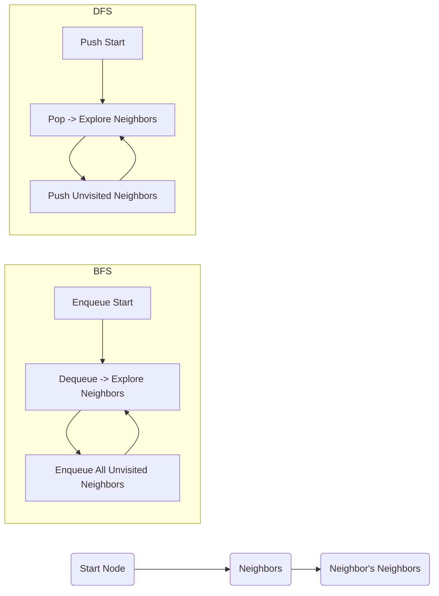

#### Key Takeaways
- **BFS** is level-by-level, ideal for shortest paths in unweighted graphs.  
- **DFS** explores deeply, useful for cycle detection and backtracking.  
- Both have **O(V+E)** time in typical adjacency list implementations.  
- BFS can require more memory; DFS can risk deep recursion.  
- SREs rely on BFS/DFS for service dependency analysis and diagnosing cascading failures.

---

### Question 3: Hash Map for Two-Sum
> **Question:**  
> Describe how a hash map helps solve the two-sum problem in O(n) time.  
> What are the trade-offs compared to other approaches?

#### Answer Overview
Using a **hash map**, you can check if the **complement** of the current number exists in constant time. This approach is **O(n)** but uses extra memory.

#### Detailed Answer
1. **For each number `num` in the array**:  
   - Calculate `complement = target - num`.  
   - Check if `complement` is in the hash map. If yes, return the pair of indices.  
   - Otherwise, store `num` and its index in the hash map.  

**Trade-Offs:**  
- **Pros:** Single-pass O(n) on average, simple logic.  
- **Cons:** Uses O(n) additional space, and in worst-case hash collisions, performance may degrade.

#### Algorithm Analysis
- **Time Complexity:** **O(n)** average.  
- **Space Complexity:** **O(n)** for the hash map.

#### Example Usage: Two-Sum with a Hash Map
```python
def two_sum(nums, target):
    """
    Returns indices of the two numbers that add up to 'target'
    using a hash map in average O(n) time.

    :param nums: List of integers
    :param target: Target integer sum
    :return: List containing the two indices if found, else []
    """
    seen = {}
    for i, num in enumerate(nums):
        complement = target - num
        if complement in seen:
            return [seen[complement], i]
        seen[num] = i
    return []

# Example Usage:
numbers = [2, 7, 11, 15]
target_value = 9
result_indices = two_sum(numbers, target_value)
```

#### Example Output
- **Input:** `nums = [2, 7, 11, 15]`, `target = 9`  
- **Output:** `[0, 1]` (the values `2` and `7` sum to `9`)

#### Testing Approach
- **No Valid Pair:** e.g., `[1,2,3]` with target `7`, expect `[]`.  
- **Duplicates:** e.g., `[3,3]` with target `6`, expect `[0,1]`.  
- **Large Input:** Confirm performance scaling.

#### SRE Perspective
- **Real-time Log Filtering:** If you need to quickly find pairs of log entries matching a sum-like condition.  
- **Memory Caution:** O(n) space usage can be expensive in production if `n` is huge.

#### Best Practices
- Use **meaningful variable names** like `complement`.  
- Check for **edge cases** (empty array, single element).  
- Return **immediately** upon finding a match.  
- Document **space-time trade-offs** in your code.  
- Consider **sorting** first if memory is constrained (but that’s O(n log n)).  
- Avoid **collisions** by using robust hashing if implementing your own map.

#### Common Pitfalls

| Pitfall                                     | Issue                                                        | Better Approach                                      |
|--------------------------------------------|--------------------------------------------------------------|------------------------------------------------------|
| Returning early if partial logic is placed wrongly | Might skip checking critical array positions                | Ensure complement check occurs before storing 'num' |
| Overwriting indices in the map incorrectly | Loses track of the earliest index for duplicates            | Clarify logic for duplicates if that matters        |
| Failing on negative numbers                | Confusion about complement logic with negatives             | Code carefully for all integer ranges              |
| Not verifying no solution scenario         | Could lead to None or error if no pair is found             | Always return an empty list or handle no-solution case |

#### Advanced Considerations
- **Sorting + Two-Pointers:** O(n log n), space O(1).  
- **Multi-sum Variants:** For 3-sum or 4-sum, the approach changes in complexity.  
- **Large Datasets:** Might rely on streaming with partial hashing strategies.

#### Visual Explanation
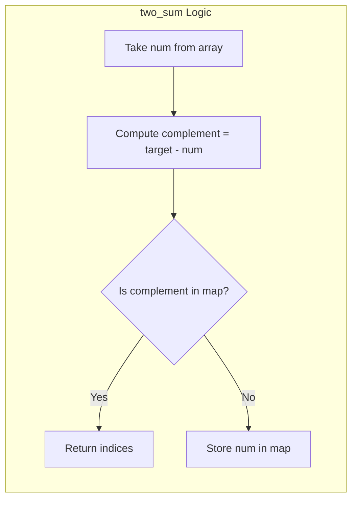

#### Key Takeaways
- Hash map approach is **O(n)** average for two-sum.  
- Requires **O(n) memory**.  
- Early detection (single pass) is straightforward.  
- Ideal for quick lookups but watch memory constraints.  
- Sorting + two-pointer is simpler on space but O(n log n).  

---

### Question 4: Quicksort Worst-Case Scenario
> **Question:**  
> What is the worst-case scenario for quicksort, and why does it happen?  
> How can this scenario be mitigated?

#### Answer Overview
The worst case arises when the chosen pivot leads to extremely unbalanced partitions, making the time complexity degrade to **O(n²)**. This often happens if the array is already sorted or nearly sorted and you pick the first or last element as a pivot.

#### Detailed Answer
- **Worst Case Trigger:** If each partition step leaves 1 element in one sub-partition and `n-1` in the other.  
- **Why?** Because you effectively remove just 1 element each time, creating a recursion depth of ~n.  

**Mitigation:**  
1. **Randomized Pivot Selection:** Minimizes likelihood of always picking the worst pivot.  
2. **Median-of-Three Pivot:** Uses the median of the first, middle, and last elements as pivot, preventing sorted input from hitting the worst case every time.

#### Algorithm Analysis
- **Average Time Complexity:** **O(n log n)**  
- **Worst-Case Time Complexity:** **O(n²)** if partitions are always unbalanced.  
- **Space Complexity:** **O(log n)** average due to recursion stack.

#### Example Usage: Quicksort with Random Pivot
```python
import random

def quicksort(arr, left, right):
    """
    Quicksort the array in-place between indices left and right.

    :param arr: List of elements to be sorted
    :param left: Left boundary index
    :param right: Right boundary index
    """
    if left < right:
        pivot_index = partition(arr, left, right)
        quicksort(arr, left, pivot_index - 1)
        quicksort(arr, pivot_index + 1, right)

def partition(arr, left, right):
    """
    Partition using a random pivot, returning the index of the pivot after partition.
    """
    pivot_idx = random.randint(left, right)
    arr[pivot_idx], arr[right] = arr[right], arr[pivot_idx]
    pivot_value = arr[right]
    store_index = left
    
    for i in range(left, right):
        if arr[i] < pivot_value:
            arr[i], arr[store_index] = arr[store_index], arr[i]
            store_index += 1
            
    arr[store_index], arr[right] = arr[right], arr[store_index]
    return store_index

# Example Usage
unsorted_arr = [10, 7, 8, 9, 1, 5]
quicksort(unsorted_arr, 0, len(unsorted_arr)-1)
```

#### Example Output
- **Input:** `[10, 7, 8, 9, 1, 5]`  
- **Output:** `[1, 5, 7, 8, 9, 10]` (sorted ascending)

#### Testing Approach
- **Already Sorted Input:** e.g. `[1,2,3,4]` to see if pivot strategy helps.  
- **Random Input:** Large random arrays to confirm average performance is good.  
- **Reverse Sorted:** e.g. `[10,9,8,7]`, also a potential worst case.

#### SRE Perspective
- **Resource Constraints:** Sorting logs or data streams can degrade significantly if pivot choice is poor.  
- **Production Reliability:** Balanced pivot selection ensures predictable performance, avoiding spikes.

#### Best Practices
- Always **randomize** or use a **median-of-three** pivot to reduce worst-case occurrences.  
- Keep code **modular**: separate partition logic from the main quicksort.  
- **Test** with varied data distributions.  
- Consider **hybrid** approaches (e.g., switch to insertion sort for small subarrays).  
- Document **worst-case** vs. average-case behavior.  
- Log **performance metrics** if sorting is done at scale in production.

#### Common Pitfalls

| Pitfall                               | Issue                                                         | Better Approach                                              |
|--------------------------------------|---------------------------------------------------------------|--------------------------------------------------------------|
| Picking first/last element as pivot  | Leads to O(n²) with sorted inputs                             | Randomize or median-of-three pivot selection                 |
| Ignoring small subarray optimization | Quicksort overhead might be large for tiny partitions         | Switch to insertion sort below a threshold                   |
| Failing to handle duplicates         | Might cause repeated partitions on same pivot or partial sorting | Use 3-way partitioning or carefully handle duplicates        |
| Large recursion depth                | Potential stack overflows with extremely unbalanced partitions| Consider tail recursion optimization or switch to iterative  |

#### Advanced Considerations
- **Dual-Pivot Quicksort (Java’s)**: Sometimes yields better empirical performance.  
- **Introsort (C++ STL)**: Starts with quicksort but switches to heapsort if recursion depth becomes too large.  
- **Parallel Quicksort:** Involves partitioning in parallel.

#### Visual Explanation
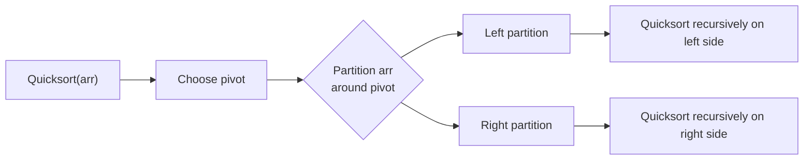

#### Key Takeaways
- Quicksort average is **O(n log n)** but worst is **O(n²)**.  
- Pivot choice is crucial to avoid worst-case splits.  
- Randomization or median-of-three are common mitigation strategies.  
- Highly used in practice for in-memory sorts.  
- SREs must be mindful of worst-case data distributions in logs or real-time data.

---

### Question 5: Binary Tree Height Bounds
> **Question:**  
> For a binary tree with **n** nodes, what is the maximum possible height?  
> What is the minimum possible height? Under what conditions do these occur?

#### Answer Overview
- **Maximum Height:** `n`, occurring when the tree is a straight “linked list” chain.  
- **Minimum Height:** ~**log₂(n)**, occurring when the tree is perfectly balanced.

#### Detailed Answer
1. **Maximum Height:**  
   - If every node has only one child, you get a path of length **n**, i.e., height = **n**.  
2. **Minimum Height:**  
   - A perfectly balanced tree ensures that every level is fully filled, leading to a height near **log₂(n)**.

#### Algorithm Analysis
- **Height Calculation:** A simple recursion visits each node once, so **O(n)** time.  
- **Space Complexity:** O(h) recursion depth, where **h** is the tree height.

#### Example Usage: Height Function
```python
def tree_height(root):
    """
    Compute the height of a binary tree.

    :param root: Root node of the binary tree
    :return: Integer height of the tree
    """
    if not root:
        return 0
    return 1 + max(tree_height(root.left), tree_height(root.right))

# Example Usage
# Suppose we have a tree:
#        5
#       / \
#      3   8
#     /   / \
#    2   6   10
# The height is 3 (edges on longest path).
```

#### Example Output
- **Tree structure** as above yields a **height of 3** (node count: 5, a mostly balanced shape).

#### Testing Approach
- **Completely Skewed:** e.g., adding nodes to the right only.  
- **Perfectly Balanced:** verify if the function returns ~ `log₂(n)`.  
- **Empty Tree:** ensure function returns 0.

#### SRE Perspective
- **BST-Based Indexes:** Unbalanced trees degrade performance to **O(n)** for searches. Self-balancing trees (AVL, Red-Black) keep performance near **O(log n)**.  
- **Monitoring Tools:** Tree-based data structures might appear in memory usage or query performance graphs.

#### Best Practices
- Keep a **base case** for `None` (empty tree).  
- Consider **iterative** approaches if recursion depth might cause stack issues.  
- If building a BST, use **insertion strategies** that avoid worst-case linear shape.  
- Use **self-balancing** trees for large, frequently updated data sets.  
- Log or track **max/min heights** in performance-critical tree structures.  
- Thoroughly **test** with balanced, skewed, and random trees.

#### Common Pitfalls

| Pitfall                       | Issue                                      | Better Approach                               |
|------------------------------|--------------------------------------------|-----------------------------------------------|
| Forgetting base case         | Could cause NoneType errors in recursion   | Always handle root == None early             |
| Confusing depth vs. height   | Might produce off-by-one errors            | Clarify that height typically counts edges    |
| Not updating max height properly | If you store global variables incorrectly | Return `1 + max(...)` from both subtrees     |
| Large skewed trees           | Possible stack overflow in deep recursion  | Consider iterative approach or balanced trees |

#### Advanced Considerations
- **Self-Balancing Trees:** Keep height ~**log(n)** automatically.  
- **Tree Depth Variation:** Some trees might be “complete” but not fully balanced, so height is close to log(n) but not exact.

#### Visual Explanation
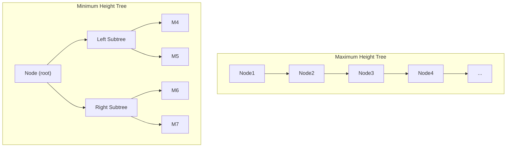

#### Key Takeaways
- A chain-like tree has height ~**n**.  
- A balanced tree has height ~**log₂(n)**.  
- Height can be computed in **O(n)**.  
- Balanced trees are crucial for efficient searching, insertion, and deletion.  
- SRE perspective: watch out for degenerate cases in production systems to avoid O(n) lookups.

---

## Code Analysis (6–8)

---

### Question 6: Linked List Reversal Code Analysis
> **Question:**  
> Review the following linked list reversal code. Is it correct? If not, identify and fix the issues:
> ```python
> def reverse_linked_list(head):
>     prev = None
>     curr = head
>     
>     while curr:
>         temp = curr.next
>         curr.next = prev
>         curr = temp
>     
>     return prev
> ```

#### Answer Overview
The code is almost correct but **fails to update `prev`** in each iteration. This results in a partially reversed list where only the first node’s pointer is reversed properly.

#### Detailed Answer
- **Intended Logic:** We need to keep moving `prev` forward to the `curr` node after reversing the pointer.  
- **Observed Bug:** `prev` remains `None` the entire loop, losing references to the reversed portion.

**Corrected Code:**  
```python
def reverse_linked_list(head):
    prev = None
    curr = head
    
    while curr:
        temp = curr.next
        curr.next = prev
        prev = curr  # Missing step
        curr = temp
    
    return prev
```
Now `prev` updates each iteration, building the reversed list properly.

#### Algorithm Analysis
- **Time Complexity:** **O(n)** — single pass.  
- **Space Complexity:** **O(1)** — uses a few pointers.

#### Example Usage: Debugging the Linked List Reversal
```python
# Example Usage:
class Node:
    def __init__(self, val):
        self.val = val
        self.next = None

def build_list(values):
    head = Node(values[0])
    curr = head
    for v in values[1:]:
        curr.next = Node(v)
        curr = curr.next
    return head

# Suppose we have [1, 2, 3, 4]
head = build_list([1, 2, 3, 4])
reversed_head = reverse_linked_list(head)
```

#### Example Output
- **Original List:** 1 -> 2 -> 3 -> 4  
- **Reversed List:** 4 -> 3 -> 2 -> 1  

(Printing the reversed list node-by-node should confirm the fix.)

#### Testing Approach
- **Empty List:** Check for `None` head.  
- **Single Node:** `[5]` remains `[5]`.  
- **Multi-Node:** `[1,2,3,4]` → `[4,3,2,1]`.

#### SRE Perspective
- **Production Bugs:** Such a subtle pointer logic bug can cause data corruption.  
- **Validation Tools:** Automated tests or static analysis could detect missing pointer updates.  

#### Best Practices
- **Keep code short** with minimal pointer usage.  
- **Test** thoroughly with edge cases.  
- Add **comments** describing each pointer’s role.  
- Use function naming like `reverse_singly_linked_list` for clarity.  
- Check for **None** references upfront.  
- Maintain **consistent naming** (`temp`, `prev`, `curr`).

#### Common Pitfalls

| Pitfall                                    | Issue                                                                 | Better Approach                                   |
|-------------------------------------------|-----------------------------------------------------------------------|---------------------------------------------------|
| Not moving `prev`                         | Loses reversed links, partially reversed list                        | Always set `prev = curr` after reversing pointer |
| Accidentally skipping a node              | If pointer updates are out of order, one node might be bypassed       | Carefully set pointer update sequence, test after each step |
| Reversing in-place vs. creating new list  | Complexity about whether references are changed or new nodes allocated | In-place is more efficient, but must ensure correct pointer ops |
| Confusing single vs. doubly linked logic  | Some might try to update `.prev` in a singly linked list by mistake    | Keep track of the data structure’s actual fields  |

#### Advanced Considerations
- **Recursive** approach also possible, but O(n) stack usage.  
- **Concurrent environment**: reversing a list in multi-threaded scenarios needs extra locks or concurrency handling.

#### Visual Explanation
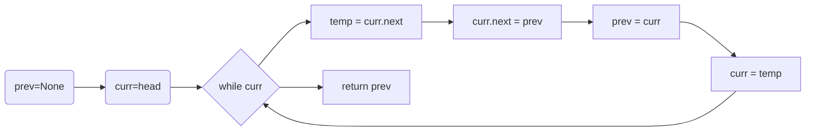

#### Key Takeaways
- Bug was forgetting `prev = curr`.  
- O(n) time, O(1) space.  
- Thorough testing is crucial for pointer manipulation.  
- SREs must ensure code correctness in data transformations.  
- Always confirm reversed list is fully connected.

---

### Question 7: BFS Traversal Output
> **Question:**  
> Given this tree:
> ```
>     1
>    / \
>   2   3
>  / \   \
> 4   5   6
> ```
> and the BFS code below, what is the output?
> ```python
> def bfs(root):
>     if not root:
>         return []
>     
>     result = []
>     queue = [root]
>     
>     while queue:
>         node = queue.pop(0)
>         result.append(node.val)
>         
>         if node.left:
>             queue.append(node.left)
>         if node.right:
>             queue.append(node.right)
>     
>     return result
> ```

#### Answer Overview
The BFS visits nodes in **level-order**, left to right. The output is `[1, 2, 3, 4, 5, 6]`.

#### Detailed Answer
1. Dequeue `1`, enqueue `2` and `3`.  
2. Dequeue `2`, enqueue `4` and `5`.  
3. Dequeue `3`, enqueue `6`.  
4. Then `4`, `5`, `6` are dequeued with no additional children.  

Hence, the final BFS list is `[1, 2, 3, 4, 5, 6]`.

#### Algorithm Analysis
- **Time Complexity:** O(n), each node is enqueued/dequeued once.  
- **Space Complexity:** O(n) in worst-case if many nodes are in the queue.

#### Example Usage: BFS with a Simple Binary Tree
```python
class TreeNode:
    def __init__(self, val):
        self.val = val
        self.left = None
        self.right = None

def build_example_tree():
    """
    Build the sample tree:
         1
        / \
       2   3
      / \   \
     4   5   6
    """
    root = TreeNode(1)
    root.left = TreeNode(2)
    root.right = TreeNode(3)
    root.left.left = TreeNode(4)
    root.left.right = TreeNode(5)
    root.right.right = TreeNode(6)
    return root

def bfs(root):
    if not root:
        return []
    
    result = []
    queue = [root]
    
    while queue:
        node = queue.pop(0)
        result.append(node.val)
        
        if node.left:
            queue.append(node.left)
        if node.right:
            queue.append(node.right)
    return result

# Example Usage:
tree_root = build_example_tree()
output = bfs(tree_root)
```

#### Example Output
- **BFS Output:** `[1, 2, 3, 4, 5, 6]`

#### Testing Approach
- **Empty Tree:** Return `[]`.  
- **Single Node:** Return `[node_val]`.  
- **Larger Tree:** Confirm BFS level-order is correct.

#### SRE Perspective
- **Queue Mechanics:** BFS is queue-based, crucial in job scheduling or message processing.  
- **Monitoring:** BFS might be used for scanning all connected components in a network.

#### Best Practices
- Use **`collections.deque`** instead of list for O(1) popleft.  
- Keep function **short** and straightforward.  
- **Guard** for empty root.  
- Validate the **structure** of the tree if built dynamically.  
- Keep your **naming** consistent: e.g., “queue”, “result”.  
- **Log** or debug print intermediate steps if diagnosing BFS issues in production.

#### Common Pitfalls

| Pitfall                               | Issue                                     | Better Approach                                              |
|--------------------------------------|-------------------------------------------|--------------------------------------------------------------|
| Using `pop(0)` on a Python list      | O(n) operation each time, harming performance | Use `collections.deque` to pop from left in O(1) time        |
| Missing `if not root:` check         | Could cause an error on empty trees       | Return `[]` for no root                                      |
| Confusing BFS with DFS logic         | Might lead to partial or out-of-order traversal | Ensure queue usage is correct, do not pop from the top of a stack |
| Not appending children in correct order | Child nodes might appear reversed or skip some nodes | Insert left child, then right child consistently            |

#### Advanced Considerations
- **Level Order BFS**: We can store (node, level) to process each level distinctly.  
- **Concurrency**: BFS can be parallelized if subtrees are handled by multiple threads.

#### Visual Explanation
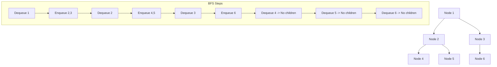

#### Key Takeaways
- BFS processes nodes in **level-order**.  
- Time complexity is **O(n)**, with queue-based iteration.  
- Output for the example is `[1, 2, 3, 4, 5, 6]`.  
- Using `deque` is recommended for performance.  
- BFS is widely used in SRE for scanning or enumerating connected systems.

---

### Question 8: Time & Space Complexity of Two-Sum
> **Question:**  
> Analyze the time and space complexity of the following two-sum implementation:
> ```python
> def two_sum(nums, target):
>     seen = {}
>     for i, num in enumerate(nums):
>         complement = target - num
>         if complement in seen:
>             return [seen[complement], i]
>         seen[num] = i
>     return []
> ```

#### Answer Overview
This implementation runs in **O(n)** average time, due to the hash map’s constant-time lookups. It also uses **O(n)** space in the worst case.

#### Detailed Answer
- We traverse the list **once**. For each **num**, we check if `target - num` is in the map.  
- Insert the current number into the map if not found.  
- If found, return the two indices.

**Performance:**  
- **Average Time:** O(n).  
- **Worst-Case Time:** O(n) if hash collisions are minimal or well-handled.  
- **Space:** O(n) for storing up to all elements in the map.

#### Algorithm Analysis
- **Time Complexity:** **O(n)** average.  
- **Space Complexity:** **O(n)**.

#### Example Usage: Two-Sum Complexity Focus
```python
def two_sum(nums, target):
    """
    Return indices of two numbers summing to target in O(n) average time.

    :param nums: List[int]
    :param target: int
    :return: List[int]
    """
    seen = {}
    for i, num in enumerate(nums):
        complement = target - num
        if complement in seen:
            return [seen[complement], i]
        seen[num] = i
    return []

# Example Usage:
indexes = two_sum([2,7,11,15], 9)
```

#### Example Output
- **Input:** `[2,7,11,15]` with target=9  
- **Output:** `[0,1]`

#### Testing Approach
- **Small List**: `[2,7]`, target=9 -> `[0,1]`.  
- **No Pair Found**: `[1,2,3]`, target=10 -> `[]`.  
- **Duplicates**: `[3,3]`, target=6 -> `[0,1]`.

#### SRE Perspective
- **Performance at Scale:** O(n) solution is important if `n` can be large.  
- **Space Constraints:** Storing a dictionary of length **n** might be costly in certain memory-limited environments.

#### Best Practices
- Document the **purpose** and complexity in docstrings.  
- Return **immediately** upon finding a match.  
- Clarify the **behavior with duplicates**.  
- Check for **empty** or **very large** inputs.  
- Use a **clear variable name** like `seen` to highlight the map’s role.  
- Test **both** presence and non-presence of solutions.

#### Common Pitfalls

| Pitfall                               | Issue                                                | Better Approach                                       |
|--------------------------------------|------------------------------------------------------|-------------------------------------------------------|
| Checking `seen[num]` instead of `complement` | Might produce wrong logic or skip some pairs         | Always compute `complement` and check if it is in map |
| Overwriting the same key in `seen`   | Loses earlier index for duplicates                   | Accept that duplicates might override older index if that’s intended |
| Not returning if no pair found       | Could lead to errors or returning None implicitly    | Return `[]` or a clear signal when no pair is found   |
| Large memory usage                   | Storing entire array in map is big in memory-limited systems | Possibly use a different approach or partial caching  |

#### Advanced Considerations
- **Sorting + Two-Pointers:** O(n log n) but O(1) space.  
- **Hash Collisions:** Might degrade performance if implementation or data distribution is poor.

#### Visual Explanation
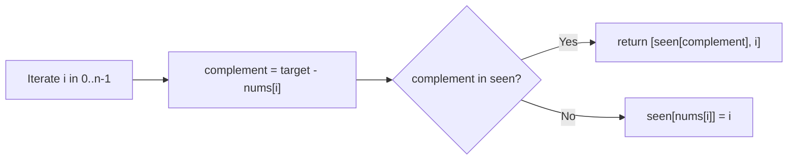

#### Key Takeaways
- Time is **O(n)** average using a hash map.  
- Space is **O(n)** to store the dictionary.  
- Ideal for quick lookups but watch memory usage.  
- Early return once a pair is found.  
- SREs must confirm performance is stable and memory is sufficient for large `n`.

---

## Coding Challenges (9–12)

---

### Question 9: Linked List Cycle Detection
> **Question:**  
> Implement a function to check if a linked list has a cycle (returns to a previously visited node).  
> Your solution should use O(1) extra space.

#### Answer Overview
Use **Floyd’s Tortoise and Hare** (cycle-finding) algorithm. It runs in **O(n)** time and **O(1)** space, moving two pointers at different speeds until they meet (or the list ends).

#### Detailed Answer
1. Initialize `slow` and `fast` at the head.  
2. Move `slow` by 1, `fast` by 2.  
3. If `fast` becomes `None`, no cycle.  
4. If `slow == fast` at any point, there is a cycle.

#### Algorithm Analysis
- **Time Complexity:** **O(n)**, as each pointer scans the list once.  
- **Space Complexity:** **O(1)**.

#### Example Usage: Cycle Detection
```python
def has_cycle(head):
    """
    Detect cycle using Floyd's Tortoise and Hare.
    :param head: Head of linked list
    :return: True if cycle exists, False otherwise
    """
    if not head or not head.next:
        return False
    
    slow, fast = head, head
    while fast and fast.next:
        slow = slow.next
        fast = fast.next.next
        if slow == fast:
            return True
    return False

# Example Usage:
# Suppose we build a list [1,2,3,4] but link node '4' back to '2' to create a cycle
```

#### Example Output
- **No Cycle:** returns `False`.  
- **Cycle Present:** returns `True`.

#### Testing Approach
- **No Cycle:** Straight list `[1,2,3]`.  
- **Full Cycle:** Last node points to first node.  
- **Partial Cycle:** Middle node points backward to an earlier node.

#### SRE Perspective
- **Detecting Loops**: In resource or dependency graphs, cycle detection is crucial.  
- **Deadlock Analysis**: Floyd’s helps quickly reveal circular wait conditions.

#### Best Practices
- Keep **code short** and neat.  
- Return **False** quickly if `head` is None or single node.  
- **Name** pointers clearly (`slow`, `fast`).  
- **Document** time & space complexity.  
- Testing **various** cycle formations.  
- Use the “**meeting**” concept for clarity.

#### Common Pitfalls

| Pitfall                                | Issue                                                      | Better Approach                                             |
|---------------------------------------|------------------------------------------------------------|-------------------------------------------------------------|
| Not checking `fast.next` before `fast.next.next` | Could raise `NoneType` error                               | Always ensure `fast and fast.next` before using `fast.next.next` |
| Stopping after only one pointer hits `None`    | Could incorrectly signal no cycle if logic is reversed     | Ensure loop condition is `while fast and fast.next`         |
| Using extra data structures (like sets)         | Consumes O(n) memory, though valid, not as space efficient | Floyd’s Tortoise and Hare is O(1) space                     |
| Not testing edge cases (0 or 1 node)           | Code might fail or produce unexpected results              | Return `False` if `head` or `head.next` is None            |

#### Advanced Considerations
- **Finding Cycle Start:** Another variation of Floyd’s can find the exact node where the cycle begins.  
- **Cycle Length:** We can measure the cycle length after the pointers meet.

#### Visual Explanation
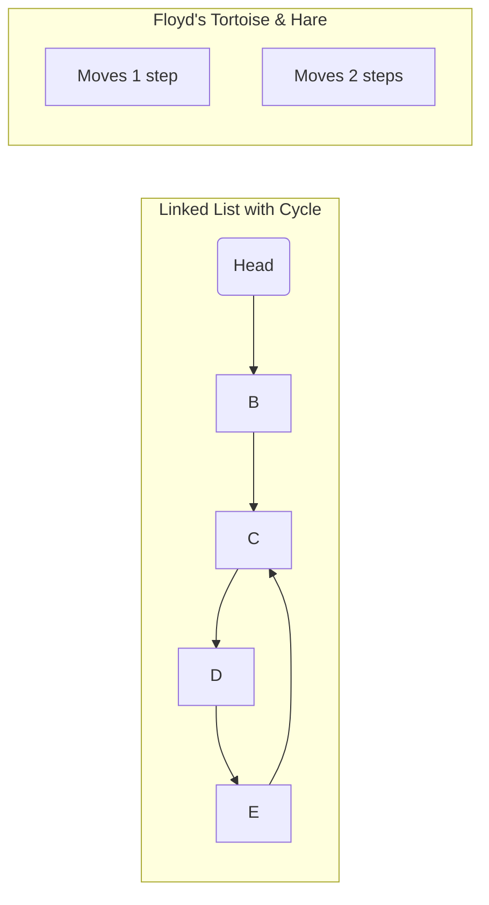

#### Key Takeaways
- Floyd’s Tortoise & Hare is an **O(n)** time, **O(1)** space cycle detection.  
- Good for memory-critical or performance-critical systems.  
- SRE use: detect resource or lock cycles.  
- Test thoroughly with edge cases (empty, single, partial cycle).  

---

### Question-10: Maximum Sum Path in a Binary Tree
> **Question:**  
> Write a function that takes a binary tree and returns the maximum sum path from root to leaf.  
> A path must start at the root and end at a leaf.

#### Answer Overview
We use **DFS** to explore all root-to-leaf paths, tracking the cumulative sum and recording the maximum at each leaf.

#### Detailed Answer
1. **Recursively** compute `max_sum_root_to_leaf` for each subtree.  
2. The path sum is `root.val + max(left_sum, right_sum)`.  
3. If we hit a leaf, just return its value.  
4. Compare the sums for the left and right subtrees and pick the largest.

#### Algorithm Analysis
- **Time Complexity:** **O(n)**, visiting each node exactly once.  
- **Space Complexity:** **O(h)** recursion depth, where **h** is tree height.

#### Example Usage: Maximum Sum Path
```python
def max_sum_root_to_leaf(root):
    """
    Computes the maximum root-to-leaf path sum.

    :param root: Root of the binary tree
    :return: Integer, max sum from root down to a leaf
    """
    if not root:
        return 0
    if not root.left and not root.right:
        return root.val
    
    left_sum = max_sum_root_to_leaf(root.left) if root.left else float('-inf')
    right_sum = max_sum_root_to_leaf(root.right) if root.right else float('-inf')
    
    return root.val + max(left_sum, right_sum)

# Example Usage:
# Suppose the tree is:
#       5
#      / \
#     4   8
#        / \
#       2   10
# Max root-to-leaf sum = 5 + 8 + 10 = 23
```

#### Example Output
- **Tree structure** above yields **23** as the max root-to-leaf sum.

#### Testing Approach
- **Empty Tree:** Return 0.  
- **Tree with all negative values:** Ensure it picks the least negative path.  
- **Multiple branches**: e.g., deeper left subtree vs. deeper right subtree.

#### SRE Perspective
- **Configuration Trees:** Summation might represent combined cost or risk from root to a leaf node.  
- **Error Path Monitoring:** Helps to measure maximum “impact path” in incident scenarios.

#### Best Practices
- **Check** for empty or single-node trees.  
- Return a **large negative** sentinel (float('-inf')) when no child.  
- Logically separate **base cases** from **recursive** step.  
- Keep function name **descriptive**: `max_sum_root_to_leaf`.  
- Test with **negative** or **mixed** values.  
- Document **time/space** complexity near the function.

#### Common Pitfalls

| Pitfall                                       | Issue                                                  | Better Approach                                               |
|----------------------------------------------|--------------------------------------------------------|---------------------------------------------------------------|
| Not returning 0 for empty tree               | Could produce error or negative infinity for no nodes  | Explicitly handle `if not root:` case                         |
| Mixing “root-to-leaf” with “root-to-any-node” logic | Might incorrectly compute the sum to an internal node   | Distinguish leaf nodes (no children) vs. internal nodes       |
| Overly complex recursion structure           | Hard to read or debug if not well commented            | Keep code short, break logic into steps or helper methods     |
| Not handling negative values properly        | Sum might incorrectly skip negative children           | Make sure logic is consistent even if all values are negative |

#### Advanced Considerations
- **Max Path Sum (root to any node)** vs. **root to leaf** might differ.  
- **Tracking the actual path** could be done by storing pointers or arrays in recursion.

#### Visual Explanation
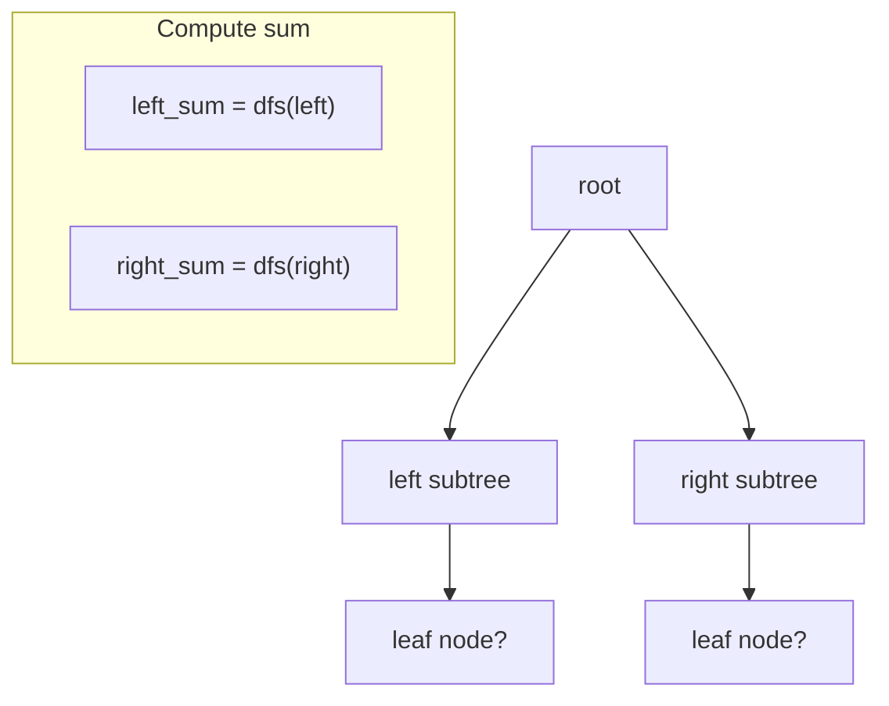

#### Key Takeaways
- DFS-based approach is straightforward for root-to-leaf sums.  
- O(n) time, O(h) stack space.  
- Must handle negative or empty scenarios.  
- SRE angle: Summation logic can map to cost or reliability metrics.  

---

### Question-11: K-th Largest Element
> **Question:**  
> Implement a function to find the k-th largest element in an unsorted array.  
> Try to optimize beyond the obvious O(n log n) sorting solution.

#### Answer Overview
A **Quickselect** algorithm can find the k-th largest in **O(n)** average time, partitioning around a pivot and recursing only into the needed partition.

#### Detailed Answer
1. Convert `k` to a 0-based index: `index_to_find = len(nums) - k`.  
2. Partition the array around a pivot (randomly chosen).  
3. If the pivot’s final position is `index_to_find`, return it.  
4. If pivot is greater than `index_to_find`, recurse left; else recurse right.

#### Algorithm Analysis
- **Time Complexity (average):** **O(n)**.  
- **Worst Case:** **O(n²)** if pivots are repeatedly unfortunate.  
- **Space Complexity:** **O(1)** besides recursion stack.

#### Example Usage: Quickselect for K-th Largest
```python
import random

def quickselect(nums, k):
    """
    Find the k-th largest element in O(n) average time.
    :param nums: List of integers
    :param k: 1-based rank for largest element
    :return: k-th largest element
    """
    index_to_find = len(nums) - k
    
    def partition(left, right):
        pivot_idx = random.randint(left, right)
        pivot_value = nums[pivot_idx]
        nums[pivot_idx], nums[right] = nums[right], nums[pivot_idx]
        store_index = left
        for i in range(left, right):
            if nums[i] < pivot_value:
                nums[store_index], nums[i] = nums[i], nums[store_index]
                store_index += 1
        nums[store_index], nums[right] = nums[right], nums[store_index]
        return store_index
    
    def select(left, right):
        if left == right:
            return nums[left]
        pivot_index = partition(left, right)
        
        if pivot_index == index_to_find:
            return nums[pivot_index]
        elif pivot_index < index_to_find:
            return select(pivot_index + 1, right)
        else:
            return select(left, pivot_index - 1)
    
    return select(0, len(nums) - 1)

# Example Usage:
arr = [3,2,1,5,6,4]
k = 2
result = quickselect(arr, k)
```

#### Example Output
- **Input:** `[3,2,1,5,6,4]`, `k=2`  
- **Output:** `5` (the 2nd largest element)

#### Testing Approach
- **k=1** largest, e.g. `[1,2,3]` -> `3`.  
- **k=len(nums)** smallest in the array.  
- **Arrays with repeated values** to confirm correctness.

#### SRE Perspective
- **Real-time Top-K Queries:** Quickselect is efficient for on-the-fly largest or smallest queries.  
- **Memory Efficiency:** Avoids storing entire sorted arrays when you only need one element.

#### Best Practices
- **Randomize pivot** to reduce worst-case.  
- Validate **k** is in range.  
- Watch out for **duplicate** handling.  
- Keep partition logic **clean** and well-documented.  
- Test with **various** array distributions.  
- Consider **median-of-medians** for guaranteed O(n) but higher constant factors.

#### Common Pitfalls

| Pitfall                                          | Issue                                                     | Better Approach                                                  |
|-------------------------------------------------|-----------------------------------------------------------|------------------------------------------------------------------|
| Failing to handle duplicates in partitioning    | Could cause incorrect pivot placement or partial ordering | Precisely define `if nums[i] < pivot_value:` condition           |
| Not converting k to zero-based index properly   | Off-by-one errors in final result                         | Use `index_to_find = len(nums) - k` carefully                    |
| Using sorted approach for small subproblems     | Might revert to O(n log n) if done too soon              | Only use sorting for very small arrays if it’s beneficial        |
| Pivot always chosen as left or right index      | Can degrade to O(n²) for nearly sorted arrays            | Use random pivot or median-of-three strategy                     |

#### Advanced Considerations
- **Median-of-Medians:** Guaranteed O(n) worst-case, but more complex.  
- **Partial Concurrency:** Each partition can be processed in parallel if desired.

#### Visual Explanation
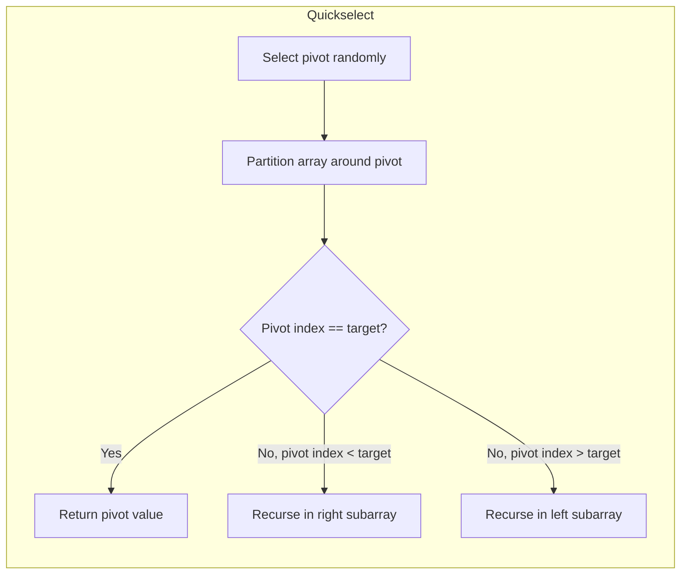

#### Key Takeaways
- Quickselect finds the k-th largest in **O(n)** average time.  
- Space usage is minimal except for recursion.  
- Pivot selection approach matters for worst-case avoidance.  
- SRE scenario: top K memory-hogging processes in real time.  

---

### Question-12: O(1) Insert, Remove, and Get Random
> **Question:**  
> Design a data structure that supports O(1) insert, remove, and get a random element.  
> Explain your approach and any trade-offs.

#### Answer Overview
Use a **combination** of a **dynamic array** (for random access) and a **hash map** (for O(1) lookup). Removal is done by swapping the element-to-remove with the last element in the array.

#### Detailed Answer
1. **Insert**: Append to array and record index in hash map.  
2. **Remove**: Find index via hash map, swap with last element in array, pop the last element, and update the hash map.  
3. **Get Random**: Use a random index on the array.

**Trade-Offs:**
- Requires storing data in **two** structures: array + map, so O(n) memory usage.  
- Doesn’t preserve order.

#### Algorithm Analysis
- **Insert:** O(1).  
- **Remove:** O(1), thanks to swapping last element.  
- **Get Random:** O(1) to pick random index.

#### Example Usage: RandomizedSet
```python
import random

class RandomizedSet:
    """
    O(1) average operations: insert, remove, getRandom
    """
    def __init__(self):
        self.array = []
        self.positions = {}
    
    def insert(self, val):
        # Returns False if already present
        if val in self.positions:
            return False
        self.array.append(val)
        self.positions[val] = len(self.array) - 1
        return True
    
    def remove(self, val):
        if val not in self.positions:
            return False
        
        idx = self.positions[val]
        last_val = self.array[-1]
        
        # Swap with last element
        self.array[idx], self.array[-1] = self.array[-1], self.array[idx]
        self.positions[last_val] = idx
        
        # Pop and delete from map
        self.array.pop()
        del self.positions[val]
        return True
    
    def getRandom(self):
        return random.choice(self.array)

# Example Usage:
rs = RandomizedSet()
rs.insert(5)   # True
rs.insert(10)  # True
rs.insert(5)   # False (already exists)
val = rs.getRandom()
```

#### Example Output
- **Inserts**: `insert(5) -> True`, `insert(10) -> True`, `insert(5) -> False`  
- **After removing** 5, the set might only have `[10]`.  
- **getRandom** from `[10]` always returns `10`.

#### Testing Approach
- **Insert repeated:** Ensure duplicates not re-inserted.  
- **Remove** non-existent element: Should return False.  
- **Get Random** on single or multiple elements, check distribution if needed.

#### SRE Perspective
- **Random Node Selection:** Could choose random nodes in a cluster for rolling updates.  
- **Scalable O(1) operations:** Ideal for large ephemeral data sets or caches.

#### Best Practices
- Keep the **swap** logic for removal minimal and well-commented.  
- **Document** that insertion fails if duplicate.  
- Let `getRandom()` handle the case of an empty array (maybe raise an exception).  
- Use **meaningful** variable names (`array`, `positions`).  
- Thoroughly **test** remove logic with index edge cases.  
- Consider **thread-safety** if accessed concurrently.

#### Common Pitfalls

| Pitfall                              | Issue                                                         | Better Approach                                             |
|-------------------------------------|---------------------------------------------------------------|-------------------------------------------------------------|
| Not updating the map after swap     | The swapped element’s new index not recorded                  | Always do `positions[last_val] = idx`                      |
| Not returning correct boolean values| May inadvertently re-insert duplicates or remove non-existing | Follow the specification (True if success, False otherwise) |
| Overcomplicating the data structure | Using multiple lists or no hash map, leading to worse than O(1) | Stick to array + hash map strategy                          |
| Failing on empty random calls       | If `getRandom()` is called on empty structure, crash or invalid output | Check for empty and handle gracefully                       |

#### Advanced Considerations
- **Thread safety**: must lock operations if concurrency is involved.  
- **Weighted getRandom()**: Additional logic needed if random selection isn’t uniform.

#### Visual Explanation
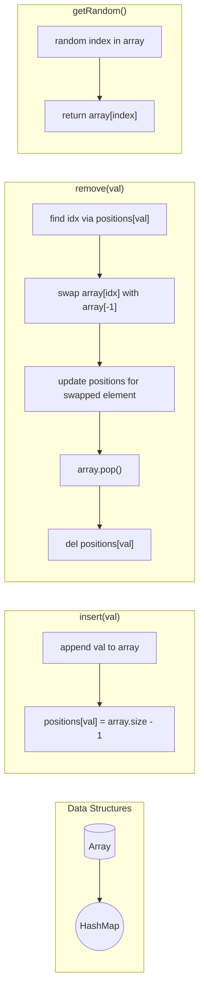

#### Key Takeaways
- Insert, Remove, and getRandom in **O(1)** average time.  
- Data structure merges a **list** with a **hash map**.  
- Swapping with last element is crucial for O(1) removal.  
- Perfect for SRE tasks needing random selection of items with constant-time updates.

---

## Application Questions (13–15)

---

### Question 13: BFS/DFS in Service Dependency Troubleshooting
> **Question:**  
> As an SRE, how might you use BFS or DFS when troubleshooting a service dependency issue?  
> Give a concrete example of how graph traversal algorithms could help in an operational scenario.

#### Answer Overview
**BFS** helps identify which services or components are impacted at each “distance” from a failing service. **DFS** helps trace a single path deeply to find the root cause or the entire chain of dependencies.

#### Detailed Answer
- Build a **service dependency graph**, where edges represent a service’s reliance on another.  
- If a service is **failing**, BFS from that node identifies the outward “blast radius” (who depends on it).  
- Conversely, DFS from the failing node might discover how the problem started upstream in a single chain.

**Concrete Example:**  
- Suppose an e-commerce site has a slowdown in **Checkout** service.  
- BFS from Checkout finds Payment and Inventory are the first level, with Database as second level.  
- DFS into Payment might reveal that Payment depends on a third-party gateway that is having issues.

#### Algorithm Analysis
- For **V** services and **E** dependencies: BFS or DFS is **O(V + E)**. In moderate microservice environments, this is typically manageable.

#### Example Usage: BFS-based Troubleshooting
```python
def bfs_troubleshoot(start_service, dependency_graph):
    """
    Return list of impacted services and their 'distance' from start_service
    """
    from collections import deque
    visited = set()
    queue = deque([(start_service, 0)])  # store (service, distance)
    impacted = []
    
    while queue:
        service, dist = queue.popleft()
        if service not in visited:
            visited.add(service)
            impacted.append((service, dist))
            for dep in dependency_graph.get(service, []):
                if dep not in visited:
                    queue.append((dep, dist + 1))
    return impacted
```

#### Example Output
- **Start Service:** "Checkout"  
- **Output** might look like: `[("Checkout",0), ("Payment",1), ("Inventory",1), ("Database",2)]`

#### Testing Approach
- **Single Node:** No dependencies.  
- **Multi-tier** microservices: to ensure BFS/DFS enumerates them.  
- **Circular dependencies**: to confirm DFS can detect loops (or BFS that stops revisiting).

#### SRE Perspective
- **Incident Response**: BFS quickly reveals all directly affected downstream services. DFS helps find the single chain to the root cause.  
- **Scalability**: In large distributed systems, partial BFS or selective DFS might be needed.

#### Best Practices
- Keep your **dependency graph** updated accurately.  
- Use BFS/DFS results to automatically **alert** downstream owners.  
- Store or visualize **distance** (number of hops).  
- Log **progress** so you can see how many services are impacted.  
- For deep calls, watch out for **stack recursion** if DFS is used.  
- Integrate BFS/DFS with your **observability** stack to fetch metrics of each node.

#### Common Pitfalls

| Pitfall                                 | Issue                                                     | Better Approach                                              |
|----------------------------------------|-----------------------------------------------------------|--------------------------------------------------------------|
| Outdated or incomplete dependency data | BFS or DFS might omit some critical nodes                | Keep a single source of truth for service dependencies       |
| Ignoring cycles in dependencies        | Could cause infinite loops if re-traversing the same nodes | Mark visited services to avoid repeated traversal            |
| Not ranking or layering BFS results    | Harder to see which is nearest vs. farthest in the chain | Keep track of levels (distance from start) for clarity       |
| Overloading DFS usage for all problems | BFS might be simpler for broad radius analysis            | Choose BFS vs. DFS based on the specific troubleshooting need|

#### Advanced Considerations
- **Weighted Edges**: If different services have different “costs” or priorities, BFS might not suffice if edges are not uniform.  
- **Parallel BFS**: Large microservice graphs can be traversed in parallel to speed up.

#### Visual Explanation
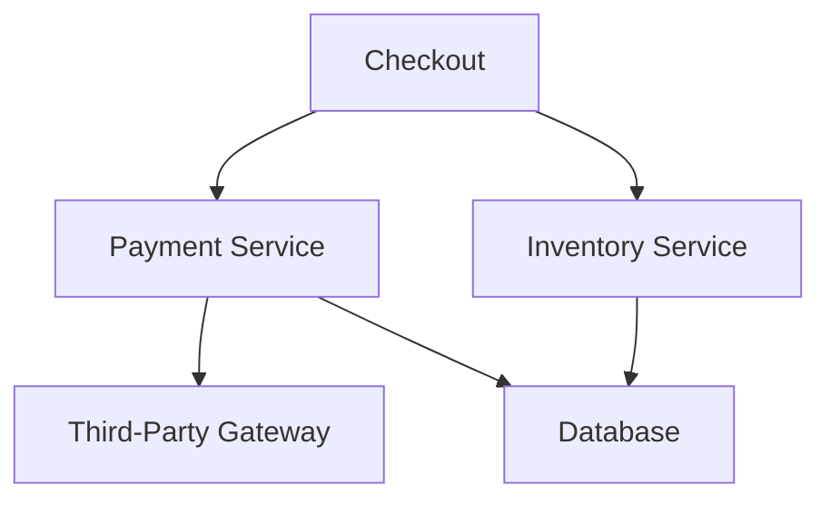

#### Key Takeaways
- BFS/DFS are must-have tools in an SRE’s kit for **dependency** troubleshooting.  
- BFS finds the “blast radius” from a failing service.  
- DFS traces single paths deeply to find a root cause.  
- Keep your dependency map up to date for accurate results.  
- In large environments, BFS/DFS must be carefully optimized.

---

### Question 14: Algorithm Complexity and System Performance
> **Question:**  
> Describe a situation where understanding algorithm complexity would be important for system performance in an SRE context.  
> How would you identify and address a potential algorithmic bottleneck?

#### Answer Overview
When a system experiences high latency or throughput issues, it may be due to an **inefficient algorithm** (e.g., O(n²) substring search). Recognizing the complexity is crucial to fix the bottleneck.

#### Detailed Answer
1. **Situation:** A logging pipeline uses a naive substring check for every incoming log line, leading to O(n²) or worse complexity.  
2. **Identification:**  
   - Monitoring reveals rising latencies as logs scale.  
   - Profiling pinpoints the substring search function using excessive CPU.  
3. **Addressing Bottleneck:**  
   - Replace naive search with **KMP** or a built-in optimized method.  
   - Possibly cache results or index logs for repeated queries.  
   - Scale horizontally if needed.

#### Algorithm Analysis in SRE Context
- **Performance Impact:** O(n²) can quickly saturate CPU when log volume grows.  
- **Observability:** CPU flame graphs or function-level profiling help find these hot spots.

#### Example Usage: Hypothetical Performance Fix
```python
def efficient_search(log_line, pattern):
    """
    Use Python's built-in 'in' or .find() for an optimized substring check.
    """
    return pattern in log_line

# Alternatively, implement KMP or another advanced algorithm for pattern matching
```

#### Example Output
- If we measure the time, we see a significant drop from O(n²) to O(n) or better for typical searches.

#### Testing Approach
- **Small & Large Log Lines**: measure performance differences.  
- **Frequent Patterns** vs. Rare Patterns.  
- **Edge Cases** with empty strings or patterns.

#### SRE Perspective
- **Global Efficiency**: If a single function is O(n²) in a high-throughput environment, it can cause widespread slowdowns.  
- **Monitoring**: Always watch resource usage in real time to detect such inefficiencies.

#### Best Practices
- Use **profilers** regularly on critical paths.  
- Keep **algorithm complexity** in mind for large n.  
- Document **known complexities** in code or architecture docs.  
- **Optimize** for typical data distributions, not worst-case only.  
- Carefully **test** after any algorithmic changes.  
- Provide **fallback** solutions if data volumes exceed expected thresholds.

#### Common Pitfalls

| Pitfall                                          | Issue                                                                 | Better Approach                                      |
|-------------------------------------------------|-----------------------------------------------------------------------|------------------------------------------------------|
| Blindly using naive approaches for big data      | System meltdown under large inputs                                   | Evaluate data size & choose efficient algorithms     |
| Not profiling in production                      | Might miss real bottlenecks                                          | Use real-time & synthetic load tests to identify problem spots |
| Over-optimizing too early                        | Wastes development time if data size is small                        | First measure, then optimize if a real bottleneck surfaces |
| Ignoring memory usage when switching algorithms  | Some solutions use more memory than is available                     | Check both time & space constraints carefully         |

#### Advanced Considerations
- **Trade-Off**: Some advanced data structures can reduce time but need more space.  
- **Algorithmic Complexity** might combine with concurrency overhead or I/O delays.

#### Visual Explanation
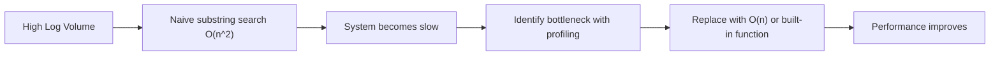

#### Key Takeaways
- O(n²) vs. O(n) can mean the difference between success or meltdown under heavy loads.  
- SRE must regularly **profile** and tune code for scaling demands.  
- Observability is key to pinpoint algorithmic hotspots.  
- Evaluate both time and space complexities.  
- Use specialized algorithms (like KMP) or well-tested library methods.

---

### Question 15: Designing an Efficient Caching System
> **Question:**  
> Explain how you would design an efficient caching system using the data structures we’ve discussed.  
> What would be your eviction policy and why?

#### Answer Overview
An **LRU (Least Recently Used)** cache uses a **hash map** plus a **doubly linked list** for quick lookups and constant-time eviction of the least recently used item.

#### Detailed Answer
- **LRU Mechanics**:  
  1. Hash map for O(1) lookups.  
  2. Doubly linked list to track recency.  
  3. When capacity is reached, remove from the tail (least recently used).  
- **Eviction Policy**: LRU is common because recently accessed items are likely to be accessed again soon (temporal locality).

#### Implementation Considerations
- **Capacity**: Must be set based on memory constraints.  
- **Concurrency**: Multi-threaded usage requires locks or concurrent data structures.  
- **TTL**: Optionally add time-based eviction.

#### Example Usage: LRU Cache
```python
class Node:
    def __init__(self, key, value):
        self.key = key
        self.value = value
        self.prev = None
        self.next = None

class LRUCache:
    def __init__(self, capacity):
        self.capacity = capacity
        self.cache = {}  # key -> Node
        self.head = Node(0, 0)  # dummy head
        self.tail = Node(0, 0)  # dummy tail
        self.head.next = self.tail
        self.tail.prev = self.head
    
    def get(self, key):
        if key in self.cache:
            node = self.cache[key]
            self._remove(node)
            self._add(node)
            return node.value
        return -1
    
    def put(self, key, value):
        if key in self.cache:
            self._remove(self.cache[key])
        new_node = Node(key, value)
        self._add(new_node)
        self.cache[key] = new_node
        
        if len(self.cache) > self.capacity:
            lru_node = self.tail.prev
            self._remove(lru_node)
            del self.cache[lru_node.key]
    
    def _add(self, node):
        # Always add right after head
        node.prev = self.head
        node.next = self.head.next
        self.head.next.prev = node
        self.head.next = node
    
    def _remove(self, node):
        # Remove from its current position
        p = node.prev
        n = node.next
        p.next = n
        n.prev = p

# Example Usage:
cache = LRUCache(2)
cache.put(1, 'A')  # stores key=1, val='A'
cache.put(2, 'B')  # stores key=2, val='B'
print(cache.get(1))  # 'A'
cache.put(3, 'C')    # evicts key=2
print(cache.get(2))  # -1 (not found)
```

#### Example Output
- **Put(1,'A'), Put(2,'B'), Get(1) -> 'A'**  
- **Put(3,'C')** → evicts (2,'B') since it’s the least recently used  
- **Get(2) → -1** not found

#### Testing Approach
- **Capacity=1**: ensures eviction occurs on every new put.  
- **Frequent gets**: confirm item reordering.  
- **Keys not found**: return -1.

#### SRE Perspective
- **Caching** is essential for performance in distributed systems. LRU avoids repeatedly fetching the same data.  
- **Reliability**: Overly large caches can lead to memory pressure; too small can lead to thrashing.

#### Best Practices
- Keep **LRU logic** minimal: a hash + doubly linked list is standard.  
- Log **evictions** for debugging.  
- Ensure **thread-safe** if multiple requests manipulate the cache.  
- Consider advanced policies like **LFU** or **TTL** if usage patterns differ.  
- Test with **high concurrency** if in a real system.  
- Distinguish **cache misses** vs. hits to measure effectiveness.

#### Common Pitfalls

| Pitfall                                 | Issue                                                           | Better Approach                                         |
|----------------------------------------|----------------------------------------------------------------|---------------------------------------------------------|
| Not removing from linked list properly | Orphaned nodes or incorrect pointers can break the list        | Thoroughly test `_remove()` with multiple consecutive ops |
| Failing to move accessed items to head | Could lead to inaccurate LRU ordering                          | On every successful get, move the node to the head      |
| Not logging evictions                  | Hard to debug or optimize capacity sizing                      | Keep minimal logs or counters for eviction stats        |
| Hardcoding capacity too high or low    | Memory bloat or frequent evictions                             | Experiment or track usage for correct capacity          |

#### Advanced Considerations
- **Distributed Caches**: LRU on a single node vs. consistent hashing across cluster.  
- **LFU (Least Frequently Used)** or **LRFU** might suit other access patterns.

#### Visual Explanation
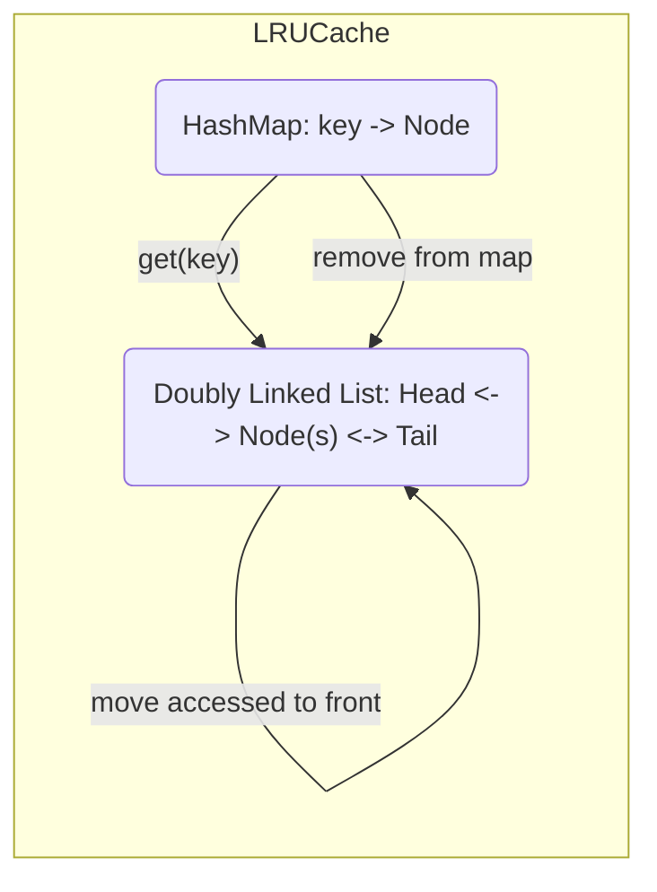

#### Key Takeaways
- LRU is a common, efficient caching strategy.  
- Achieves **O(1)** for get/put.  
- Great for memory-limited scenarios where old data is less likely to be used.  
- SRE usage: reduce repeated expensive calls or data fetches.  
- Must tune capacity and consider concurrency.

---

## Glossary
Here are **15** key terms used throughout this resource:

1. **Big O Notation**: Describes the upper bound of an algorithm’s complexity, focusing on growth rate.  
2. **Linked List**: A linear data structure of nodes pointing to the next node.  
3. **BFS (Breadth-First Search)**: Graph traversal method exploring neighbors level by level.  
4. **DFS (Depth-First Search)**: Graph traversal method exploring one path fully before backtracking.  
5. **Hash Map**: A data structure mapping keys to values, offering O(1) average-time lookups.  
6. **Two-Sum Problem**: Finds two numbers in an array that add up to a specific target.  
7. **Quicksort**: A divide-and-conquer sorting method using a pivot to partition data.  
8. **Time Complexity**: Measure of how an algorithm’s execution time grows with input size.  
9. **Space Complexity**: Measure of additional memory an algorithm needs relative to input size.  
10. **Binary Tree**: A tree data structure where each node has up to two children (left and right).  
11. **LRU (Least Recently Used)**: A caching strategy evicting the item that has gone unused the longest.  
12. **Cycle Detection**: Identifying loops in structures or graphs, often with Floyd’s Tortoise and Hare.  
13. **Quickselect**: A selection algorithm for finding the k-th largest or smallest element in average O(n).  
14. **Doubly Linked List**: A linked list where each node has pointers to both the previous and next nodes.  
15. **Partition**: A step in Quicksort or Quickselect that rearranges elements around a chosen pivot.

---

## Conclusion
Mastering **Data Structures & Algorithms** is essential for both traditional software engineering and **Site Reliability Engineering** contexts. The ability to analyze **time** and **space** complexities ensures that large-scale systems remain performant and reliable under heavy load. Whether reversing a linked list in O(1) space, diagnosing cycles in microservice dependencies, or caching data with an LRU policy, the underlying concepts from BFS/DFS to Quicksort and Quickselect are indispensable. By combining **robust testing**, **best practices**, and **careful performance monitoring**, you can build solutions that scale gracefully and maintain reliability in real-world production environments.