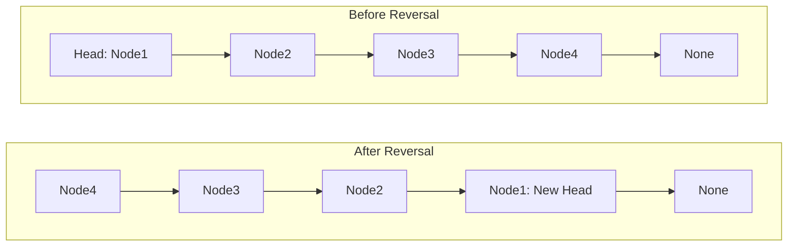
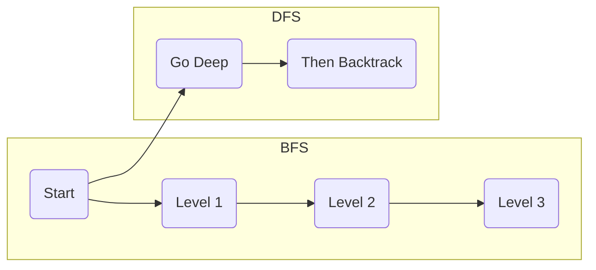
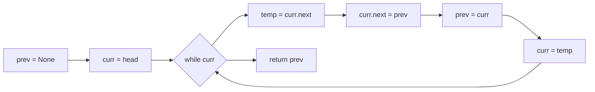
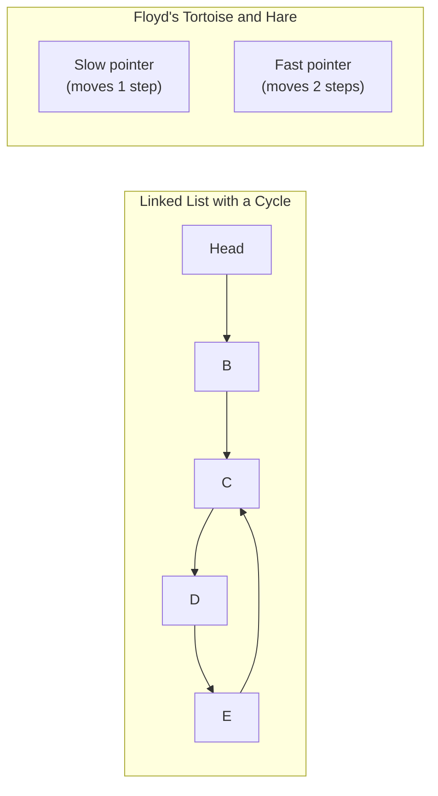
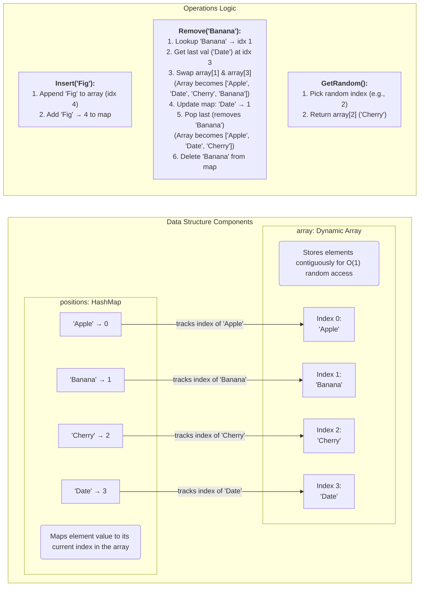
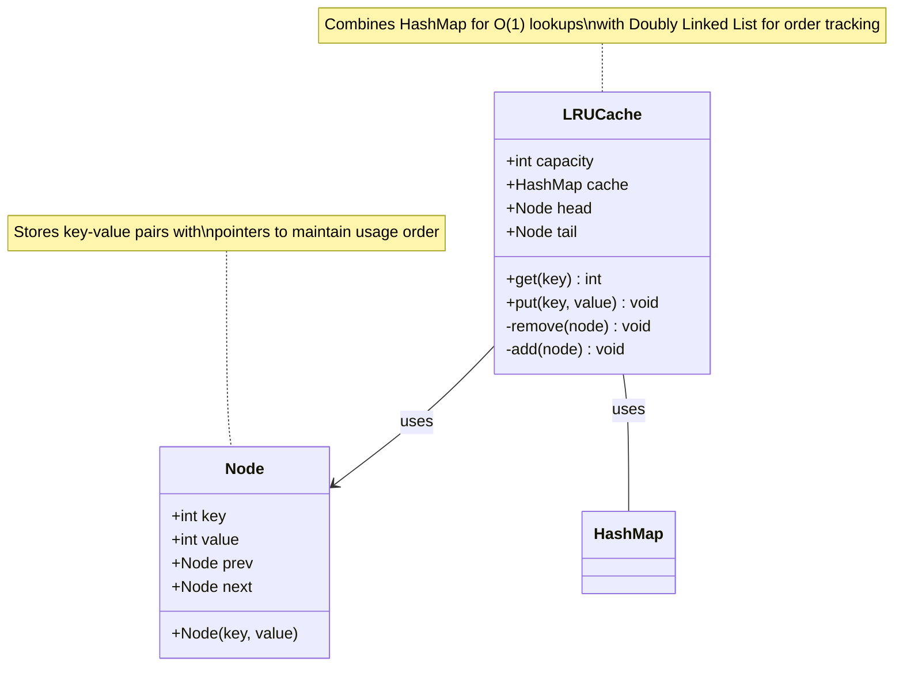
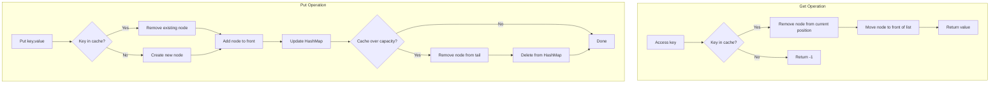
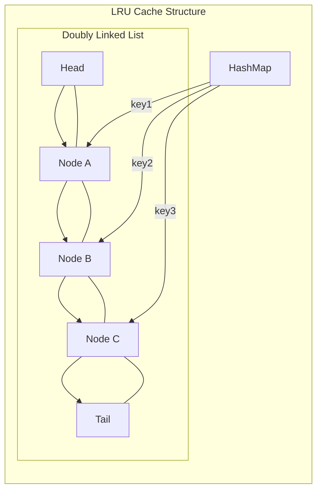

# Data Structures & Algorithms Quiz – Detailed Answer Sheet

Below is the full answer sheet. Each question is restated, then answered with the required elements:

1. **Conceptual Questions:** 1–5  
2. **Code Analysis:** 6–8  
3. **Coding Challenges:** 9–12  
4. **Application Questions:** 13–15  

---

## Answer 1: Time Complexity of Reversing a Singly Linked List Iteratively

**Question (Conceptual):**  
What is the time complexity of reversing a singly linked list iteratively?  
- Explain your reasoning and identify the key operations that contribute to this complexity.

**Answer Overview:**  
Reversing a singly linked list iteratively requires visiting each node once; hence the time complexity is O(n), where n is the number of nodes. The main operations involve pointer manipulation (constant time) for each node.

**Detailed Answer:**  
- An iterative reversal typically uses three pointers: `prev`, `curr`, and `temp` (or `next`).  
- For each of the n nodes, we perform a constant set of operations:
  1. Store the next node (`temp = curr.next`)
  2. Reverse the current pointer (`curr.next = prev`)
  3. Advance `prev` and `curr` to move through the list
- No extra loops or nested operations are required, so the total cost is proportional to n.

**Algorithm Analysis:**
- **Time Complexity:** O(n). Each of the n nodes is processed exactly once.  
- **Space Complexity:** O(1). We use a fixed number of pointer variables, regardless of list size.  
- **Key Operations:** Pointer assignments and reassignments.

**Example Code:**
```python
def reverse_linked_list(head):
    """
    Reverse a singly linked list iteratively.
    
    Time Complexity: O(n)
    Space Complexity: O(1)
    """
    prev = None
    curr = head
    
    while curr:
        temp = curr.next
        curr.next = prev
        prev = curr
        curr = temp
    
    return prev  # 'prev' becomes the new head of the reversed list
```

**SRE Perspective:**
- **Queue-Like Structures:** Linked lists are sometimes used in messaging queues or job schedulers, where reversal might be part of a reordering operation.
- **Memory Efficiency:** O(1) space usage is friendly to systems under heavy load, preserving memory capacity for other critical tasks.
- **Observability:** If a system’s code inadvertently “reverses” an internal list due to a bug, monitoring memory usage or throughput could detect anomalies.

**Common Misconceptions:**
1. **Assuming a Need for Two Passes:** Some believe you need two traversals, but a single pass suffices.
2. **Ignoring Edge Cases:** Lists with 0 or 1 node should also return instantly (already reversed).

**Advanced Considerations:**
- **Recursive Approach:** Also O(n) in time but O(n) in space due to stack usage.
- **Doubly Linked Lists:** Requires updating both next and prev pointers, but still O(n) overall.

**Visual Explanation:**


---

## Answer 2: BFS vs. DFS – Data Structures and Search Order

**Question (Conceptual):**  
Explain the difference between BFS and DFS in terms of their data structures and search order.  
- Provide examples of scenarios where each would be preferable.

**Answer Overview:**  
- **Breadth-First Search (BFS):** Uses a queue, explores neighbors level by level.  
- **Depth-First Search (DFS):** Uses a stack (or recursion), explores one path to its depth before backtracking.

**Detailed Answer:**  
- **BFS:**
  - Data Structure: Queue (FIFO).
  - Search Order: Processes all nodes at the current "distance" before moving to the next level.
  - Typical Use Cases:  
    1. Finding the shortest path in an unweighted graph.  
    2. Layer-by-layer traversal (e.g., shortest path in a maze).
- **DFS:**
  - Data Structure: Stack (or recursion implicitly).
  - Search Order: Goes deep along one branch, then backtracks.
  - Typical Use Cases:  
    1. Detecting cycles in graphs.  
    2. Performing topological sorts in directed acyclic graphs (DAGs).  
    3. Exhaustive searches (backtracking solutions).

**Algorithm Analysis:**  
- **BFS Complexity:**
  - Time: O(V + E) (V = number of vertices, E = number of edges).
  - Space: O(V) in worst case (queue can hold all nodes in the same level).
- **DFS Complexity:**
  - Time: O(V + E) as well.
  - Space: O(V) in worst case if recursion stack or explicit stack holds all nodes.

**Example Code (BFS vs. DFS in Python):**
```python
def bfs(graph, start):
    visited = set()
    queue = [start]
    visited.add(start)
    order = []
    
    while queue:
        node = queue.pop(0)
        order.append(node)
        for neighbor in graph[node]:
            if neighbor not in visited:
                visited.add(neighbor)
                queue.append(neighbor)
    return order

def dfs(graph, start):
    visited = set()
    stack = [start]
    order = []
    
    while stack:
        node = stack.pop()
        if node not in visited:
            visited.add(node)
            order.append(node)
            for neighbor in reversed(graph[node]):
                # Reversed to ensure correct left-to-right adjacency exploration
                if neighbor not in visited:
                    stack.append(neighbor)
    return order
```

**SRE Perspective:**  
- **Dependency Graphs:** BFS helps you see how issues spread layer by layer. DFS helps trace a single deep dependency chain.
- **Incident Response:** BFS is excellent for understanding the breadth of impact. DFS is great for zeroing in on one problematic path.

**Common Misconceptions:**  
1. **Assuming BFS is always faster:** Both BFS and DFS have similar theoretical complexity for graph traversal.
2. **Overlooking recursion limits in DFS:** In large graphs, a recursive DFS can fail due to stack limitations.

**Advanced Considerations:**  
- **Bidirectional Search:** Combines BFS from start and end nodes to reduce search time in large graphs.
- **Iterative Deepening DFS (IDDFS):** Merges BFS’s layer concept with DFS’s memory efficiency.

**Visual Explanation:**


---

## Answer 3: Hash Map for Two-Sum in O(n)

**Question (Conceptual):**  
Describe how a hash map helps solve the two-sum problem in O(n) time.  
- What are the trade-offs compared to other approaches?

**Answer Overview:**  
A hash map stores visited elements and their indices; we can check in O(1) average time if the complement of the current number exists.

**Detailed Answer:**  
- **Two-Sum Problem:** Given an array and a target, find two numbers that sum up to the target.
- **Hash Map Approach:**  
  1. Traverse the list of numbers.  
  2. For each number `num`, compute `complement = target - num`.  
  3. Check if `complement` is in the hash map. If yes, we have found the two indices.  
  4. Otherwise, store the current `num` and its index in the map for future lookup.
- **Trade-Offs:**
  - **Pros:**  
    - O(n) average time (one pass, constant-time lookups).  
    - Simple to implement.  
  - **Cons:**  
    - Requires O(n) extra space.  
    - In worst-case scenarios (poor hash function or many collisions), lookup could degrade, though typically still near O(n) time overall.

**Algorithm Analysis:**  
- **Time Complexity:** O(n) average for a single pass.  
- **Space Complexity:** O(n) for the hash map.  

**Example Code (Hash Map Method):**
```python
def two_sum(nums, target):
    seen = {}
    for i, num in enumerate(nums):
        complement = target - num
        if complement in seen:
            return [seen[complement], i]
        seen[num] = i
    return []
```

**SRE Perspective:**  
- **Performance Under Load:** O(n) time is crucial when handling large data sets in real-time (e.g., filtering logs).
- **Memory vs. Speed Trade-Off:** This approach uses extra memory, which may be constrained in production systems.

**Common Misconceptions:**  
1. **Needing Two Passes:** A single pass is sufficient if you store and check simultaneously.
2. **Sorting First:** Sorting can also solve two-sum in O(n log n) but changes the indices and may require extra steps to track original positions.

**Advanced Considerations:**  
- **Collision Handling:** In practice, a good hash function and map design ensures near-O(1) lookups.
- **Large Datasets:** For extremely large arrays, consider streaming solutions or partial caching.

---

## Answer 4: Quicksort Worst-Case Scenario

**Question (Conceptual):**  
What is the worst-case scenario for quicksort, and why does it happen?  
- How can this scenario be mitigated?

**Answer Overview:**  
- **Worst Case:** O(n²) time if the pivot is consistently the smallest or largest element.  
- **Cause:** Poor pivot selection leads to highly unbalanced partitions every time.

**Detailed Answer:**  
- **Worst-Case Trigger:** When the partition step always splits off a subarray of size n-1 and leaves the rest empty.  
- **Example:** Already sorted or reverse-sorted arrays, if the first or last element is chosen as pivot.  
- **Mitigation Strategies:**  
  1. **Randomized Pivot Selection:** Choose a pivot at random to reduce the chance of consistently bad splits.  
  2. **Median-of-Three Pivot:** Pick the pivot as the median of the first, middle, and last elements to improve partition balance.

**Algorithm Analysis:**  
- **Time Complexity:**  
  - **Average Case:** O(n log n)  
  - **Worst Case:** O(n²)  
- **Space Complexity:**  
  - **In-Place Partition:** O(log n) on average due to recursion stack.  
  - **Worst-Case Recursion Depth:** O(n).

**SRE Perspective:**  
- **Large Data Partitioning:** Quicksort is often used in memory-limited environments for sorting logs or trace data.  
- **Reliability:** A systematic pivot strategy is essential to ensure consistent performance under production loads.

**Common Misconceptions:**  
1. **Quicksort is Always O(n log n):** While usually true in average cases, the worst-case can be O(n²) if the pivot selection is naive.  
2. **Randomization Guarantees Perfect Splits:** It doesn’t guarantee perfect splits, but it statistically reduces the likelihood of repeated worst-case splits.

**Advanced Considerations:**  
- **Dual-Pivot Quicksort (Java’s Implementation)**: Improves performance in practice, but pivot selection still matters.  
- **Hybrid Approaches**: Switch to insertion sort if the subarray size goes below a certain threshold.

---

## Answer 5: Maximum and Minimum Height of a Binary Tree

**Question (Conceptual):**  
For a binary tree with n nodes, what is the maximum possible height?  
- What is the minimum possible height? Under what conditions do these occur?

**Answer Overview:**  
- **Maximum Height:** n, in a “degenerate” (linked list-like) tree.  
- **Minimum Height:** ~log₂(n), in a balanced tree.

**Detailed Answer:**  
- **Maximum Height (Worst Case):** Occurs when each node has only one child, creating a linear chain. In that scenario, the height is n.  
- **Minimum Height (Best Case):** Occurs when the tree is perfectly balanced. The height is O(log n), specifically ⌊log₂(n)⌋ or ⌈log₂(n)⌉, depending on distribution.

**Algorithm Analysis:**  
- **Max Height Calculation:** Repeatedly add a single child – each new node increases height by 1, so height = n for n nodes.  
- **Min Height Calculation:** In a perfectly balanced tree with n nodes, the height is around log₂(n).

**Example Code (Naive Height Calculation):**
```python
def tree_height(root):
    if not root:
        return 0
    return 1 + max(tree_height(root.left), tree_height(root.right))
```

**SRE Perspective:**  
- **System Indexes / Hierarchical Data:** Large degenerate structures can cause performance bottlenecks if traversals always become O(n).  
- **Balancing Strategies:** Balancing is crucial for ensuring consistently log(n) operations in binary search trees, critical for high-throughput systems.

**Common Misconceptions:**  
1. **Thinking Full vs. Complete Trees:** Perfectly balanced vs. a complete but not perfectly balanced tree can differ slightly in height.  
2. **Confusing Height with Depth:** “Height” is often the number of edges on the longest path from root to leaf, while “depth” is the distance from the root to a node.

**Advanced Considerations:**  
- **AVL and Red-Black Trees:** Self-balancing approaches keep height near log(n).  
- **Sparse Trees:** Large n but mostly empty subtrees can effectively approach worst-case heights.

---

## Answer 6: Linked List Reversal Code Analysis

**Question (Code Analysis):**  
Review the following linked list reversal code. Is it correct? If not, identify and fix the issues:

```python
def reverse_linked_list(head):
    prev = None
    curr = head
    
    while curr:
        temp = curr.next
        curr.next = prev
        curr = temp
    
    return prev
```

**Answer Overview:**  
The idea is correct but incomplete: the code never updates `prev` within the loop, causing the reversed pointers to be lost.

**Code Analysis:**  
- **Intent:** Reverse a singly linked list in O(n) time.  
- **Issue:** After `curr.next = prev`, we must move `prev` to `curr` before moving `curr` forward.  
- **Symptom:** Only the first node is effectively reversed; subsequent nodes lose their linkage.

**Algorithm Analysis:**  
- **Time Complexity:** O(n) if implemented correctly.  
- **Space Complexity:** O(1).  
- **Key Operations:** Pointer manipulation in a single pass.

**Output/Behavior:**  
- **Incorrect Implementation:** Results in `prev` pointing to `None` while `curr` marches forward, ultimately losing access to the reversed sub-list.  
- **Corrected Implementation:** Properly updates `prev`.

**Fixed Code:**
```python
def reverse_linked_list(head):
    prev = None
    curr = head
    
    while curr:
        temp = curr.next
        curr.next = prev
        prev = curr   # Missing in the original
        curr = temp
    
    return prev
```

**SRE Perspective:**  
- **Silent Failures:** A partially reversed or disconnected list might not throw immediate errors but cause inconsistencies later.  
- **Testing & Validation:** Comprehensive unit tests and checklists ensure code reliability in production.

**Edge Cases and Considerations:**  
- **Empty List:** Returns None immediately.  
- **Single Node:** Reversal is trivial but must be tested.  
- **Memory Leaks:** In unmanaged languages, be mindful of pointers.

**Visual Explanation:**


---

## Answer 7: BFS Traversal Output on a Tree

**Question (Code Analysis):**  
What will be the output of the following BFS traversal code on this tree?

```text
    1
   / \
  2   3
 / \   \
4   5   6
```

```python
def bfs(root):
    if not root:
        return []
    
    result = []
    queue = [root]
    
    while queue:
        node = queue.pop(0)
        result.append(node.val)
        
        if node.left:
            queue.append(node.left)
        if node.right:
            queue.append(node.right)
    
    return result
```

**Answer Overview:**  
The BFS traversal visits nodes level-by-level, left-to-right at each level. The order will be `[1, 2, 3, 4, 5, 6]`.

**Code Analysis:**  
- **Algorithm:** Standard BFS using a queue.  
- **Process:**  
  - Dequeue `1`, append children (2, 3).  
  - Dequeue `2`, append children (4, 5).  
  - Dequeue `3`, append child (6).  
  - Dequeue `4`, no children.  
  - Dequeue `5`, no children.  
  - Dequeue `6`, no children.

**Algorithm Analysis:**  
- **Time Complexity:** O(n), where n is the number of nodes in the tree. Each node is enqueued and dequeued exactly once.  
- **Space Complexity:** O(n) in the worst case (when the queue holds all nodes of the widest level).

**Output/Behavior:**  
- The final result is `[1, 2, 3, 4, 5, 6]`.

**Optimization Opportunities:**  
- Replacing `pop(0)` with an actual queue data structure (e.g., `collections.deque` in Python) to achieve O(1) pops from the front.

**SRE Perspective:**  
- **Queue Mechanics:** This code demonstrates how queue-based BFS logic is fundamental in job scheduling, work queues, and other site reliability patterns.  
- **Monitoring**: BFS-level order processing might be applied to network discovery, where each level represents a network “hop.”

**Edge Cases and Considerations:**  
- **Empty Tree:** Returns `[]`.  
- **Single Node:** Returns `[root.val]`.

---

## Answer 8: Time and Space Complexity of Two-Sum Implementation

**Question (Code Analysis):**  
Analyze the time and space complexity of the following two-sum implementation:

```python
def two_sum(nums, target):
    seen = {}
    for i, num in enumerate(nums):
        complement = target - num
        if complement in seen:
            return [seen[complement], i]
        seen[num] = i
    return []
```

**Answer Overview:**  
- **Time Complexity:** O(n) on average due to a single pass and O(1) hash lookups.  
- **Space Complexity:** O(n) for storing elements in the hash map.

**Code Analysis:**  
- The function iterates once over the `nums`. For each `num`, it checks if `target - num` is in the dictionary.  
- Dictionary insertions and lookups are generally O(1) average.  
- It returns as soon as a valid pair is found, short-circuiting the loop.

**Algorithm Analysis:**  
- **Time Complexity:** O(n) average; O(n) worst case for certain hash collisions.  
- **Space Complexity:** O(n), storing an entry for each element until we find a pair.

**Output/Behavior:**  
- Returns indices of two values in `nums` that sum to `target`.

**SRE Perspective:**  
- **Performance:** Scales linearly with the size of `nums`, suitable for real-time or large-scale log scanning.  
- **Memory Consideration:** Using O(n) space can be expensive in memory-constrained environments.

**Edge Cases and Considerations:**  
- **No Valid Pair:** Returns `[]` if no solution is found.  
- **Duplicates:** Code handles duplicates by updating the index in the hash map each time.

---

## Answer 9: Linked List Cycle Detection (Floyd’s Tortoise and Hare)

**Question (Coding Challenge):**  
Implement a function to check if a linked list has a cycle (returns to a previously visited node).  
- Your solution should use O(1) extra space.

### Solution Approach
Use **Floyd’s Cycle-Finding Algorithm**:
1. Have two pointers, `slow` and `fast`.  
2. Move `slow` by one step, `fast` by two steps.  
3. If there is a cycle, the fast pointer will eventually meet the slow pointer.

**Algorithm Analysis:**  
- **Time Complexity:** O(n). In the worst case, the fast pointer will traverse the cycle until it meets the slow pointer.  
- **Space Complexity:** O(1). Only two pointers are used.

### Complete Solution
```python
def has_cycle(head):
    """
    Detects a cycle in a singly linked list using Floyd's Tortoise and Hare algorithm.
    
    Time Complexity: O(n)
    Space Complexity: O(1)
    """
    if not head or not head.next:
        return False
    
    slow = head
    fast = head
    
    while fast and fast.next:
        slow = slow.next
        fast = fast.next.next
        if slow == fast:
            return True
    
    return False
```

### Solution Walkthrough
- **Edge Cases:** If the list is empty or has only one node, it cannot have a cycle.  
- **Cycle Meeting Point:** If the pointers meet, that implies a loop.

### Testing Approach
- **Test with No Cycle:** A standard linear list.  
- **Test with Full Cycle:** Last node points to head.  
- **Test with Partial Cycle:** A mid-list node links back to an earlier node.

**SRE Perspective:**
- **Detecting Loops in Dependencies:** Similar approach helps detect circular dependencies in microservices.  
- **Resource Locks:** Floyd’s pattern can detect circular lock wait dependencies.

### Optimization Opportunities
- Already optimal in O(n) time and O(1) space for cycle detection.

### Alternative Approaches
- **Hash Set:** O(n) time, O(n) space.  
- **Marking Visited Nodes:** Feasible in special circumstances if you can modify node structures.

**Visual Explanation:**


---

## Answer 10: Maximum Sum Path from Root to Leaf in a Binary Tree

**Question (Coding Challenge):**  
Write a function that takes a binary tree and returns the maximum sum path from root to leaf.  
- A path must start at the root and end at a leaf.

### Solution Approach
1. Use **DFS** to explore all root-to-leaf paths.  
2. Keep track of the cumulative sum along each path.  
3. Compare sums at leaves, recording the maximum.

**Algorithm Analysis:**  
- **Time Complexity:** O(n) where n is the number of nodes; each node is visited once.  
- **Space Complexity:** O(h), where h is the tree height, due to recursive calls. Worst case is O(n) if the tree is skewed.

### Complete Solution
```python
def max_sum_root_to_leaf(root):
    """
    Returns the maximum sum from root to leaf in a binary tree.
    
    Time Complexity: O(n)
    Space Complexity: O(h) where h is the height of the tree
    """
    if not root:
        return 0
    
    # If leaf node, return its value
    if not root.left and not root.right:
        return root.val
    
    left_sum = max_sum_root_to_leaf(root.left) if root.left else float('-inf')
    right_sum = max_sum_root_to_leaf(root.right) if root.right else float('-inf')
    
    return root.val + max(left_sum, right_sum)
```

### Solution Walkthrough
- **Base Case:** If the current node is a leaf, return its value.  
- **Recursive Case:** Add the node’s value to the maximum of its children’s sums.  
- **Result:** A single integer representing the max sum path.

### Testing Approach
- **Balanced Tree Test**  
- **Skewed Tree Test**  
- **Tree with Negative Values**

**SRE Perspective:**
- **Configuration or Dependency Trees:** If each node represents a component cost, we can find the most “expensive” path from a top-level system to a leaf service.  
- **Error Path Monitoring:** Summation can track severity from root cause to end effect.

### Optimization Opportunities
- **Caching / Memoization:** If tree nodes get revisited. Usually not needed unless the tree is shared among queries.

### Alternative Approaches
- Could also store the actual path, not just the sum.

---

## Answer 11: Find the k-th Largest Element in an Unsorted Array

**Question (Coding Challenge):**  
Implement a function to find the k-th largest element in an unsorted array.  
- Try to optimize beyond the obvious O(n log n) sorting solution.

### Solution Approach
Use a **Quickselect** algorithm, a selection variant of Quicksort:
1. Partition the array around a chosen pivot.  
2. If the pivot is at position `k`, return it.  
3. If `k` < pivot index, recurse on the left; otherwise, recurse on the right.

**Algorithm Analysis:**  
- **Time Complexity:** O(n) average, O(n²) worst-case if pivots are poorly chosen repeatedly.  
- **Space Complexity:** O(1) for in-place partitioning (ignoring recursion stack which is O(log n) on average).

### Complete Solution
```python
import random

def quickselect(nums, k):
    """
    Returns the k-th largest element using Quickselect.
    k is 1-based (1 -> largest, 2 -> 2nd largest, etc.).
    
    Time Complexity: O(n) average, O(n^2) worst-case
    Space Complexity: O(1) in-place, ignoring recursion stack
    """
    # Convert to zero-based index
    index_to_find = len(nums) - k
    
    def partition(left, right):
        pivot_index = random.randint(left, right)
        pivot_value = nums[pivot_index]
        # Move pivot to end
        nums[pivot_index], nums[right] = nums[right], nums[pivot_index]
        store_index = left
        
        for i in range(left, right):
            if nums[i] < pivot_value:
                nums[store_index], nums[i] = nums[i], nums[store_index]
                store_index += 1
        
        nums[store_index], nums[right] = nums[right], nums[store_index]
        return store_index
    
    def select(left, right):
        if left == right:
            return nums[left]
        
        pivot_index = partition(left, right)
        
        if pivot_index == index_to_find:
            return nums[pivot_index]
        elif pivot_index < index_to_find:
            return select(pivot_index + 1, right)
        else:
            return select(left, pivot_index - 1)
    
    return select(0, len(nums) - 1)
```

### Solution Walkthrough
1. **Pivot Selection:** Randomly pick a pivot to reduce worst-case occurrences.  
2. **Partition:** Rearrange array so elements < pivot are left, elements > pivot are right.  
3. **Recursive Narrowing:** Only explore the part of the array containing the k-th largest.

### Testing Approach
- **Small Arrays** (k=1, k=length).  
- **Arrays with Repeated Values**.  
- **Random Large Arrays**.

**SRE Perspective:**
- **Real-Time Monitoring:** Quickselect can fetch top-K resource-consuming processes quickly.  
- **Speed vs. Worst-Case:** For urgent SRE tasks, average O(n) is beneficial, but watch for pathological pivot splits in some data distributions.

### Optimization Opportunities
- **Median-of-medians Algorithm:** Guarantees O(n) worst-case, but with higher constant factors.

### Alternative Approaches
- **Min-Heap** of size k: O(n log k) time.  
- **Sorting**: O(n log n) straightforward but less optimal for large n when only k is needed.

---

## Answer 12: Design a Data Structure with O(1) Insert, Remove, and Get Random

**Question (Coding Challenge):**  
Design a data structure that supports the following operations in O(1) time:
- Insert an element  
- Remove an element  
- Get a random element  

Explain your approach and any trade-offs.

### Solution Approach
Use a **combination** of a hash map and a dynamic array (list):
1. **Array (list) for getRandom():** Allows picking a random index in O(1).  
2. **Hash Map:** Maps each element to its position in the array for O(1) removal.

**Detailed Explanation:**
- **Insert:**
  1. Append the new element to the array.
  2. Store its index in the hash map.
- **Remove:**
  1. Use the hash map to find the element’s index in the array.
  2. Swap the last array element with this element to be removed.
  3. Pop the last element from the array.
  4. Update the hash map for the swapped element’s new index.
- **Get Random:**
  1. Generate a random index within the array size.
  2. Return the element at that index.

### Algorithm Analysis
- **Insert:** O(1) average for appending to an array and updating a hash map.  
- **Remove:** O(1) average for index lookup in the map, constant-time swap, pop from the array, and map update.  
- **Get Random:** O(1) to pick a random index.

### Complete Solution
```python
import random

class RandomizedSet:
    def __init__(self):
        self.array = []
        self.positions = {}
    
    def insert(self, val):
        if val in self.positions:
            return False  # or do nothing
        self.array.append(val)
        self.positions[val] = len(self.array) - 1
        return True
    
    def remove(self, val):
        if val not in self.positions:
            return False  # or do nothing
        
        idx = self.positions[val]
        last_val = self.array[-1]
        
        # Swap element to remove with the last element
        self.array[idx], self.array[-1] = self.array[-1], self.array[idx]
        self.positions[last_val] = idx
        
        # Remove the last element
        self.array.pop()
        del self.positions[val]
        return True
    
    def getRandom(self):
        return random.choice(self.array)
```

### SRE Perspective
- **Caching Pool:** This approach is useful for quickly picking random “nodes” in a cluster or random “tasks” for health checks.  
- **Scalability:** O(1) operations remain fast even with thousands or millions of elements.

### Trade-offs
- **Memory Usage:** Maintaining both a list and a map can be more memory-intensive than a single structure.  
- **Order Preservation:** This structure does not preserve any insertion order.

### Visual Explanation


---

## Answer 13: Using BFS/DFS When Troubleshooting a Service Dependency Issue

**Question (Application):**  
As an SRE, how might you use BFS or DFS when troubleshooting a service dependency issue?  
- Give a concrete example of how graph traversal algorithms could help in an operational scenario.

**Solution Overview:**  
- **BFS** is useful for broad, level-by-level exploration, identifying immediate and subsequent layers of impacted services.  
- **DFS** is helpful when you suspect a deep dependency chain.

**Detailed Solution:**  
- **Service Dependency Graph:** Represent each service as a node, with edges denoting dependencies.  
- **Troubleshooting Steps:**  
  1. **Identify Problem Node(s):** The symptom is reported at a service.  
  2. **BFS:** Explore outward to see which services directly or indirectly rely on the failing service to understand the blast radius.  
  3. **DFS:** If you need to trace a specific path deeper to find a root cause in a chain of dependencies, DFS follows the chain thoroughly.
- **Concrete Example:**  
  - An e-commerce site has a slowdown in the checkout service.  
  - BFS from “Checkout” reveals Payment, Order, and Inventory services are upstream.  
  - DFS might further reveal a deep chain leading to a misconfigured database instance.

**Implementation Considerations:**  
1. **Accurate Dependency Map:** Must maintain an up-to-date graph.  
2. **Concurrency:** Large graphs might require parallel BFS for quicker results.  
3. **Observability:** Each node’s metrics are retrieved to see where the real bottleneck is.

**Sample Implementation:**
```python
def bfs_troubleshoot(start_service, graph):
    queue = [start_service]
    visited = set()
    impacted_services = []
    
    while queue:
        service = queue.pop(0)
        if service not in visited:
            visited.add(service)
            metrics = get_metrics(service)
            impacted_services.append((service, metrics))
            for dep in graph[service]:
                if dep not in visited:
                    queue.append(dep)
    
    return impacted_services
```

**Algorithm Analysis in SRE Context:**  
- **Performance Impact:** BFS or DFS each scale with the number of services (V + E). Typically manageable for moderate microservice ecosystems.

**Real-World SRE Application:**  
- **Incident Response Tools:** Automated BFS from a failing service node quickly builds a list of impacted services, accelerating root cause analysis.

---

## Answer 14: Importance of Algorithm Complexity for System Performance

**Question (Application):**  
Describe a situation where understanding algorithm complexity would be important for system performance in an SRE context.  
- How would you identify and address a potential algorithmic bottleneck?

**Solution Overview:**  
When a system experiences degraded performance, it might be due to an underlying O(n²) or worse algorithm. Recognizing the complexity helps us pinpoint and fix the bottleneck.

**Detailed Solution:**  
- **Concrete Example:** A logging pipeline that processes each incoming log message in O(n²) due to a naive substring matching approach. As traffic grows, throughput plummets.  
- **Identification Steps:**  
  1. **Observability:** Set up metrics for request latency and throughput.  
  2. **Profiling:** Use CPU flame graphs or function profiling to detect functions with suspiciously high CPU usage or repeated calls.  
  3. **Complexity Analysis:** Investigate code to confirm if the performance aligns with an O(n²) pattern.  
- **Addressing Bottlenecks:**  
  1. **Optimize the Approach:** Switch from naive substring matching to KMP (Knuth-Morris-Pratt) or a more efficient algorithm.  
  2. **Caching / Indexing:** For repeated queries, caching or indexing can drastically reduce repeated computations.  
  3. **Scalable Architecture:** If unavoidable, distribute the load or partition data.

**Implementation Considerations:**
1. **Testing:** Use load tests that replicate real traffic patterns.  
2. **Monitoring:** Alert on latencies that exceed certain thresholds.

**Sample Implementation (Hypothetical Fix):**
```python
def efficient_search(log_line, pattern):
    # Possibly use a built-in or well-optimized string search method
    return log_line.find(pattern) != -1
```

**Algorithm Analysis in SRE Context:**
- **Performance Impact:** Large input sizes + poor complexity can cause slowdowns or outages.  
- **Scale Considerations:** If the system must handle 10x traffic in the next quarter, O(n²) might become impractical.

**Real-World SRE Application:**
- Overhauling a log collection pipeline, noticing that once data volume spikes, an O(n²) step becomes the main culprit. After switching to an O(n) approach for pattern searching, system latencies dropped significantly.

---

## Answer 15: Designing an Efficient Caching System

**Question (Application):**  
Explain how you would design an efficient caching system using the data structures we’ve discussed.  
- What would be your eviction policy and why?

**Solution Overview:**  
An efficient caching system balances quick lookups, inserts, and evictions. A popular approach is using a **Hash Map + Doubly Linked List** for LRU (Least Recently Used) caching.

**Detailed Solution:**  
- **LRU Cache Mechanics:**  
  1. **Hash Map:** For O(1) average lookups to find if an item is cached.  
  2. **Doubly Linked List:** Maintains order of usage — most recently used at the front, least recently used at the back.  
  3. **Eviction Policy (LRU):** When capacity is reached, remove the node at the tail (least recently used).  
- **Why LRU?** It’s simple, widely applicable, and effective under many usage patterns where recently used items are likely to be used again.

**Implementation Considerations:**
1. **Capacity:** Predefine maximum capacity based on memory constraints.  
2. **Concurrency:** Use locks or concurrent data structures to handle multi-threaded environments.  
3. **Expiry / TTL:** You might incorporate time-based eviction for ephemeral items.

**Sample Implementation:**
```python
class LRUCache:
    def __init__(self, capacity: int):
        self.capacity = capacity
        self.cache = {}
        # head and tail are dummy nodes for the doubly linked list
        self.head = Node(0, 0)
        self.tail = Node(0, 0)
        self.head.next = self.tail
        self.tail.prev = self.head

    def get(self, key: int) -> int:
        if key in self.cache:
            node = self.cache[key]
            self._remove(node)
            self._add(node)
            return node.value
        return -1

    def put(self, key: int, value: int) -> None:
        if key in self.cache:
            self._remove(self.cache[key])
        node = Node(key, value)
        self._add(node)
        self.cache[key] = node
        if len(self.cache) > self.capacity:
            # Evict least recently used
            lru = self.tail.prev
            self._remove(lru)
            del self.cache[lru.key]

    def _remove(self, node: 'Node'):
        p = node.prev
        n = node.next
        p.next = n
        n.prev = p

    def _add(self, node: 'Node'):
        # Always add right after head
        p = self.head
        n = self.head.next
        p.next = node
        node.prev = p
        node.next = n
        n.prev = node

class Node:
    def __init__(self, key, value):
        self.key = key
        self.value = value
        self.prev = None
        self.next = None
```

**Algorithm Analysis in SRE Context:**
- **Time Complexity:** O(1) average for both `get` and `put`.  
- **Space Complexity:** O(capacity) for storing up to capacity items.

**Real-World SRE Application:**
1. **Web Content Caching:** Minimizes repeated, expensive downstream requests.  
2. **Database Query Caching:** Improves response times for hot queries.

## Visual Explanation:
Comprehensive Explanation of LRU Cache Implementation

I've split the diagram into three parts to address the syntax error. Let me explain each part and how they work together to form an efficient caching system:
1. Class Structure
The first diagram shows the class structure of our LRU Cache:

- LRUCache: The main class that orchestrates everything

 - Stores the capacity limit
- Maintains references to the HashMap and the head/tail of the linked list
- Implements the core operations (get/put) and helper methods

Node: The building block of our doubly linked list

- Stores a key-value pair
- Contains references to previous and next nodes for quick traversal in both directions


The LRUCache uses both a HashMap for fast lookups and a collection of Nodes to form a doubly linked list for tracking usage order.


2. Data Structure Visualization
The second diagram shows how the data structures are connected:

HashMap: Maps keys directly to Node references

- Provides O(1) lookups regardless of cache size
- Each entry points to a specific Node in the linked list

Doubly Linked List: Maintains the usage order

- Most recently used items are near the head
- Least recently used items are near the tail
- Bidirectional links allow quick removal from any position


This diagram shows how we can efficiently access any node through the HashMap and maintain order through the linked list.



3. Cache Operations
The third diagram illustrates the two main operations:

Get Operation:

- Check if the key exists in the HashMap
- If found, remove the node from its current position
- Add the node to the front (marking it as most recently used)
- Return the value
- If not found, return -1

Put Operation:

- Check if the key already exists
- If it exists, remove the old node
- Create a new node with the key-value pair
- Add the node to the front of the list
- Update the HashMap with the new node reference
- If we've exceeded capacity, remove the last node (least recently used)
- Also remove that key from the HashMap


### Why This Design Is Efficient
This implementation is efficient because:

1. Fast Access: HashMap provides O(1) lookups regardless of cache size
2. Fast Updates: Doubly linked list allows O(1) removal and insertion at any position
3. Memory Efficient: We only store each item once (in the Node), with the HashMap just referencing those nodes
4. Automatic Eviction: The least recently used item is always at the tail, ready for removal

#### Why LRU as an Eviction Policy?
LRU (Least Recently Used) is an effective eviction policy because:

1. Temporal Locality: It leverages the principle that recently accessed items are likely to be accessed again soon
2. No Extra Metadata: Unlike some other policies (like LFU), it doesn't require counting or additional tracking
3. Simple Implementation: As shown in the diagrams, it can be implemented efficiently
4. Widely Applicable: Works well for many types of workloads and access patterns

This caching strategy is used extensively in many systems, from browser caches to database query results and API response caching.

---

# Additional Resources

1. **Books:**
   - *Introduction to Algorithms* (CLRS)
   - *Algorithms* by Sedgewick & Wayne  
2. **Online Platforms:**  
   - LeetCode, HackerRank, CodeSignal  
3. **SRE-Focused Reads:**
   - *Site Reliability Engineering* (Google SRE Book)
   - *The Site Reliability Workbook*
   - *Designing Data-Intensive Applications* by Martin Kleppmann

**Reminder**: Always test algorithms with both average and edge-case scenarios, profile under realistic loads, and verify the trade-offs (time vs. space vs. complexity) align with your system requirements.

---
