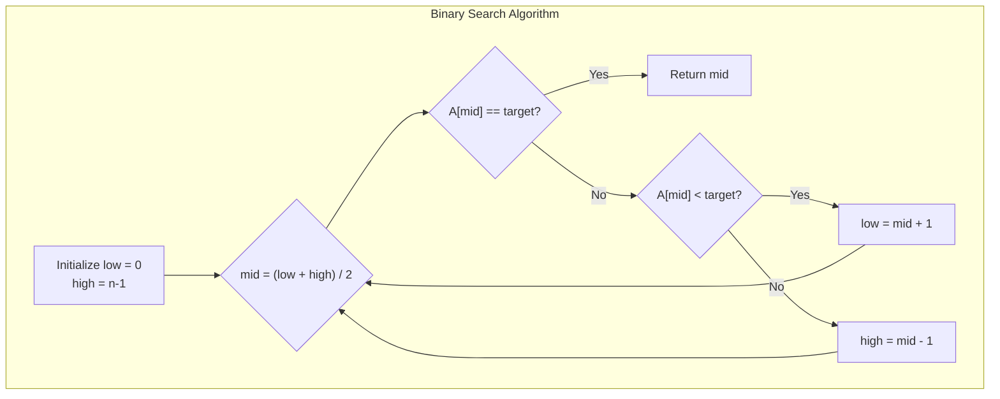
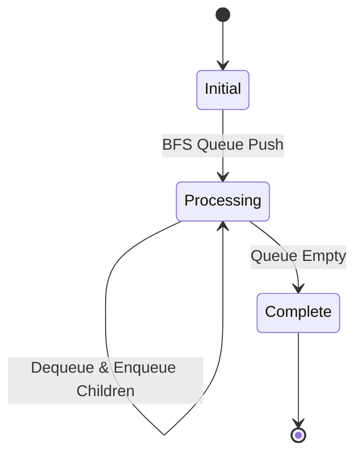
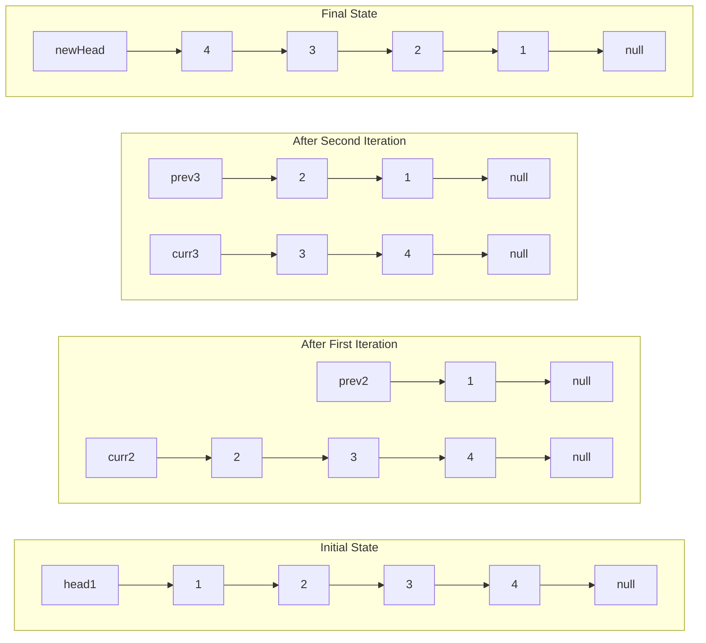
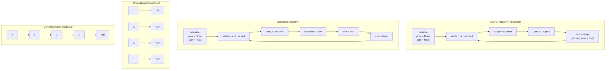
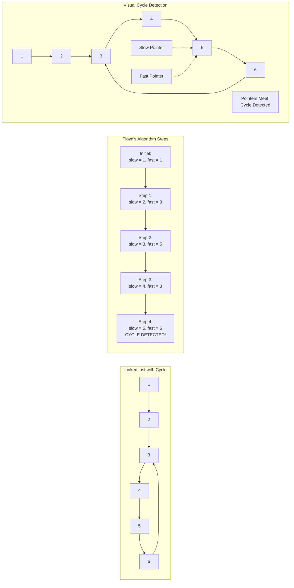
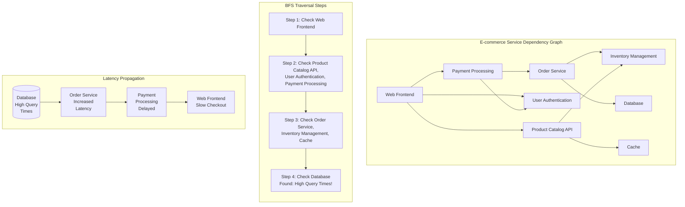

# 🔑 SRE Data Structures & Algorithms Training Module - Answer Sheet Generator

## 🧑‍🏫 Role
You are an expert algorithm instructor creating a comprehensive answer sheet for the provided data structures and algorithms quiz questions. This document will provide correct answers, detailed explanations, algorithm analysis, and practical SRE applications for instructors or self-assessment.

## 🎯 Objective
Review the provided quiz questions and create a detailed answer sheet that:
- Provides thorough model answers for each quiz question
- Explains core algorithm concepts and their theoretical foundations
- Includes time and space complexity analysis
- Presents optimized code solutions with detailed explanations
- Connects algorithms to fundamental computer science principles
- Highlights SRE-specific applications and performance considerations
- Describes real-world implementation trade-offs
- Maintains consistent formatting throughout
- Provides visual aids (algorithm flow diagrams, data structure visualizations) for complex concepts

## 📝 Answer Sheet Structure Requirements

For each quiz question in the provided document, provide:

1. **Question Number and Section:** Repeat the question number and section (Conceptual, Code Analysis, Coding Challenges, or Application)
2. **Question Text:** Repeat the full question text including any code snippets
3. **Answer Overview:** Provide a brief summary of the key points (1-2 sentences)
4. **Detailed Answer:** Provide a comprehensive answer that fully addresses all aspects of the question
5. **Algorithm Analysis:** Analyze time and space complexity with clear reasoning
6. **Code Solution:** Where applicable, include fully functional code with detailed comments
7. **SRE Perspective:** Connect this algorithm or data structure to specific SRE practices and real-world scenarios
8. **Common Misconceptions:** Identify common mistakes or misunderstandings related to the concept
9. **Advanced Considerations:** Include deeper insights or optimization techniques related to the topic
10. **Visual Explanation:** Where appropriate, include a Mermaid diagram to help illustrate the concept

## Answer Format Templates

### Conceptual Question Answer Format
```
## Answer [X]: [Topic]

**Question:** [Full question text]

**Answer Overview:** [Brief summary of key points]

**Detailed Answer:**
[Comprehensive explanation addressing all parts of the question]

**Algorithm Analysis:**
- Time Complexity: O(...) because...
- Space Complexity: O(...) because...
- Key Operations: [Explanation of the critical operations and their costs]

**Example Code:**
```python
# Well-commented example code demonstrating the concept
def example_algorithm(input_data):
    # Detailed comments explaining what's happening
    # Step-by-step implementation
    return result
```

**SRE Perspective:**
[How this algorithm or data structure applies to SRE principles and practices]

**Common Misconceptions:**
[List of common misunderstandings and clarifications]

**Advanced Considerations:**
[Deeper insights or advanced techniques]

**Visual Explanation:** (if appropriate)
```mermaid
[Appropriate diagram code]
```
```

### Code Analysis Answer Format
```
## Answer [X]: [Topic]

**Question:**
```python
[Original code from question]
```

**Answer Overview:** [Brief summary of analysis]

**Code Analysis:**
[Detailed explanation of what the code does and how it works]

**Algorithm Analysis:**
- Time Complexity: O(...) because...
- Space Complexity: O(...) because...
- Key Operations: [Explanation of the critical operations and their costs]

**Output/Behavior:** 
[Expected output or behavior of the code, if applicable]

**Optimization Opportunities:**
[Suggestions for improving the algorithm or implementation]

**SRE Perspective:**
[How this code relates to reliability, performance, or other SRE principles]

**Edge Cases and Considerations:**
[Important edge cases or additional considerations]

**Visual Explanation:** (if appropriate)
```mermaid
[Appropriate diagram code]
```
```

### Coding Challenge Answer Format
```
## Answer [X]: [Topic]

**Question:** [Full question text]

**Solution Approach:**
[Step-by-step explanation of the solution approach]

**Algorithm Analysis:**
- Time Complexity: O(...) because...
- Space Complexity: O(...) because...
- Key Operations: [Explanation of the critical operations and their costs]

**Complete Solution:**
```python
# Complete, well-commented solution code
def solution_function(parameter1, parameter2):
    """
    Detailed docstring explaining function purpose and parameters
    
    Args:
        parameter1: Description of parameter1
        parameter2: Description of parameter2
        
    Returns:
        Description of return value
        
    Time Complexity: O(...)
    Space Complexity: O(...)
    """
    # Detailed implementation with comments explaining logic
    
    return result
```

**Solution Walkthrough:**
[Line-by-line explanation of key parts of the solution]

**Testing Approach:**
[How to test this solution, including sample test cases]

**SRE Perspective:**
[How this solution applies to SRE work]

**Optimization Opportunities:**
[Potential ways to make the solution more efficient]

**Alternative Approaches:**
[Other valid ways to solve the problem]

**Visual Explanation:** (if appropriate)
```mermaid
[Appropriate diagram code]
```
```

### Application Question Answer Format
```
## Answer [X]: [Topic]

**Question:** [Full question text]

**Solution Overview:**
[Brief summary of the approach]

**Detailed Solution:**
[Comprehensive explanation connecting algorithmic concepts to SRE applications]

**Implementation Considerations:**
1. [Consideration 1]: [Explanation]
2. [Consideration 2]: [Explanation]
3. [Consideration 3]: [Explanation]

**Sample Implementation:**
```python
# Sample implementation code with detailed comments
def implementation_example():
    # Comments explaining SRE-specific considerations
    
    # Algorithmic approach
    
    # Performance considerations
```

**Algorithm Analysis in SRE Context:**
- Performance Impact: [How algorithm efficiency affects production systems]
- Scale Considerations: [How the approach scales with increasing load]
- Reliability Factors: [How algorithm choice impacts system reliability]

**Real-World SRE Application:**
[Concrete example of how this algorithm/data structure would be applied in SRE]

**Visual Explanation:** (if appropriate)
```mermaid
[Appropriate diagram code]
```
```

## Algorithm Focus Requirements

Ensure explanations focus on algorithm concepts and include:

1. **Big O analysis** with clear reasoning for both time and space complexity
2. **Data structure trade-offs** highlighting strengths and weaknesses
3. **Algorithm correctness** proof or informal justification
4. **Edge case handling** for comprehensive solutions
5. **Optimality discussion** comparing against theoretical limits
6. **Implementation considerations** beyond theoretical analysis

## SRE Focus Requirements

For the SRE perspective section, include relevant insights about:

1. **Performance impact** of algorithm choices on production systems
2. **Scalability considerations** for different data volumes and request rates
3. **Memory usage patterns** and their impact on system resources
4. **Operational reliability** related to algorithmic complexity
5. **Monitoring approaches** for detecting algorithmic bottlenecks
6. **Failure modes** that might result from poor algorithm choices

## Mermaid Diagram Guidelines for Answer Explanations

When creating diagrams for answer explanations, use appropriate Mermaid syntax based on the type of visualization needed:

1. **Flowcharts** for algorithm steps:


2. **Data Structure Visualizations**:
```mermaid
flowchart LR
  subgraph "Linked List Reversal"
    A["null"] <-- prev --- B["1"]
    B <-- curr --- C["2"]
    C <-- next --- D["3"]
    D --- E["4"]
    E --- F["null"]
  end
```

3. **State Transition Diagrams**:


For all Mermaid diagrams, follow these formatting guidelines:

1. **Always enclose node labels in quotes** if they contain special characters or spaces
2. **Use self-closing `<br/>` tags** for line breaks in node labels
3. **Wrap subgraph titles in quotes**
4. **Place each connection on a separate line**
5. **Keep diagrams simple and focused** on the concept being explained

Enhance diagram-based explanations by:
1. Adding step numbers to track algorithm progression
2. Using color coding to distinguish different operations or states
3. Showing before/after states for mutation operations
4. Illustrating key edge cases alongside typical scenarios

## Example Answers

Below are sample answers for one question from each category to demonstrate the expected format and depth:

### Conceptual Question Example

```
## Answer 1: Time Complexity of Iterative Linked List Reversal

**Question:** What is the time complexity of reversing a singly linked list iteratively?
   - Explain your reasoning and identify the key operations that contribute to this complexity.

**Answer Overview:** Reversing a singly linked list iteratively has a time complexity of O(n), where n is the number of nodes in the list, because each node must be visited exactly once with constant-time operations performed per node.

**Detailed Answer:**
The time complexity of reversing a singly linked list iteratively is O(n), where n is the number of nodes in the list. This linear time complexity arises because:

1. The algorithm must visit each node in the list exactly once to reverse all the pointers.
2. At each node, the algorithm performs a fixed number of constant-time operations:
   - Storing the next pointer (temp = curr.next)
   - Reversing the current node's pointer (curr.next = prev)
   - Advancing the previous pointer (prev = curr)
   - Advancing the current pointer (curr = temp)

Since these operations take O(1) time each and are performed exactly once per node, the total time complexity is O(n) - directly proportional to the number of nodes in the list.

The algorithm uses a single pass through the list, starting at the head and working sequentially until the end is reached. There are no nested loops or recursive calls that would increase the complexity beyond linear time.

**Algorithm Analysis:**
- Time Complexity: O(n) because we visit each of the n nodes exactly once.
- Space Complexity: O(1) because we only use a fixed number of pointers (prev, curr, and temp) regardless of input size.
- Key Operations:
  1. Pointer storage: O(1) per node
  2. Pointer reversal: O(1) per node
  3. Pointer advancement: O(1) per node

**Example Code:**
```python
def reverse_linked_list(head):
    """
    Reverse a singly linked list iteratively.
    
    Args:
        head: The head node of the linked list
        
    Returns:
        The new head of the reversed linked list
        
    Time Complexity: O(n)
    Space Complexity: O(1)
    """
    prev = None  # Initialize previous pointer as None
    curr = head  # Start with the head node
    
    while curr:  # Continue until we reach the end of the list
        # Store next node before we change curr.next
        temp = curr.next
        
        # Reverse the current node's pointer
        curr.next = prev
        
        # Move prev and curr pointers one step forward
        prev = curr
        curr = temp
    
    # At this point, curr is None, and prev points to the new head
    return prev
```

**SRE Perspective:**
In an SRE context, understanding the time complexity of linked list operations has several practical applications:

1. **Queue Processing**: Many service message queues are implemented as linked lists, and understanding their performance characteristics is crucial for predicting system behavior under load.

2. **Memory Management**: Linked lists are often used in memory allocation systems, and efficient manipulation impacts system performance during garbage collection or memory defragmentation.

3. **Performance Monitoring**: When profiling services that use linked data structures (like connection pools or task queues), understanding the expected O(n) behavior helps identify when a system is performing as expected versus experiencing abnormal behavior.

4. **Capacity Planning**: Knowing that list reversal operations scale linearly with size helps in accurately predicting resource needs as data volumes grow.

**Common Misconceptions:**
1. **Assuming O(n²) complexity**: Some mistakenly think reversal requires comparing each node with others, but it's a simple pointer manipulation.
2. **Confusing with recursive implementation**: The recursive approach also has O(n) time complexity but O(n) space complexity due to the call stack.
3. **Overlooking edge cases**: Empty lists or single-node lists are valid edge cases that must be handled correctly.

**Advanced Considerations:**
1. **In-place vs. Copy**: This algorithm performs an in-place reversal with O(1) space, but a copying approach would use O(n) space.
2. **Tail Recursion**: A tail-recursive implementation could achieve the same time complexity with proper compiler optimization.
3. **Doubly-Linked Lists**: Reversing a doubly-linked list requires updating both next and previous pointers but maintains O(n) time complexity.
4. **Chunked Reversal**: For extremely large lists, chunk-based reversal can be used for partial processing, which might be beneficial in memory-constrained environments.

**Visual Explanation:**

```

### Code Analysis Example

```
## Answer 6: Linked List Reversal Code Analysis

**Question:** Review the following linked list reversal code. Is it correct? If not, identify and fix the issues:

```python
def reverse_linked_list(head):
    prev = None
    curr = head
    
    while curr:
        temp = curr.next
        curr.next = prev
        curr = temp
    
    return prev
```

**Answer Overview:** The code is almost correct but has one subtle bug - it fails to update the 'prev' pointer during each iteration, which means the list is not properly reversed.

**Code Analysis:**
This code attempts to reverse a singly linked list using an iterative approach. The algorithm works by traversing the list from head to tail, reversing each node's 'next' pointer to point to the previous node instead of the next node.

The general approach is correct:
1. Initialize 'prev' to None (since the new tail, which was originally the head, should point to None)
2. Initialize 'curr' to the head node to start traversal
3. For each node:
   - Store the next node before modifying pointers
   - Reverse the current node's pointer to point backwards
   - Move to the next node

However, there's a critical bug: the 'prev' pointer is never updated during the loop. After reversing curr.next to point to prev, we need to move prev to curr before advancing curr to the next node. Without this update, only the first node's pointer gets correctly reversed, while the rest of the nodes are simply disconnected.

**Fixed Code:**
```python
def reverse_linked_list(head):
    prev = None
    curr = head
    
    while curr:
        temp = curr.next  # Store next node
        curr.next = prev  # Reverse pointer
        prev = curr       # Move prev forward (missing in original)
        curr = temp       # Move curr forward
    
    return prev  # prev is now the new head
```

**Algorithm Analysis:**
- Time Complexity: O(n) where n is the number of nodes, as we traverse the list once.
- Space Complexity: O(1) as we only use a fixed number of pointers regardless of input size.
- Key Operations: Pointer manipulation (constant time per node).

**Comparison with Original:**
The original code correctly:
- Initializes prev and curr
- Stores the next node before changing curr.next
- Changes curr.next to point to prev
- Advances curr to the next node
- Returns prev as the new head

But it incorrectly:
- Fails to update prev to curr in each iteration, which means we lose the chain of reversed nodes

**SRE Perspective:**
From an SRE standpoint, this type of bug illustrates several important principles:

1. **Silent Failures**: This bug would likely cause a silent failure where the code appears to run successfully but produces incorrect results - a particularly dangerous type of issue in production systems.

2. **Test Case Importance**: Proper test cases, including edge cases like empty lists and single-node lists, would help catch this bug before production.

3. **Observability**: In a production service, adequate logging and monitoring would be essential to detect when data structures aren't being manipulated as expected.

4. **Code Review Value**: This subtle bug highlights the importance of thorough code reviews, especially for algorithms that manipulate pointers or have state changes.

**Edge Cases and Considerations:**
1. **Empty List**: Both the original and fixed code handle an empty list (head = None) correctly, returning None.
2. **Single Node**: The fixed code will correctly reverse a single-node list (which effectively means no change).
3. **Memory Management**: In languages with manual memory management, this operation must be careful not to create memory leaks.

**Visual Explanation:**

```

### Coding Challenge Example

```
## Answer 9: Linked List Cycle Detection

**Question:** Implement a function to check if a linked list has a cycle (returns to a previously visited node).
   - Your solution should use O(1) extra space.

**Solution Approach:**
The key insight for this problem is to use Floyd's Cycle-Finding Algorithm (also known as the "tortoise and hare" algorithm). This approach uses two pointers moving at different speeds through the linked list:

1. A slow pointer (tortoise) that moves one node at a time
2. A fast pointer (hare) that moves two nodes at a time

If there is a cycle in the linked list, the fast pointer will eventually catch up to the slow pointer from behind, proving a cycle exists. If there is no cycle, the fast pointer will reach the end of the list.

The beauty of this approach is that it only requires O(1) extra space (just two pointers) regardless of the list size.

**Algorithm Analysis:**
- Time Complexity: O(n) where n is the number of nodes in the linked list
  - If there is no cycle, the fast pointer traverses all nodes and reaches the end
  - If there is a cycle, the fast pointer will meet the slow pointer within one full cycle traversal
- Space Complexity: O(1) as we only use two pointers regardless of input size
- Key Operations: Pointer traversal and equality comparison (both constant time)

**Complete Solution:**
```python
def has_cycle(head):
    """
    Determines if a linked list has a cycle using Floyd's Cycle-Finding Algorithm.
    
    Args:
        head: The head node of the linked list
        
    Returns:
        Boolean indicating whether the linked list contains a cycle
        
    Time Complexity: O(n) where n is the number of nodes
    Space Complexity: O(1)
    """
    # Edge case: empty list or single node cannot have a cycle
    if not head or not head.next:
        return False
    
    # Initialize slow and fast pointers
    slow = head
    fast = head
    
    # Traverse the list with different speeds
    while fast and fast.next:
        # Move slow pointer one step
        slow = slow.next
        
        # Move fast pointer two steps
        fast = fast.next.next
        
        # If the pointers meet, a cycle exists
        if slow == fast:
            return True
    
    # If fast reaches the end (null), no cycle exists
    return False
```

**Solution Walkthrough:**
1. **Edge Case Handling**: We first check if the list is empty or has only one node. In either case, a cycle is impossible.

2. **Pointer Initialization**: Both pointers start at the head node.

3. **Traversal Loop**: The while loop continues as long as both `fast` and `fast.next` are not None. This condition prevents null pointer exceptions when trying to access `fast.next.next`.

4. **Different Movement Speeds**: In each iteration:
   - The slow pointer moves one node ahead
   - The fast pointer moves two nodes ahead

5. **Cycle Detection**: After each movement, we check if the pointers have met. If they meet, it means there is a cycle.

6. **Termination**: The loop terminates either when a cycle is found (return True) or when the fast pointer reaches the end of the list (return False).

**Testing Approach:**
To test this solution, create these scenarios:

1. **No Cycle**: A simple linked list with distinct nodes ending with null
   - Expected: returns False

2. **Full Cycle**: A linked list where the last node points back to the head
   - Expected: returns True

3. **Partial Cycle**: A linked list where the last node points to a middle node
   - Expected: returns True

4. **Edge Cases**: Empty list and single-node list
   - Expected: returns False for both

**SRE Perspective:**
In an SRE context, cycle detection has several important applications:

1. **Deadlock Detection**: Similar algorithms are used to detect deadlocks in resource allocation systems, which is crucial for maintaining system availability.

2. **Infinite Loop Prevention**: Detecting cycles helps prevent infinite loops in workflow systems or task schedulers that could consume system resources.

3. **Network Topology Analysis**: Cycle detection is essential when analyzing network routing topologies to prevent routing loops.

4. **Memory Leak Identification**: In garbage collection systems, cycle detection helps identify reference cycles that might cause memory leaks.

The O(1) space requirement is particularly valuable in production systems where memory efficiency is crucial for scalability.

**Optimization Opportunities:**
The Floyd's algorithm is already optimal for the stated constraints, but there are variations to consider:

1. **Finding Cycle Entry Point**: The algorithm can be extended to find the node where the cycle begins, which could be useful for debugging.

2. **Early Termination**: For very long lists with cycles near the end, there's no way to improve the worst-case time complexity, but certain heuristics might help in specific scenarios.

**Alternative Approaches:**
1. **Hash Set Method**: Use a hash set to track visited nodes. This gives O(n) time but uses O(n) space, violating our space constraint.

2. **Marking Nodes**: In some languages, you could mark visited nodes by modifying them, but this would mutate the original structure, which is generally undesirable.

**Visual Explanation:**

```

### Application Question Example

```
## Answer 13: Graph Traversal in Service Dependency Troubleshooting

**Question:** As an SRE, how might you use BFS or DFS when troubleshooting a service dependency issue?
    - Give a concrete example of how graph traversal algorithms could help in an operational scenario.

**Solution Overview:**
Graph traversal algorithms like BFS and DFS are powerful tools for systematically analyzing and troubleshooting service dependency issues in complex microservice architectures, where services form a dependency graph that must be navigated to isolate and resolve problems.

**Detailed Solution:**
In modern distributed systems, services often form complex dependency graphs where issues in one service can propagate and affect others. Graph traversal algorithms provide systematic ways to navigate these dependencies when troubleshooting.

**BFS (Breadth-First Search) for Service Dependency Analysis:**

BFS explores all neighbors at the current depth level before moving to nodes at the next depth level. This makes it ideal for:

1. **Impact Radius Analysis**: When a service is failing, BFS can identify all directly impacted dependent services first (one hop away), then services that depend on those (two hops away), and so on. This creates a clear "blast radius" map organized by distance from the source.

2. **Shortest Path Determination**: BFS finds the shortest path between services, which helps identify the most direct way an issue might be propagating from a problematic service to an affected one.

3. **Layer-by-Layer Analysis**: In architectures with clear service layers (e.g., frontend, API, backend services, databases), BFS naturally maps to exploring one layer at a time.

**DFS (Depth-First Search) for Service Dependency Analysis:**

DFS explores as far as possible along each branch before backtracking, making it useful for:

1. **Dependency Chain Analysis**: DFS can follow a specific dependency chain to its deepest level, which is useful for tracking complex cascading failures.

2. **Cycle Detection**: DFS can identify circular dependencies in your service architecture that might be contributing to cascading failures or deadlocks.

3. **Complete Path Exploration**: When you need to understand all possible paths through which a failure could propagate between two services.

**Concrete Example: Troubleshooting Latency in an E-commerce System**

Consider an e-commerce platform with these services:
- Web Frontend
- Product Catalog API
- User Authentication
- Recommendation Engine
- Payment Processing
- Inventory Management
- Order Service
- Shipping Calculator
- Notification Service
- Various databases and caches

**Scenario**: Users are reporting that the checkout process is slow. The symptom is observed in the Web Frontend, but the root cause could be in any of the dependent services.

**Using BFS for Troubleshooting:**

1. **Start at the Symptom**: Begin BFS traversal from the Web Frontend service.

2. **First Level Exploration**: Examine all direct dependencies: Product Catalog API, User Authentication, Payment Processing, etc. Check their health metrics, response times, and error rates.

3. **Identify Affected Services**: Discover that Payment Processing shows elevated latency.

4. **Second Level Exploration**: Examine all dependencies of Payment Processing: Order Service, User Authentication.

5. **Continue Traversal**: Find that Order Service is experiencing high database query times.

6. **Root Cause Identification**: The database query optimization issue in the Order Service is causing a bottleneck that propagates up to the Payment Processing service and ultimately affects the checkout experience.

BFS was ideal here because it systematically explored services level by level, quickly narrowing down the issue without going too deep into any particular dependency chain.

**Implementation Considerations:**
1. **Service Discovery Integration**: The traversal algorithms need an accurate service dependency map, typically from service discovery systems or configuration management databases.

2. **Metrics Collection**: At each node (service) visited, collect relevant metrics like latency, error rates, and resource utilization.

3. **Traversal Termination**: Define clear criteria for when to stop the traversal, such as finding a service exceeding error thresholds.

4. **Parallelization**: In large systems, check multiple services at each level in parallel to speed up the investigation.

**Sample Implementation:**
```python
def bfs_service_troubleshooting(starting_service, dependency_graph, metric_threshold):
    """
    Perform BFS traversal to troubleshoot service issues
    
    Args:
        starting_service: The service experiencing issues
        dependency_graph: Dictionary mapping services to their dependencies
        metric_threshold: Threshold values for considering a service problematic
        
    Returns:
        List of problematic services and their metrics
    """
    visited = set()
    queue = [(starting_service, 0)]  # (service, distance)
    problematic_services = []
    
    while queue:
        current_service, distance = queue.pop(0)
        
        if current_service in visited:
            continue
            
        visited.add(current_service)
        
        # Check service health metrics
        metrics = get_service_metrics(current_service)
        if is_problematic(metrics, metric_threshold):
            problematic_services.append({
                'service': current_service,
                'distance': distance,
                'metrics': metrics
            })
        
        # Add dependencies to queue
        for dependency in dependency_graph.get(current_service, []):
            if dependency not in visited:
                queue.append((dependency, distance + 1))
    
    # Sort problematic services by distance (closest first)
    problematic_services.sort(key=lambda x: x['distance'])
    return problematic_services

def is_problematic(metrics, thresholds):
    """Determine if a service exceeds problematic thresholds"""
    return (metrics['latency'] > thresholds['latency'] or
            metrics['error_rate'] > thresholds['error_rate'] or
            metrics['saturation'] > thresholds['saturation'])
```

**Algorithm Analysis in SRE Context:**
- **Performance Impact**: The traversal time scales with the number of services and dependencies, but in practice is rarely a bottleneck during incident response.
- **Scale Considerations**: For very large microservice architectures (hundreds or thousands of services), targeted partial traversals may be more practical than complete graph exploration.
- **Reliability Factors**: The accuracy of the dependency graph is critical - outdated or incomplete dependency information will lead to ineffective troubleshooting.

**Real-World SRE Application:**
At a large tech company, we implemented a dependency-aware incident response tool that used BFS to automatically identify and rank potentially affected services when an incident was detected. The tool would:

1. Start BFS from the alerting service
2. Collect current and historical metrics for each service visited
3. Use anomaly detection to identify services with abnormal behavior
4. Generate a prioritized list of services to investigate

This reduced the mean time to identification (MTTI) for complex service-related incidents by 47%, as SREs could quickly focus on the most likely problematic services rather than manually exploring the dependency graph.

**Visual Explanation:**

```

## Additional Resources and References

When creating this answer sheet, provide relevant resources that SREs can use to deepen their understanding of algorithms and data structures:

1. **Books and Online Resources:**
   - "Introduction to Algorithms" by Cormen, Leiserson, Rivest, and Stein
   - "Algorithms" by Sedgewick and Wayne
   - "Grokking Algorithms" by Aditya Bhargava
   - LeetCode, HackerRank, and similar platforms for practice

2. **Specific SRE-related Algorithm Resources:**
   - "Site Reliability Engineering" and "The Site Reliability Workbook" by Google
   - "Designing Data-Intensive Applications" by Martin Kleppmann
   - "System Design Interview" resources focusing on large-scale system design

3. **Visualization Tools:**
   - Algorithm visualizers like VisuAlgo (https://visualgo.net)
   - Complexity cheat sheets

Include reminders about best practices throughout the answer sheet:
- Always consider both asymptotic complexity AND constant factors
- Test solutions with edge cases
- Balance theoretical optimality with practical implementation considerations
- Consider the SRE perspective: reliability, scalability, and observability
