# Comprehensive OOP Quiz Educational Resource

## Table of Contents

1. [E-commerce OOP Questions (1–5)](#e-commerce-oop-questions-1–5)
   - [Question 1: Encapsulation in the `Product` Class](#question-1-encapsulation-in-the-product-class)
   - [Question 2: Composition via the `OrderItem` Class](#question-2-composition-via-the-orderitem-class)
   - [Question 3: Purpose of the `Order` Class](#question-3-purpose-of-the-order-class)
   - [Question 4: Relationship Between `Customer` and `Order`](#question-4-relationship-between-customer-and-order)
   - [Question 5: Purpose of the `demonstrate_ecommerce_oop` Function](#question-5-purpose-of-the-demonstrate_ecommerce_oop-function)

2. [Singleton Logger Example (6–10)](#singleton-logger-example-6–10)
   - [Question 6: Singleton Pattern in the `Logger` Class](#question-6-singleton-pattern-in-the-logger-class)
   - [Question 7: Thread Safety in the `Logger` Class](#question-7-thread-safety-in-the-logger-class)
   - [Question 8: Purpose of the `LogLevel` Enum](#question-8-purpose-of-the-loglevel-enum)
   - [Question 9: Preventing Direct Instantiation in the `Logger`](#question-9-preventing-direct-instantiation-in-the-logger)
   - [Question 10: Purpose of the `worker_function` in the Logger Example](#question-10-purpose-of-the-worker_function-in-the-logger-example)

3. [General Concepts (11–15)](#general-concepts-11–15)
   - [Question 11: Single Responsibility Principle (SRP)](#question-11-single-responsibility-principle-srp)
   - [Question 12: Composition vs. Inheritance](#question-12-composition-vs-inheritance)
   - [Question 13: Type Hinting and Code Readability](#question-13-type-hinting-and-code-readability)
   - [Question 14: Purpose of the `__str__` Method](#question-14-purpose-of-the-__str__-method)
   - [Question 15: Handling Order Cancellation in the `Order` Class](#question-15-handling-order-cancellation-in-the-order-class)

4. [Glossary (15 Technical Terms)](#glossary-15-technical-terms)

5. [Conclusion](#conclusion)

---

## E-commerce OOP Questions (1–5)

---

### Question 1: Encapsulation in the `Product` Class

> **What is encapsulation and how is it demonstrated in the `Product` class?**  

#### Answer Overview
**Encapsulation** is about bundling data (attributes) together with the methods (behaviors) that operate on them, while restricting direct external access. In a `Product` class, it typically appears as **private or protected attributes** plus **public getters/setters**.

#### Detailed Answer
**Encapsulation** ensures the internal state of an object remains hidden from outside interference. In Python, one common convention is using a leading underscore (e.g., `_price`) to indicate “private” variables, with read/write access controlled by **setter** or **property** methods.

By gating how attributes like **price** or **stock** can be updated, you can **validate** incoming data (e.g., no negative prices) and **maintain** consistent state.

##### OOP Principle Analysis
- **Encapsulation** is one of the four major OOP pillars. It protects and organizes data by limiting how external code interacts with an object’s internals.
- This fosters **robustness** and **predictability**, as you can refine or refactor internal implementation details without impacting code that uses the `Product`.

#### Example Usage:
```python
class Product:
    """A simple encapsulated product with name, price, and stock."""
    def __init__(self, name, price, stock):
        # Using underscores to indicate private-like attributes
        self._name = name
        self._price = price
        self._stock = stock
    
    @property
    def price(self):
        """Getter for price."""
        return self._price
    
    @price.setter
    def price(self, new_price):
        """Setter for price with validation."""
        if new_price < 0:
            raise ValueError("Price cannot be negative!")
        self._price = new_price
    
    @property
    def stock(self):
        """Getter for stock."""
        return self._stock
    
    def update_stock(self, amount):
        """
        Update the stock by a given amount, 
        preventing negative stock levels.
        """
        if self._stock + amount < 0:
            raise ValueError("Insufficient stock to reduce!")
        self._stock += amount

# Example Usage
if __name__ == "__main__":
    product = Product("Laptop", 1200.0, 10)
    print(product.price)           # 1200.0
    product.price = 1300.0         # Valid price update
    print(product.price)           # 1300.0
    product.update_stock(-5)
    print(product.stock)           # 5
```

#### Example Output
```
$ python product_example.py
1200.0
1300.0
5
```

#### Testing Approach
- **Test 1**: Create a `Product` with valid price/stock, confirm changes via getters.
- **Test 2**: Attempt a negative price assignment; expect a `ValueError`.
- **Test 3**: Attempt to reduce stock below zero; expect a `ValueError`.

#### SRE Perspective
Encapsulation helps maintain **data integrity** in large systems where multiple services might modify product data. **Reliability** is enhanced when invalid states (e.g., negative stock) are prevented at the class boundary.

#### Best Practices
- **Use properties** or getter/setter methods to keep direct attribute access restricted.
- **Validate** updates to ensure consistent state.
- **Document** each public method’s usage clearly.
- **Keep** each class’s responsibility narrow (price, stock logic belongs in `Product`).
- **Raise** explicit exceptions for invalid actions (improves observability).
- **Integrate** type hints so usage is self-documenting.

#### Common Pitfalls

| Pitfall                         | Issue                                              | Better Approach                                   |
|---------------------------------|----------------------------------------------------|---------------------------------------------------|
| Direct public attribute access  | Risk of invalid or unchecked updates              | Use properties with validation                    |
| No validation for negative values | Could set price or stock to invalid states         | Always check data before updating attributes      |
| Overly large classes            | Hard to maintain or test                          | Keep `Product` focusing solely on product logic   |

#### Advanced Considerations
- **Data Classes (Python 3.7+)**: `@dataclass` can simplify boilerplate, but you still need custom setters for validation.
- **Refactoring**: If product logic grows too large, consider splitting shipping or discount logic into separate classes.

#### Visual Explanation
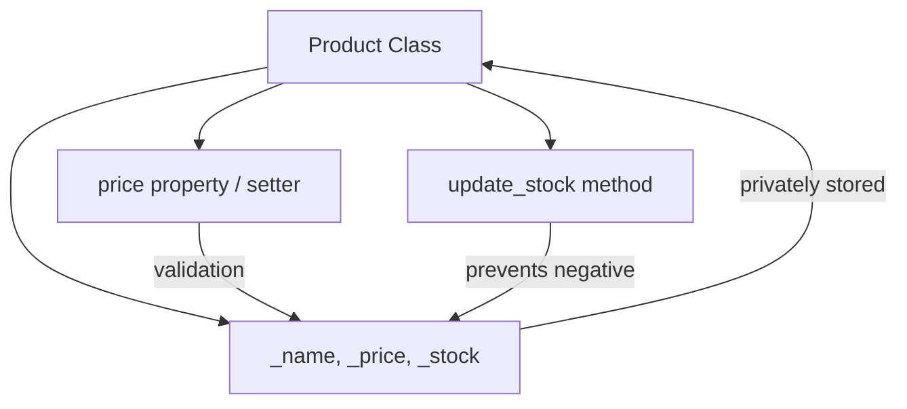

#### Key Takeaways
- **Encapsulation** secures internal state and enforces constraints.
- **Properties** are a Pythonic way to manage attribute access.
- **Validation** at the class boundary prevents invalid states.
- **Narrow** responsibilities lead to maintainable code.
- **Exception handling** is crucial for indicating invalid operations.

---

### Question 2: Composition via the `OrderItem` Class

> **Which principle is demonstrated by the `OrderItem` class containing a `Product` object?**

#### Answer Overview
**Composition** is the principle where one class **has-a** instance of another class. In `OrderItem`, we see it holds a `Product`, establishing a “has-a” relationship rather than “is-a.”

#### Detailed Answer
With **composition**, `OrderItem` depends on `Product` but does not inherit from it. This fosters **loose coupling** and **flexibility**: you can substitute or mock `Product` easily in testing or extend `OrderItem` logic without tangling it with `Product` inheritance.

##### OOP Principle Analysis
- **Composition** is often favored over inheritance because it avoids deep hierarchies and allows classes to be reused in multiple contexts.

#### Example Usage:
```python
class OrderItem:
    """Represents a line item in an order, composing a Product."""
    def __init__(self, product, quantity):
        # Composition: storing a product instance
        self._product = product
        self._quantity = quantity
    
    def get_subtotal(self):
        """Calculate subtotal cost for this item."""
        return self._product.price * self._quantity

if __name__ == "__main__":
    from product_example import Product  # Suppose we have a separate product file
    laptop = Product("Laptop", 999.99, 10)
    order_item = OrderItem(laptop, 2)
    print(order_item.get_subtotal())  # Should be 1999.98
```

#### Example Output
```
$ python order_item_example.py
1999.98
```

#### Testing Approach
- **Test 1**: Construct `OrderItem` with a valid `Product` and quantity, check correct subtotal.
- **Test 2**: Attempt using a mock or stub `Product` (verifying compositional reuse).
- **Test 3**: Zero or negative quantity (validate or handle gracefully).

#### SRE Perspective
**Composition** fosters more maintainable code, which reduces **operational risk**. When classes handle only well-defined parts of the system, it’s simpler to test, deploy, and debug them, improving overall **reliability**.

#### Best Practices
- **Keep** composition relationships clearly documented (“has-a”).
- **Validate** references (e.g., a null or None `Product`).
- **Separate** responsibilities: `Product` logic remains in `Product`, `OrderItem` focuses on quantity and price multiplication.
- **Use** composition if a class logically contains or uses another object.
- **Avoid** deep inheritance hierarchies; composition can reduce complexity.
- **Inject** dependencies for easier testing (Dependency Injection pattern).

#### Common Pitfalls

| Pitfall                              | Issue                                                       | Better Approach                                |
|--------------------------------------|-------------------------------------------------------------|-----------------------------------------------|
| Forcing inheritance `OrderItem : Product` | Incorrect "is-a" relationship: an order item is not a product | Use composition to reflect real relationships |
| Tightly coupling classes             | Harder to substitute or update `Product` logic              | Keep them separate, only referencing needed methods |
| Not revalidating changed `Product` data | Potential mismatch if `Product` price changes after creation | Consider recalculating on demand or handle price updates |

#### Advanced Considerations
- **Testing** with mocks or stubs for the composed class is easier than with inheritance.
- **Performance**: Composition overhead is minimal, but if you have thousands of items, be mindful of memory usage.

#### Visual Explanation
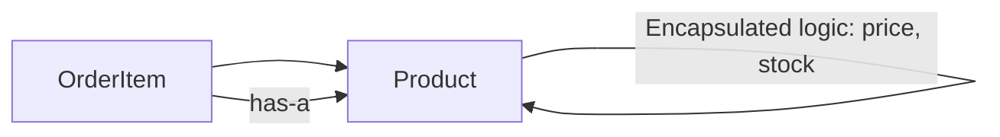

#### Key Takeaways
- **Composition** is “has-a” rather than “is-a.”
- It promotes **loose coupling**.
- **Reuse** is simpler: you can swap out the embedded object easily.
- **Simplifies** code over deep inheritance structures.
- A robust approach to building flexible, maintainable systems.

---

### Question 3: Purpose of the `Order` Class

> **What is the purpose of the `Order` class in the e-commerce system?**

#### Answer Overview
The **`Order`** class **aggregates** multiple `OrderItem`s and manages the overall order flow. It calculates totals, tracks order status, and ensures each item is accounted for.

#### Detailed Answer
An **`Order`** typically includes:
1. A **list** of `OrderItem`s referencing various products.
2. Methods to **add**, **remove**, or **update** items.
3. Logic to **compute** total cost or other fees (tax, shipping).
4. Potentially the **status** (e.g., pending, shipped, canceled).

##### OOP Principle Analysis
- **Encapsulation**: The `Order` hides internal item management behind methods like `add_item` or `calculate_total`.
- **SRP (Single Responsibility Principle)**: The `Order` primarily focuses on order logic, not inventory or user interfaces.

#### Example Usage:
```python
class Order:
    """Manages a collection of OrderItems and calculates the total cost."""
    def __init__(self):
        self._items = []
    
    def add_item(self, order_item):
        """Add an OrderItem to this order."""
        self._items.append(order_item)
    
    def calculate_total(self):
        """Compute the total cost by summing each item's subtotal."""
        total = 0.0
        for item in self._items:
            total += item.get_subtotal()
        return total

if __name__ == "__main__":
    from order_item_example import OrderItem, Product
    # Build an order
    product_a = Product("Headphones", 49.99, 50)
    product_b = Product("Mouse", 19.99, 100)
    
    order = Order()
    order.add_item(OrderItem(product_a, 2))  # 2 headphones
    order.add_item(OrderItem(product_b, 1))  # 1 mouse
    
    print(order.calculate_total())  # 49.99*2 + 19.99*1 = 119.97
```

#### Example Output
```
$ python order_example.py
119.97
```

#### Testing Approach
- **Test 1**: Create an empty `Order`, confirm total is 0.
- **Test 2**: Add multiple items, validate the sum matches expected values.
- **Test 3**: Edge cases with zero quantity or duplicates.

#### SRE Perspective
**Reliable** e-commerce is vital: losing track of items or miscalculating totals leads to revenue loss and negative user experience. The `Order` class is a core part of the transaction boundary—**robust** logic here helps prevent systemic errors.

#### Best Practices
- **Keep** the order logic cohesive (cost calculation, status updates).
- **Avoid** mixing payment or inventory logic here; delegate those to specialized classes.
- **Document** possible order states (pending, confirmed, canceled).
- **Ensure** thread safety if multiple services update the same order (in distributed systems).
- **Log** important steps (e.g., final total) to aid debugging and analytics.
- **Maintain** single responsibility: orders handle item aggregation, not user management.

#### Common Pitfalls

| Pitfall                          | Issue                                               | Better Approach                                  |
|----------------------------------|-----------------------------------------------------|--------------------------------------------------|
| Bloated Order class              | Doing inventory checks, shipping calculations, etc. | Delegate specialized tasks to separate classes   |
| Not recalculating totals properly | Stale totals if items or prices change dynamically   | Recompute or maintain a real-time approach       |
| Hardcoding taxes or shipping logic in Order | Hard to extend or localize                       | Use strategy or separate modules for tax/shipping |

#### Advanced Considerations
- **Transactional** consistency: If an order fails mid-update, you might need rollback logic.
- **Partial shipments**: Real-world orders can be partially fulfilled, complicating the class logic.

#### Visual Explanation
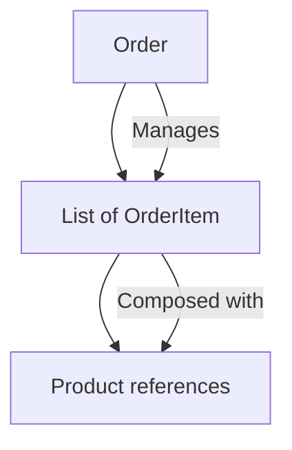

#### Key Takeaways
- **Order** coordinates `OrderItem`s for a final purchase.
- Focus on **aggregation** and total cost calculations.
- Keep external concerns (inventory, payments) out of `Order`.
- Use a **clean** method-based interface for item management.
- Reliable “order management” is crucial for overall system stability.

---

### Question 4: Relationship Between `Customer` and `Order`

> **How does the `Customer` class maintain the relationship between customers and their orders?**

#### Answer Overview
A **`Customer`** typically holds a **list of `Order` objects** that belong to that customer. This is another form of **composition** or **aggregation**, but “one-to-many.”

#### Detailed Answer
The `Customer` class might store:
- Customer identification details
- A **collection** (list/array) of `Order`s representing that user’s purchase history
- Methods to create or retrieve existing orders

##### OOP Principle Analysis
- **Aggregation**: A `Customer` can exist independently of any particular `Order`; they are associated but not strictly locked in a “whole-part” relationship.
- This adheres to the **Single Responsibility** principle: the `Customer` manages user-specific data, while each `Order` manages its own logic.

#### Example Usage:
```python
class Customer:
    """Represents a customer who can have multiple orders."""
    def __init__(self, name):
        self._name = name
        self._orders = []
    
    def add_order(self, order):
        """Associate a new Order with this customer."""
        self._orders.append(order)
    
    def get_orders(self):
        """Retrieve all orders for this customer."""
        return self._orders

if __name__ == "__main__":
    customer = Customer("Alice")
    from order_example import Order, Product, OrderItem
    
    # Create an order
    order1 = Order()
    product_x = Product("Keyboard", 29.99, 20)
    order1.add_item(OrderItem(product_x, 1))
    
    # Attach order to customer
    customer.add_order(order1)
    all_orders = customer.get_orders()
    print(f"{customer._name}'s orders:", len(all_orders))
```

#### Example Output
```
$ python customer_example.py
Alice's orders: 1
```

#### Testing Approach
- **Test 1**: Create a customer with no orders, confirm an empty list is returned.
- **Test 2**: Add multiple orders, confirm they are properly stored.
- **Test 3**: Validate behavior if an order is removed or canceled (still stored or not?).

#### SRE Perspective
**Customer** data is often crucial for loyalty, support, and analytics. Ensuring correct references to orders is essential for retrieving history or reprocessing issues. If references break, reliability and customer satisfaction suffer.

#### Best Practices
- **Maintain** references in a logically consistent manner (no duplication).
- **Consider** lazy loading if a customer can have thousands of orders.
- **Separate** personal data from order data for privacy or compliance reasons (GDPR).
- **Document** the aggregator approach (one-to-many relationship).
- **Keep** customer logic minimal (profile info, shipping addresses) to avoid bloat.
- **Ensure** user-friendly methods for searching or filtering orders.

#### Common Pitfalls

| Pitfall                    | Issue                                                 | Better Approach                                  |
|----------------------------|-------------------------------------------------------|--------------------------------------------------|
| Directly linking customers from the `Order` side only | Might lose track of orders from the customer's perspective | Maintain a two-way link or a domain service layer |
| Storing huge order history in memory  | Potential memory issues for heavy users                   | Use lazy-loading or pagination in a real system  |
| Coupling too many user features into `Customer` class | Bloating the class beyond order references                | Keep user profile, payment info, etc. in specialized classes |

#### Advanced Considerations
- **Data consistency** in distributed systems: `Customer` might be in one microservice, `Order` in another. Ensuring references align is non-trivial.
- **Caching** or partial loading for large volumes of historical orders.

#### Visual Explanation
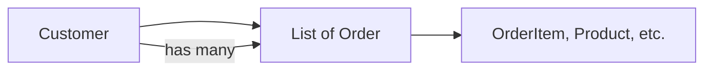

#### Key Takeaways
- A **customer** aggregates multiple orders in a one-to-many association.
- Keep `Customer` logic focused on user data and references to orders.
- Avoid storing massive data sets directly if performance is a concern.
- Maintaining correct references is crucial for reliability and user satisfaction.
- “**Aggregation**” vs. “Composition” can be subtle, but the principle is the same: a container referencing other objects.

---

### Question 5: Purpose of the `demonstrate_ecommerce_oop` Function

> **What is the purpose of the `demonstrate_ecommerce_oop` function?**

#### Answer Overview
This function typically **showcases** how the e-commerce model’s classes (`Product`, `OrderItem`, `Order`, etc.) work together. It’s a **demo** or “driver” method, not a production routine.

#### Detailed Answer
- It **instantiates** classes (e.g., `Product`, `Customer`, `Order`) to highlight key OOP interactions (encapsulation, composition).
- Could demonstrate **adding items to an order**, computing totals, or showing how a `Customer` references multiple orders.

##### OOP Principle Analysis
- **Integration**: This function ties various classes together, illustrating **encapsulation** and **composition** in real usage.
- **Abstraction**: By showing real usage, the function helps abstract away the complex details behind simpler method calls.

#### Example Usage:
```python
def demonstrate_ecommerce_oop():
    """
    Demonstrates main OOP concepts:
    - Creating Products
    - Creating OrderItems
    - Managing an Order
    - Assigning an Order to a Customer
    """
    # 1. Create products
    product_tv = Product("TV", 499.99, 5)
    product_game_console = Product("Game Console", 299.99, 10)
    
    # 2. Create an order with items
    order = Order()
    order.add_item(OrderItem(product_tv, 1))
    order.add_item(OrderItem(product_game_console, 2))
    
    # 3. Create a customer and assign the order
    customer = Customer("Bob")
    customer.add_order(order)
    
    # 4. Print total
    total_cost = order.calculate_total()
    print(f"Total cost of Bob's order: ${total_cost:.2f}")

if __name__ == "__main__":
    demonstrate_ecommerce_oop()
```

#### Example Output
```
$ python ecommerce_demo.py
Total cost of Bob's order: $1099.97
```

#### Testing Approach
- **Test 1**: Run the function, observe correct output with the sample data.
- **Test 2**: Modify the function to add negative quantity or price to confirm it raises an error (test validations).
- **Test 3**: Add more items or orders to confirm it scales and still prints the correct total.

#### SRE Perspective
**Demonstration scripts** are vital for **non-production** verification or **smoke testing**. They show that the OOP design is coherent and help identify major breakages before deeper integration or release.

#### Best Practices
- **Keep** demonstration code separate from production code (avoid bloat).
- **Include** minimal but representative data (like the example).
- **Document** clearly how to run the demonstration.
- **Automate** demos or smoke tests in CI pipelines.
- **Ensure** the sample scenario covers key functionalities.
- **Use** meaningful print statements or logs to clarify the demonstration steps.

#### Common Pitfalls

| Pitfall                            | Issue                                                        | Better Approach                                          |
|------------------------------------|--------------------------------------------------------------|----------------------------------------------------------|
| Using demonstration logic in production environment | Could cause confusion or extra overhead                         | Keep it strictly as a test or educational script         |
| Overly trivial demos that skip error handling | Might hide real-world complexities                            | Show at least one or two edge cases in the demonstration |
| Hardcoding large volumes of data   | Clutters the example and distracts from the core concepts     | Keep data minimal and relevant                           |

#### Advanced Considerations
- **CI Integration**: The demonstration might become a quick test scenario in a pipeline.
- **Interactive** demos: Possibly add interactive prompts for even richer demonstration.

#### Visual Explanation
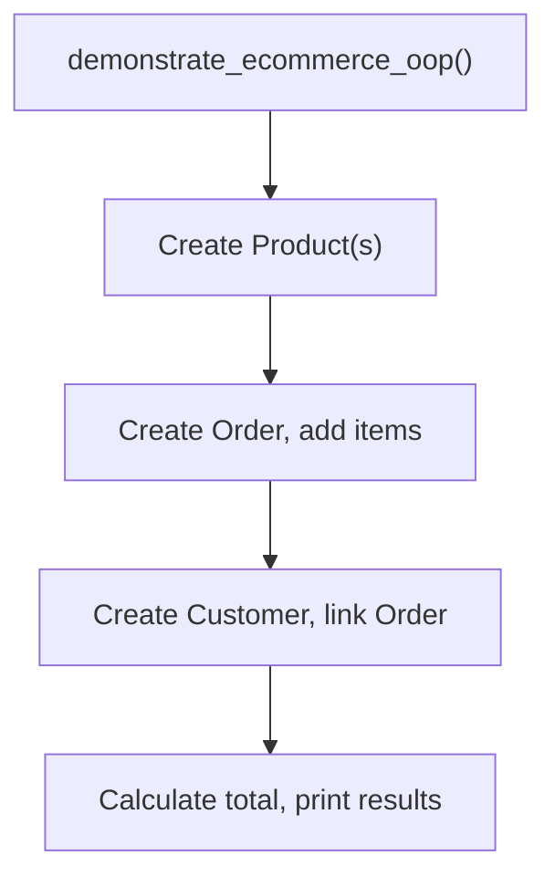

#### Key Takeaways
- Demo functions highlight **OOP design** in action.
- They provide a **practical** overview of how classes interact.
- Keep them simple, showcasing **core features**.
- Avoid merging demonstration logic with production code.
- Great for **smoke testing** or presenting architecture.

---

## Singleton Logger Example (6–10)

---

### Question 6: Singleton Pattern in the `Logger` Class

> **What is the Singleton design pattern and how is it implemented in the `Logger` class?**

#### Answer Overview
A **singleton** ensures **only one** instance of a class exists during the application’s lifetime. The `Logger` class uses a **class-level approach** to control instantiation and provide a global access method.

#### Detailed Answer
**Singleton** typically requires:
1. **Private or restricted** constructor.
2. A **static/class-level** method (e.g., `get_instance()`) that returns the single instance.
3. Possibly **lazy instantiation**: the instance is created only on first request.

##### OOP Principle Analysis
- **Encapsulation**: The class hides its constructor, exposing only one retrieval method.
- **Creational Design Pattern**: The **Singleton** is a well-known pattern in OOP for shared resources.

#### Example Usage:
```python
import threading

class Logger:
    """A thread-safe Singleton Logger."""
    _instance = None
    _instance_lock = threading.Lock()
    
    def __init__(self):
        # Prevent direct instantiation
        if Logger._instance is not None:
            raise RuntimeError("Use get_instance() to get the Logger singleton.")
        self._log_entries = []
    
    @classmethod
    def get_instance(cls):
        """Acquire a lock and create the single instance if it doesn't exist."""
        with cls._instance_lock:
            if cls._instance is None:
                cls._instance = cls()
        return cls._instance
    
    def log(self, message):
        """Add a log entry in a thread-safe manner."""
        # In real usage, might also write to file or standard output
        self._log_entries.append(message)

if __name__ == "__main__":
    logger_a = Logger.get_instance()
    logger_b = Logger.get_instance()
    print(logger_a is logger_b)  # True, same instance
```

#### Example Output
```
$ python logger_singleton.py
True
```

#### Testing Approach
- **Test 1**: Obtain the `Logger` in multiple places, confirm `is` identity is the same object.
- **Test 2**: Attempt direct `Logger()` call, expect a `RuntimeError`.
- **Test 3**: Use threads to concurrently call `get_instance()`, ensure no duplicates.

#### SRE Perspective
Centralizing logging in a **singleton** is common for consistent formatting, synchronization, and easy integration with monitoring. However, SREs must ensure the singleton doesn’t become a **bottleneck** or hamper testing if it’s too global.

#### Best Practices
- **Ensure** thread safety with a lock or synchronization approach.
- **Document** the global nature for clarity (avoid surprising side effects).
- **Limit** the amount of logic in the singleton to prevent monstrous “god objects.”
- **Use** a small, well-defined interface (e.g., `log(message)`).
- **Clean up** or “reset” the singleton in test environments if needed.
- **Monitor** performance overhead if many threads log simultaneously.

#### Common Pitfalls

| Pitfall                                | Issue                                           | Better Approach                                        |
|----------------------------------------|-------------------------------------------------|--------------------------------------------------------|
| Not locking instance creation          | Risk of multiple instances in multi-threaded apps | Use locks or double-checked locking pattern            |
| Overstuffed singleton with extra logic | Creates a giant “god class” that’s hard to maintain | Keep the singleton minimal, focusing on logging only   |
| Relying too heavily on global access   | Reduces testability and clarity                 | Use dependency injection patterns where feasible       |

#### Advanced Considerations
- **Double-checked locking**: Some languages require special memory barriers to ensure thread safety, though Python’s GIL helps but is not always enough for concurrency correctness.
- **Performance**: If logging is frequent and high-volume, an asynchronous or queue-based logger might be better.

#### Visual Explanation
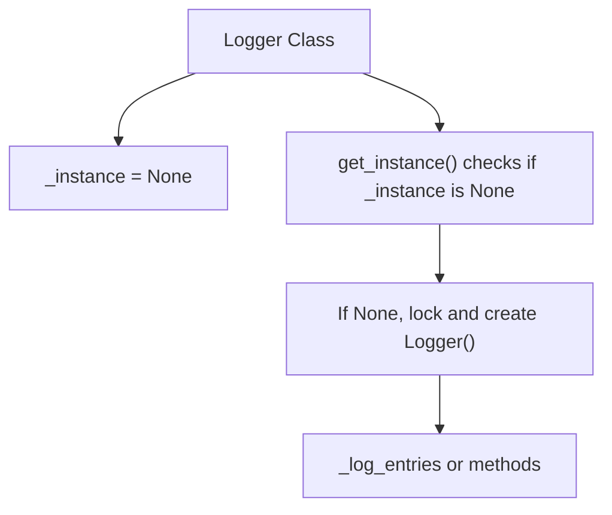

#### Key Takeaways
- **Singleton** ensures exactly one instance across the application.
- **Thread safety** is crucial for concurrent use.
- **Good** for centralized resources like logging, config, etc.
- Overuse can hamper testability and lead to tight coupling.
- Keep the **interface** minimal and well-defined.

---

### Question 7: Thread Safety in the `Logger` Class

> **How does the `Logger` class ensure thread safety?**

#### Answer Overview
**Thread safety** is managed by:
1. A **lock** around instance creation, ensuring only one thread can create or retrieve the instance at a time.
2. Additional synchronization or design patterns for logging operations if needed.

#### Detailed Answer
In the example, a **class-level lock** (`_instance_lock`) is used in `get_instance()`. This prevents two threads from simultaneously creating separate `Logger` objects. Additionally, if the logger writes to a shared resource (e.g., list, file), it may need its own lock mechanism around `log()` calls.

##### OOP Principle Analysis
- **Encapsulation**: Thread-safety details are hidden within the `Logger` class. External code simply calls `get_instance()` or `log()`.
- **Singleton** pattern synergy: The concurrency approach is part of the design.

#### Example Usage:
*(See previous question’s code for `Logger`.)*

```python
def worker_function(id_num):
    logger = Logger.get_instance()
    logger.log(f"Worker {id_num} logging a message.")
```

*(Below is the code snippet demonstrating concurrency)*

#### Example Output
```
$ python threaded_logger_example.py
# Output depends on thread scheduling, but all messages go to the same logger instance
```

#### Testing Approach
- **Test 1**: Spin up multiple threads that call `Logger.get_instance()` repeatedly, confirm only one instance is created.
- **Test 2**: Stress test logging volume, checking for missing or duplicated logs (if the logger writes to disk).
- **Test 3**: Attempt simultaneous access from different parts of the code, verifying no concurrency exceptions.

#### SRE Perspective
**Thread safety** is critical for **reliability**. If concurrency leads to multiple log files or partial writes, diagnosing incidents becomes far harder. Proper synchronization ensures consistent logs.

#### Best Practices
- **Use** well-known concurrency patterns or libraries.
- **Lock** critical sections (instance creation, log writing).
- **Minimize** the time spent in locked code to reduce contention.
- **Document** concurrency assumptions (e.g., is `log()` fully safe for concurrent calls?).
- **Monitor** performance overhead from locking in high-throughput scenarios.
- **Consider** advanced solutions (e.g., queue-based logging) for heavy concurrency.

#### Common Pitfalls

| Pitfall                                   | Issue                                   | Better Approach                                      |
|-------------------------------------------|-----------------------------------------|------------------------------------------------------|
| Not locking `get_instance()` in a multi-threaded environment | Could create multiple singletons        | Use a lock, ensure only one instance is created      |
| Logging operations not synchronized       | Race conditions in log messages         | Add a lock or use thread-safe data structures        |
| Overly large critical sections            | Performance bottlenecks under load      | Keep locks minimal, possibly queue logs asynchronously |

#### Advanced Considerations
- **Queue-based** logging can decouple the logging operation from the main thread, improving throughput.
- **Double-checked locking** technique might be used, but in Python, simpler is often better.

#### Visual Explanation
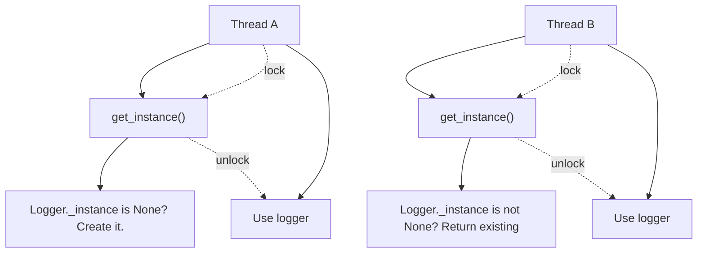

#### Key Takeaways
- **Locks** ensure single-instance creation under concurrency.
- Carefully handle **logging operations** if multiple threads log at once.
- Concurrency is a critical reliability factor in real systems.
- Keep lock usage **focused** to avoid performance hits.
- Always test concurrency thoroughly in staging or dev environments.

---

### Question 8: Purpose of the `LogLevel` Enum

> **What is the purpose of the `LogLevel` enum in the `Logger` class?**

#### Answer Overview
A **`LogLevel`** enum enumerates valid logging levels (e.g., **DEBUG**, **INFO**, **ERROR**). It offers **type safety** and a clear set of recognized constants, preventing “magic strings.”

#### Detailed Answer
In Python, `Enum` provides named constants that can be used in place of raw strings or integers. This clarifies code and reduces errors. For example, `LogLevel.DEBUG` is more explicit than `"debug"`.

##### OOP Principle Analysis
- **Abstraction**: An enum focuses on the essential meaning of levels, hiding raw numeric or textual details.
- **Encapsulation**: The logger can accept these enum values, ensuring no invalid log levels slip in.

#### Example Usage:
```python
from enum import Enum

class LogLevel(Enum):
    DEBUG = 1
    INFO = 2
    WARNING = 3
    ERROR = 4
    CRITICAL = 5

class Logger:
    """Logger that accepts a LogLevel enum."""
    def __init__(self, min_level=LogLevel.INFO):
        self._min_level = min_level
    
    def log(self, message, level=LogLevel.INFO):
        if level.value >= self._min_level.value:
            print(f"[{level.name}] {message}")

if __name__ == "__main__":
    logger = Logger(min_level=LogLevel.DEBUG)
    logger.log("Starting up...", LogLevel.DEBUG)
    logger.log("Something went wrong!", LogLevel.ERROR)
```

#### Example Output
```
$ python logger_enum_example.py
[DEBUG] Starting up...
[ERROR] Something went wrong!
```

#### Testing Approach
- **Test 1**: Log messages at different levels, confirm they appear only if `level >= min_level`.
- **Test 2**: Attempt invalid numeric or string level; verify the code prevents usage (or returns an error).
- **Test 3**: Adjust `min_level` to `LogLevel.WARNING`, retest logs to ensure lower levels are skipped.

#### SRE Perspective
Using a standard **log level** enum helps unify logs across the system. SRE teams rely on consistent levels for **alerting** and **monitoring** (e.g., capturing only ERROR and CRITICAL in production).

#### Best Practices
- **Define** relevant levels for your environment (avoid too many).
- **Document** when to use each level (DEBUG for dev, ERROR for recoverable issues, etc.).
- **Use** the enum throughout the code to avoid confusion or mismatched strings.
- **Keep** defaults sensible (e.g., INFO).
- **Prevent** expansions of new custom levels unless truly needed.
- **Integrate** with external log frameworks that respect these levels.

#### Common Pitfalls

| Pitfall                        | Issue                                       | Better Approach                              |
|--------------------------------|---------------------------------------------|----------------------------------------------|
| Using strings for levels       | Misspellings or inconsistent naming         | Use an enum for uniform naming               |
| Overly granular levels         | Hard to interpret logs, too many categories | Keep a limited set (5 or so levels)          |
| No default level in logger     | Could produce unfiltered spam or discard all logs | Provide a well-chosen default (INFO or WARNING) |

#### Advanced Considerations
- **Dynamic** level changes: Some systems let you adjust the min level at runtime to debug issues in production.
- **Mapping** to standard frameworks (e.g., Python’s built-in `logging` levels).

#### Visual Explanation
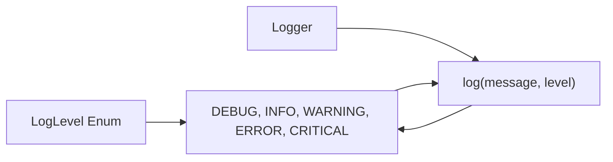

#### Key Takeaways
- Enums provide **type-safe** constants for log levels.
- They prevent **magic strings** and reduce confusion about valid levels.
- Central logging strategies rely on consistent levels for filtering/alerts.
- Keep the number of **levels** minimal for clarity.
- Integrate with standard logging frameworks where possible.

---

### Question 9: Preventing Direct Instantiation in the `Logger`

> **How does the `Logger` class prevent direct instantiation?**

#### Answer Overview
By **raising an error** in the constructor if `_instance` is already set, the `Logger` ensures users call `get_instance()` instead of `Logger()` directly. Python doesn’t have private constructors, so this approach is a workaround.

#### Detailed Answer
Inside `Logger.__init__`, we check if `_instance` is `None`. If not, we **raise** `RuntimeError`. This effectively blocks direct usage of `Logger()`, forcing calls to `Logger.get_instance()`.

##### OOP Principle Analysis
- **Encapsulation**: Creation logic is fully enclosed in the class, restricting how instances arise.
- **Singleton**: This is part of the pattern—only one instance can exist.

#### Example Usage:
*(See earlier `Logger` code. Attempting `Logger()` would throw `RuntimeError`.)*

#### Example Output
```
$ python direct_init_logger.py
RuntimeError: Use get_instance() to get the Logger singleton.
```

#### Testing Approach
- **Test 1**: Manually do `logger = Logger()`; expect `RuntimeError`.
- **Test 2**: Call `Logger.get_instance()` multiple times, no error.
- **Test 3**: Confirm the single instance is reused across the codebase.

#### SRE Perspective
Ensuring **consistent** usage of the logger leads to better **observability** and fewer config mistakes. Blocking direct instantiation also reduces risk of partial initialization.

#### Best Practices
- **Clearly** document your singleton approach so devs know to call `get_instance()`.
- **Enforce** error messages that guide correct usage.
- **Unit test** the creation path thoroughly.
- **Integrate** with the standard Python `logging` if possible for ecosystem synergy.
- **Keep** the logic minimal in `__init__`.
- **Avoid** hidden side effects in `get_instance()` (like heavy logic).

#### Common Pitfalls

| Pitfall                                    | Issue                                                 | Better Approach                                   |
|--------------------------------------------|-------------------------------------------------------|---------------------------------------------------|
| Not raising an error in `__init__`         | Devs might instantiate multiple singletons accidentally | Provide a clear guard + error message in `__init__` |
| Creating partial or uninitialized states   | If direct calls bypass certain setups                 | Force usage of the official method for proper setup |
| Overcomplicating the constructor logic     | Hard to maintain or debug                             | Keep the constructor short and purposeful         |

#### Advanced Considerations
- Some prefer a **module-level** singleton, where the instance is simply defined in the module’s global scope and not enforced in `__init__`.

#### Visual Explanation
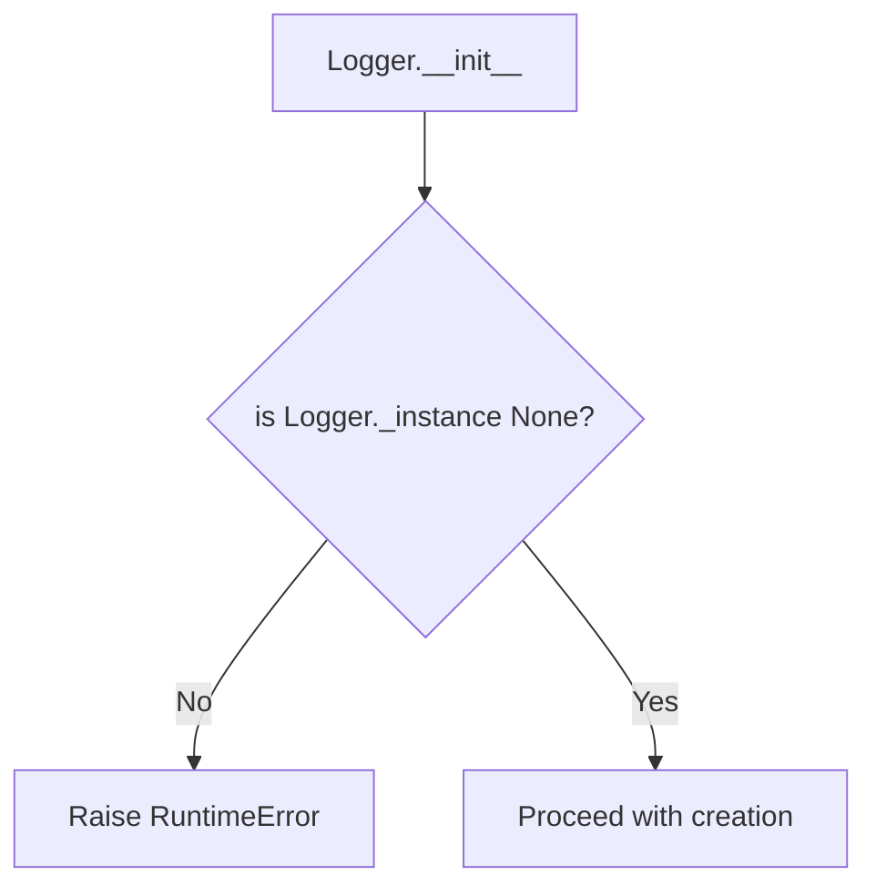

#### Key Takeaways
- Python lacks truly private constructors, so raising an **exception** is a workaround.
- This enforces the **singleton** pattern by redirecting creation to `get_instance()`.
- Minimizes confusion or accidental extra instances.
- Provides a **clear error message** guiding correct usage.

---

### Question 10: Purpose of the `worker_function` in the Logger Example

> **What is demonstrated by the `worker_function` in the `Logger` example?**

#### Answer Overview
A **`worker_function`** typically **retrieves** the singleton logger from multiple threads and logs messages, showcasing that all threads share the **same** logger instance.

#### Detailed Answer
In concurrency demos, `worker_function` might:
1. Call `Logger.get_instance()`
2. Log a message with thread ID or data
3. Illustrate that each log call goes to the same underlying object

##### OOP Principle Analysis
- **Singleton** usage in multi-threaded contexts: it exemplifies concurrency and shared resource patterns.

#### Example Usage:
```python
import threading

def worker_function(worker_id):
    logger = Logger.get_instance()
    logger.log(f"Worker {worker_id} log entry.")

if __name__ == "__main__":
    threads = []
    for i in range(5):
        t = threading.Thread(target=worker_function, args=(i,))
        threads.append(t)
        t.start()
    
    for t in threads:
        t.join()
```

#### Example Output
```
$ python multithread_demo.py
# Output might vary by thread scheduling, e.g.:
# Worker 0 log entry.
# Worker 1 log entry.
# Worker 2 log entry.
# Worker 3 log entry.
# Worker 4 log entry.
```

#### Testing Approach
- **Test 1**: Run multiple threads; verify all logs are in the same list or output.
- **Test 2**: Increase thread count to check concurrency performance.
- **Test 3**: Introduce artificial delays, ensuring no race conditions or multiple instantiations occur.

#### SRE Perspective
**Multiple threads** (or processes) typically exist in real systems. Having a single, thread-safe logging solution avoids inconsistent logs, thus improving **reliability** for debugging and audit trails.

#### Best Practices
- **Use** concurrency patterns (thread pools, async) that are well-documented.
- **Limit** the logger’s overhead—if logging is frequent, consider asynchronous or buffered logging to reduce lock contention.
- **Test** concurrency thoroughly with real or stress-level usage.
- **Ensure** logs preserve ordering or at least maintain consistent timestamps for debug.
- **Separate** large text writes from the main thread if needed for performance.
- **Provide** enough context (thread ID) in logs to track concurrency issues.

#### Common Pitfalls

| Pitfall                            | Issue                                           | Better Approach                              |
|------------------------------------|-------------------------------------------------|----------------------------------------------|
| Not capturing thread ID or context | Hard to diagnose concurrency logs               | Include the worker ID or thread ID in messages |
| Insufficient concurrency tests     | Potential concurrency bugs remain hidden        | Stress test with many threads over a longer period |
| Over-reliance on synchronous logging | Performance bottleneck under heavy load        | Possibly adopt asynchronous logging solutions   |

#### Advanced Considerations
- **Distributed** logging across multiple machines might require a centralized aggregator or logging service, not just a local singleton.
- **Structured** logs can simplify analyzing concurrency behaviors.

#### Visual Explanation
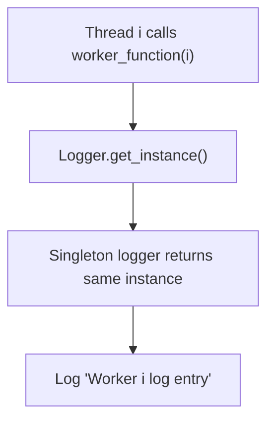

#### Key Takeaways
- Demonstrates how threads share a **single** logger instance in a **thread-safe** manner.
- Confirms concurrency usage of the **singleton** design.
- Critical for **operational** logging in multi-threaded servers or background tasks.
- Focus on **maintaining** performance and clarity in logs.

---

## General Concepts (11–15)

---

### Question 11: Single Responsibility Principle (SRP)

> **What is the Single Responsibility Principle (SRP) and how is it applied in the provided examples?**

#### Answer Overview
The **Single Responsibility Principle** states that each class or module should have **one reason to change**. It’s applied by ensuring each class in the e-commerce or logger examples does exactly **one** job: `Product` manages product data, `Order` manages order logic, etc.

#### Detailed Answer
**SRP** is one of the **SOLID** principles. It helps keep code cohesive, testable, and easy to maintain. For instance, `Product` is purely about product data, `Order` about item aggregation, `Logger` about logging. Merging unrelated functionality leads to confusion and tight coupling.

##### OOP Principle Analysis
- **SRP** fosters **high cohesion**—all methods in a class revolve around a single domain concept. 
- Reduces the chance that changes in one area break unrelated features.

#### Example Usage:
*(All the above e-commerce classes are fairly SRP-compliant: `Product` doesn’t track orders, `Order` doesn’t store user info, etc.)*

```python
# Quick illustration:
class InventoryService:
    """Handles stock validation and replenishment, separate from Order logic."""
    def check_stock(self, product, quantity):
        return product.stock >= quantity

# SRP: InventoryService is only about checking or managing stock.
```

#### Example Output
*(No direct runtime output; the point is code organization.)*

#### Testing Approach
- **Test 1**: Check if each class has a clear domain boundary (no extraneous methods).
- **Test 2**: Attempt adding new features—does it force multiple classes to change or just one?
- **Test 3**: Validate that code is easier to reason about (a more architectural test).

#### SRE Perspective
**Code clarity** is essential for reliability. When classes do one thing, it’s simpler to debug and adapt them under operational pressure or scaling demands. Complex changes become more predictable, reducing downtime risk.

#### Best Practices
- **Identify** core responsibilities before coding a class.
- **Refactor** classes if they accumulate unrelated logic over time.
- **Document** the single purpose: “This class is only for X.”
- **Split** large classes into smaller modules if needed.
- **Use** “one reason to change” as a guiding question during design.
- **Review** code regularly to ensure no scope creep in classes.

#### Common Pitfalls

| Pitfall                            | Issue                                             | Better Approach                                    |
|------------------------------------|---------------------------------------------------|----------------------------------------------------|
| Mega-class or “god object”         | Hard to maintain, many reasons to change          | Break down logically into smaller classes          |
| Combining domain logic + UI logic  | Ties front-end changes to domain changes          | Separate concerns, keep classes domain-focused     |
| Over-splitting classes with trivial roles | Possibly too many micro-classes                 | Balance clarity with practicality                  |

#### Advanced Considerations
- **SOLID** stands for Single Responsibility, Open/Closed, Liskov Substitution, Interface Segregation, Dependency Inversion. 
- **Microservices** at a system scale reflect a similar principle (a service does one main function).

#### Visual Explanation
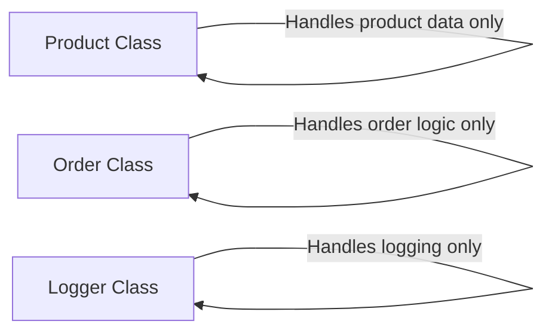

#### Key Takeaways
- **SRP**: Each class should have exactly **one** job or reason to change.
- High **cohesion** leads to simpler testing and maintenance.
- Overly large classes hamper agility and clarity.
- This principle underpins many best practices in OOP.
- A strong foundation for **scalable** and robust systems.

---

### Question 12: Composition vs. Inheritance

> **What is composition and how is it different from inheritance?**

#### Answer Overview
**Composition** means building classes by **including** instances of other classes (“has-a”). **Inheritance** extends a base class (“is-a”). Composition doesn’t create a parent-child hierarchy, whereas inheritance does.

#### Detailed Answer
- **Composition**: `Class A` has a reference to `Class B`. This is a flexible design allowing substituting or mocking `Class B`.
- **Inheritance**: `Class A` extends or overrides `Class B`, forming a parent-child chain.

##### OOP Principle Analysis
- **Favor Composition Over Inheritance** is common advice to keep designs simpler and less coupled.

#### Comparison Table

| Aspect        | Composition                                | Inheritance                              | Typical Usage Scenarios                                                           |
|---------------|--------------------------------------------|-------------------------------------------|-----------------------------------------------------------------------------------|
| Relationship  | **Has-a** (one object contains another)    | **Is-a** (subclass is a specialized form) | E.g., “OrderItem has-a Product” vs. “AdminUser is-a User”                          |
| Coupling      | Looser                                     | Tighter                                   | Composition allows substituting dependencies easily                                |
| Reusability   | High, can be injected or replaced          | Medium, extends existing behavior         | Composition often used for utility classes, inheritance for specialized variations |
| Maintenance   | Generally simpler, fewer side effects      | Changes in base class can ripple widely   | Inheritance can lead to fragile hierarchies if not carefully managed               |
| Example       | `OrderItem -> Product`                     | `Cat -> Animal`                           | Real-world: `Order` contains `OrderItem`s, or `Teacher` inherits from `Person`     |

#### Example Usage:
```python
# Composition example:
class Engine:
    def start(self):
        print("Engine started.")

class Car:
    def __init__(self):
        self._engine = Engine()  # Car "has-a" Engine
    
    def start_car(self):
        self._engine.start()

# Inheritance example:
class Animal:
    def make_sound(self):
        print("Some generic animal sound")

class Cat(Animal):
    def make_sound(self):
        print("Meow")
```

#### Example Output
```
$ python composition_vs_inheritance.py
Engine started.
Meow
```

*(Output lines are conceptual: starting a car prints “Engine started.” Overriding animal sound prints “Meow.”)*

#### Testing Approach
- **Test 1**: Check each approach with realistic usage (`Car.start_car()` vs. `Cat.make_sound()`).
- **Test 2**: Attempt to swap out `Engine` with a mock or a different engine type to see composition’s flexibility.
- **Test 3**: Extend `Animal` with more sub-classes (`Dog`, `Horse`) to confirm inheritance usage.

#### SRE Perspective
**Compositional** designs are typically easier to scale or modify without large refactoring. Systems with deep inheritance can become brittle. **Reliability** benefits from simpler coupling that composition provides.

#### Best Practices
- **Favor** composition for code reuse unless a real “is-a” relationship is clear.
- **Use** inheritance if a subclass truly is a specialized form of the parent.
- **Keep** inheritance hierarchies shallow to avoid complexity.
- **Document** the relationships clearly for maintainers.
- **Test** substitutability or reusability in composition to ensure no hidden dependencies.
- **Review** code for misused inheritance (lack of an actual “is-a” relationship).

#### Common Pitfalls

| Pitfall                             | Issue                                                  | Better Approach                                        |
|-------------------------------------|--------------------------------------------------------|--------------------------------------------------------|
| Overusing inheritance for code reuse | Leads to “incorrect is-a” relationships                | Use composition or utility classes to share behavior   |
| Very deep inheritance chains         | Hard to track which class implements which method      | Keep hierarchies short, or prefer composition          |
| Not leveraging composition’s flexibility | Stuck with a single “baked-in” dependency for classes    | Accept dependency injection for easier testing and changes |

#### Advanced Considerations
- **Multiple Inheritance** can be more confusing; composition is often simpler.
- **Mixin** classes in Python can provide partial behaviors, bridging a middle ground.

#### Visual Explanation
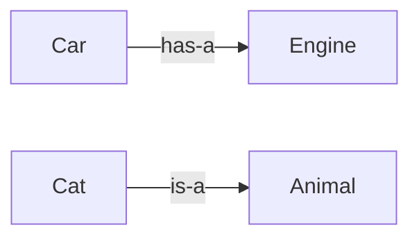

#### Key Takeaways
- **Composition**: **has-a** relationship; more flexible and loosely coupled.
- **Inheritance**: **is-a** relationship; extends or overrides base class.
- Knowing when to use each fosters maintainable, robust designs.
- Overuse of inheritance can lead to fragile code; composition is often safer.
- **SRE** aspects: simpler composition-based designs scale better under changes.

---

### Question 13: Type Hinting and Code Readability

> **What is type hinting and how does it improve code readability?**

#### Answer Overview
**Type hinting** in Python uses **annotations** (`: Type`) on function parameters and return values to clarify expected data types. This provides **self-documentation** and helps tools catch type errors.

#### Detailed Answer
Introduced with **PEP 484**, Python type hints look like `def foo(bar: int) -> str:`. They do not enforce rules at runtime by default but can be checked with **static analysis tools** (e.g., `mypy`).

##### OOP Principle Analysis
- **Abstraction**: Type hints clarify the “what” of an interface without diving into internal details. 
- They do not directly represent an OOP principle but strongly complement encapsulation and clarity.

#### Example Usage:
```python
def add_prices(price_a: float, price_b: float) -> float:
    """
    Adds two floating point prices and returns the result.
    """
    return price_a + price_b

if __name__ == "__main__":
    total = add_prices(9.99, 14.50)
    print(f"Total: {total:.2f}")
```

#### Example Output
```
$ python type_hint_example.py
Total: 24.49
```

#### Testing Approach
- **Test 1**: Pass correct types, confirm normal operation.
- **Test 2**: Pass incorrect type (e.g., a string instead of float) and see if `mypy` or another checker flags it.
- **Test 3**: Integrate type checks in CI pipeline to catch accidental type errors.

#### SRE Perspective
Large or distributed codebases can become **error-prone** with dynamic typing. Type hints reduce production bugs, improving **stability**. They also help new team members navigate code quickly.

#### Best Practices
- **Annotate** function signatures for clarity.
- **Use** third-party checkers like `mypy` or `pyright` to catch mismatches.
- **Be** consistent: If you adopt type hints, do so widely to maximize benefits.
- **Document** complex data structures with `typing` module (e.g., `List[Product]`).
- **Keep** usage optional for quick scripts or prototypes, but strongly recommended for large systems.
- **Combine** with docstrings for thorough understanding.

#### Common Pitfalls

| Pitfall                              | Issue                                             | Better Approach                                  |
|--------------------------------------|---------------------------------------------------|--------------------------------------------------|
| Inconsistent type hints across code  | Confusion and less reliability of analysis         | Ensure uniform adoption of type hints in the repo |
| Relying on hints without static checks | Potential illusions of safety, as Python won't enforce | Use `mypy` or similar to actually validate hints    |
| Overly complicated generics          | Can become hard to read                            | Keep generics straightforward, refactor if needed |

#### Advanced Considerations
- **Gradual Typing**: Python allows partial adoption; code can remain partially unhinted.
- **Type Aliases**, **Protocols**, or **TypedDict** for advanced patterns.

#### Visual Explanation
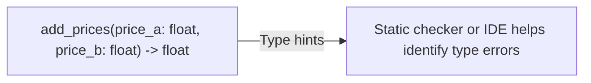

#### Key Takeaways
- **Type hints** add clarity, reduce runtime type bugs.
- Tools like `mypy` or IDEs can ensure consistency.
- They do not add overhead unless combined with runtime checks or advanced usage.
- Very beneficial in large-scale or collaborative environments.
- Encourages **explicit** and self-documenting function definitions.

---

### Question 14: Purpose of the `__str__` Method

> **What is the purpose of the `__str__` method in a class?**

#### Answer Overview
In Python, **`__str__`** returns a **user-friendly string** representation of an object, typically used by `str()` or print statements. This differs from `__repr__`, which is for developers.

#### Detailed Answer
When you do `print(myObject)`, Python calls `myObject.__str__()`. This method is meant to produce a **readable** or **informative** string, such as `"Product: TV, Price: 499.99"`.

##### OOP Principle Analysis
- **Abstraction**: The `__str__` method hides internal data structures, presenting only relevant info.
- **Encapsulation**: The class decides how it wants to portray itself externally.

#### Example Usage:
```python
class Product:
    def __init__(self, name, price):
        self._name = name
        self._price = price
    
    def __str__(self):
        return f"Product[name={self._name}, price={self._price:.2f}]"

if __name__ == "__main__":
    tv = Product("Television", 499.99)
    print(tv)  # calls tv.__str__()
```

#### Example Output
```
$ python str_method_example.py
Product[name=Television, price=499.99]
```

#### Testing Approach
- **Test 1**: Check the output string for correctness.
- **Test 2**: Update product attributes, confirm new `__str__` result is correct.
- **Test 3**: Compare `__str__` vs. `__repr__` if implemented.

#### SRE Perspective
Readable string representations can improve **logging** and debugging. If an incident occurs, seeing a clear “Product[name=X, price=Y]” is far better than “<Product object at 0x1234>.”

#### Best Practices
- **Keep** the `__str__` concise yet informative (avoid huge dumps).
- **Use** formatting to highlight key attributes clearly.
- **Separate** developer debugging info (which might belong in `__repr__`) from user-friendly output.
- **Document** the difference: `__str__` is user-facing, `__repr__` is developer-facing.
- **Test** with multiple data points to ensure consistent output format.
- **Avoid** side effects or large computations in `__str__`.

#### Common Pitfalls

| Pitfall              | Issue                                       | Better Approach                                 |
|----------------------|---------------------------------------------|-------------------------------------------------|
| Overly long strings  | Hard to read, clutters logs                 | Summarize or provide main info only             |
| Missing `__str__` method | Print statements produce cryptic <object ...> references | Implement a descriptive `__str__` for clarity   |
| Combining logic in `__str__`  | Might cause unexpected behavior or overhead   | Keep it as a simple representation function     |

#### Advanced Considerations
- Some frameworks rely on `__str__` for serialization or debugging. Ensure it’s stable.
- For complex objects, consider a short summary plus a method that dumps details if needed.

#### Visual Explanation
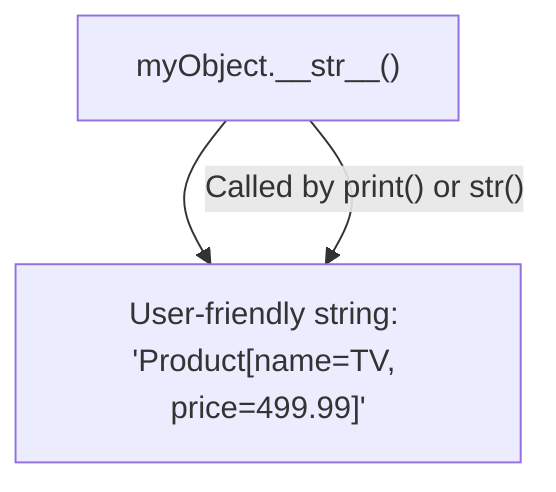

#### Key Takeaways
- `__str__` yields a **user-friendly** textual representation in Python.
- Great for **logging** and debugging.
- Keep it **concise** and relevant.
- Distinguish from `__repr__`, which is for dev inspection.

---

### Question 15: Handling Order Cancellation in the `Order` Class

> **How does the `Order` class handle the cancellation of an order?**

#### Answer Overview
To **cancel** an order, the class typically marks it as canceled (e.g., `status = "Cancelled"`) and **restores** any allocated resources, like returning items to inventory.

#### Detailed Answer
In many e-commerce systems:
1. The `Order` status is updated to “Cancelled.”
2. The item quantities or stock are **reverted** to reflect the canceled items.
3. Optional: Additional steps like **notifications** or **refund** triggers occur outside the `Order` class or via domain events.

##### OOP Principle Analysis
- **Encapsulation**: The `Order` manages its own lifecycle states. 
- **SRP**: The `Order` does not handle refunds or shipping directly. It simply reverts its allocated items and changes internal status.

#### Example Usage:
```python
class Order:
    def __init__(self):
        self._items = []
        self._status = "Pending"
    
    def add_item(self, item):
        self._items.append(item)
    
    def cancel(self):
        """Cancel this order and release stock."""
        self._status = "Cancelled"
        for item in self._items:
            item._product.update_stock(item._quantity)  # return stock
        self._items.clear()

if __name__ == "__main__":
    # Demo
    from product_example import Product
    from order_item_example import OrderItem
    
    product_cam = Product("Camera", 249.99, 5)
    order = Order()
    order.add_item(OrderItem(product_cam, 2))
    
    print(f"Before cancel: product_cam stock = {product_cam.stock}")  # 5
    order.cancel()
    print(f"After cancel: product_cam stock = {product_cam.stock}")   # 7 (stock restored)
```

#### Example Output
```
$ python order_cancel_example.py
Before cancel: product_cam stock = 5
After cancel: product_cam stock = 7
```

#### Testing Approach
- **Test 1**: Cancel an order with items; verify status is “Cancelled” and stock is restored.
- **Test 2**: Cancel an already canceled order; ensure it remains consistent, no double stock increments.
- **Test 3**: Cancel an empty order, confirm no errors occur.

#### SRE Perspective
Proper **cancellation logic** is crucial for system accuracy. If partial cancellations skip returning stock, items can remain incorrectly allocated, leading to **inventory mismatches**. Reliability depends on correct lifecycle transitions.

#### Best Practices
- **Keep** `Order` status transitions consistent (e.g., from “Pending” to “Cancelled”).
- **Revert** resources in a consistent manner (inventory, etc.).
- **Log** cancellations for auditing or incident analysis.
- **Validate** if partial shipment or partial cancellation is needed in real-world scenarios.
- **Document** final states so devs know how to handle canceled vs. completed orders.
- **Ensure** idempotency if “cancel” is called multiple times.

#### Common Pitfalls

| Pitfall                                        | Issue                                                       | Better Approach                                              |
|------------------------------------------------|-------------------------------------------------------------|--------------------------------------------------------------|
| Not returning stock to inventory               | Inventory remains artificially low, blocking future sales    | Always revert allocated resources on cancellation            |
| Failing if cancel is called multiple times     | Might double-increment stock or throw errors                | Make the method idempotent, check if status is already “Cancelled” |
| Over-burdening the `Order` with refunds logic  | Violates SRP, complicates code                              | Keep financial or payment logic in a separate module/class    |

#### Advanced Considerations
- **Distributed** inventory or microservices require an event-based approach to ensure all microservices revert resources consistently.
- **Partial** cancellation might require more granular logic (some items shipped, others not).

#### Visual Explanation
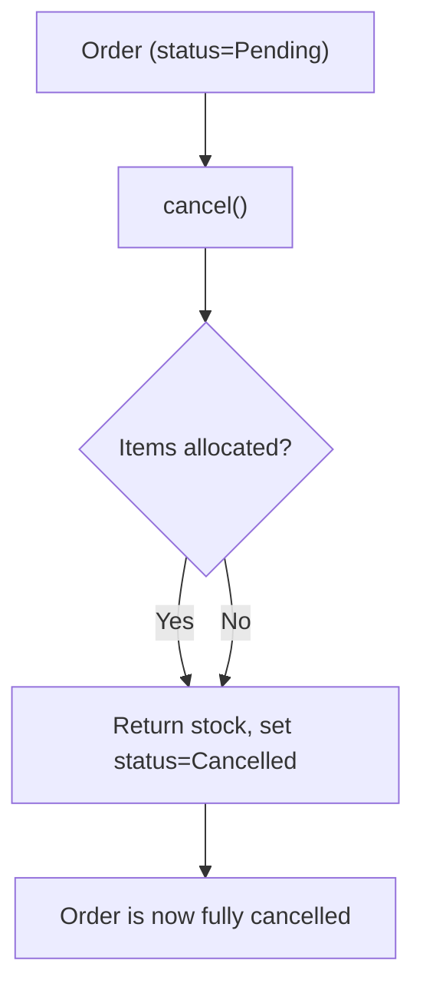

#### Key Takeaways
- **Cancellation** transitions an order to “Cancelled” and reverts resources.
- The `Order` class focuses on order logic, not payment or UI concerns.
- Properly **restoring** inventory is key to system accuracy.
- Cancellations are a vital “rollback” path in e-commerce flows.
- Ensuring consistency avoids inventory or financial discrepancies.

---

## Glossary (15 Technical Terms)

Below are 15 key terms used throughout this resource:

1. **Encapsulation**: An OOP principle that bundles data and methods, restricting direct access to internal state.  
2. **Composition**: A “has-a” relationship where one class includes another as a field or property.  
3. **Inheritance**: An “is-a” relationship where a subclass extends or modifies a parent class.  
4. **Polymorphism**: Allowing different classes to implement the same interface or method signature in varied ways.  
5. **Abstraction**: Hiding internal details and showing only necessary features of an object or system.  
6. **Single Responsibility Principle (SRP)**: A class should have one and only one reason to change.  
7. **Singleton**: A creational design pattern ensuring only one instance of a class exists.  
8. **Thread Safety**: Code design ensuring correct behavior when accessed concurrently by multiple threads.  
9. **Type Hinting**: Python feature that uses annotations to indicate expected parameter and return types.  
10. **Enum**: A data type consisting of a set of named values (constants), improving type safety and clarity.  
11. **`__str__` Method**: A Python special method that defines a user-friendly string representation of an object.  
12. **Mermaid Diagram**: A syntax for creating flowcharts, class diagrams, or sequence diagrams in markdown.  
13. **Dependency Injection**: Providing an object’s dependencies externally rather than creating them internally.  
14. **SOLID**: A set of five design principles (Single Responsibility, Open/Closed, Liskov Substitution, Interface Segregation, Dependency Inversion).  
15. **Data Classes**: Pythonic classes that reduce boilerplate for storing data, introduced in Python 3.7+ with `@dataclass`.

---

## Conclusion

In this **comprehensive educational resource**, we’ve covered:

- **Fundamental OOP Concepts**: **Encapsulation**, **Composition**, **Inheritance**, **Polymorphism**, **SRP**, and others, illustrated through an **e-commerce** example and a **singleton logger** use case.
- **Practical Code Examples**: Demonstrations of real Python usage for products, orders, customers, and concurrency-safe logging.
- **Best Practices & SRE Perspectives**: Emphasizing how design patterns and OOP principles contribute to **reliability**, **maintainability**, and **scalability** in real-world software.
- **Comparison Tables**, **Mermaid Diagrams**, and **Type Hints**: Enhancing clarity for each question and OOP principle, ensuring you can visualize and implement these concepts effectively.

Armed with these **OOP principles** and *best practices*, developers and SREs can create robust, adaptable systems that stand the test of evolving requirements, high concurrency, and large-scale deployments.