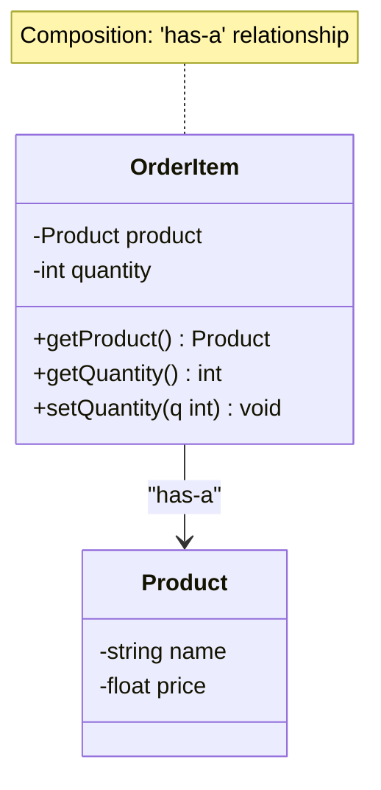

# Object-Oriented Programming Quiz – Detailed Answer Sheet

Below is the full answer sheet. Each question is restated, then answered with the required elements:

## E-commerce OOP Questions (1–5)

---

## Answer 1: Encapsulation in the `Product` Class

**Question:**  
What is encapsulation and how is it demonstrated in the `Product` class?  
- a) Encapsulation is the bundling of data with the methods that operate on that data. It is demonstrated by using private attributes and providing public getter and setter methods.  
- b) Encapsulation is the inheritance of properties from a parent class. It is demonstrated by the `Product` class inheriting from a base class.  
- c) Encapsulation is the ability to create multiple instances of a class. It is demonstrated by creating multiple `Product` objects.  
- d) Encapsulation is the ability to define multiple methods with the same name. It is demonstrated by method overloading in the `Product` class.

**Correct Answer:** a) Encapsulation is the bundling of data with the methods that operate on that data. It is demonstrated by using private attributes and providing public getter and setter methods.

**Answer Explanation:**  
Encapsulation is one of the four fundamental pillars of OOP (encapsulation, inheritance, polymorphism, abstraction). It bundles the data (attributes) and the operations that act on that data (methods) into a single unit (the class) and controls access to the internal state. In the `Product` class:

1. **Attributes** (like `_name`, `_price`, `_stock`) are intended to be private or protected (in Python, typically indicated by a leading underscore).  
2. **Public Methods** such as getters (`getName()`) and setters (`setPrice(...)`) provide controlled read/write access.  
3. **Internal Logic** can validate or transform data in these methods, preventing invalid states and ensuring data integrity.

This design ensures that any changes to how product data is stored or validated do not affect external code that relies only on the public interface.

**Incorrect Options Analysis:**  
- **Option b)** Describes **inheritance**, not encapsulation. Inheritance allows a subclass to extend or override a parent class’s members.  
- **Option c)** Describes instantiation, not encapsulation. Encapsulation is about protecting the internal state of an object.  
- **Option d)** Describes method overloading, a form of **polymorphism**, not encapsulation.

**OOP Principle Explanation (Encapsulation):**  
- **Core Idea:** Keep the internal data private and expose public methods for interaction.  
- **Benefits:** Better maintainability, reduced coupling, and more robust code since external classes cannot directly modify the internal state in unexpected ways.

**SRE Application:**  
- **Configuration Objects:** SREs frequently encapsulate configuration data (e.g., thresholds, environment variables) in classes that validate or sanitize inputs.  
- **Reliability:** If an object that manages a critical resource (like a database connection) is encapsulated, only well-formed and safe operations can be performed.

**Implementation Considerations:**  
- **Validation:** Encapsulation is most helpful when the class enforces constraints (e.g., price cannot be negative).  
- **Pythonic Convention:** Use underscores to indicate “private” attributes, since Python doesn’t strictly enforce privacy.

**Code Example:**
```python
class Product:
    def __init__(self, name, price, stock):
        self._name = name
        self._price = price
        self._stock = stock
    
    @property
    def name(self):
        return self._name
    
    @property
    def price(self):
        return self._price
    
    @price.setter
    def price(self, new_price):
        if new_price < 0:
            raise ValueError("Price cannot be negative")
        self._price = new_price
    
    @property
    def stock(self):
        return self._stock
    
    def update_stock(self, amount):
        """Increase or decrease stock by a given amount."""
        if self._stock + amount < 0:
            raise ValueError("Insufficient stock")
        self._stock += amount
```

---

## Answer 2: Composition via the `OrderItem` Class

**Question:**  
Which principle is demonstrated by the `OrderItem` class containing a `Product` object?  
- a) Inheritance  
- b) Polymorphism  
- c) Composition  
- d) Abstraction

**Correct Answer:** c) Composition

**Answer Explanation:**  
When one class holds an instance (or instances) of another class as a field, this is **composition**. The `OrderItem` class contains a reference to a `Product`, meaning it is composed of a `Product` rather than inheriting from it or merely referencing it abstractly. Composition is a “has-a” relationship:

- An `OrderItem` **has a** `Product`.  
- This is distinct from inheritance (an “is-a” relationship).

**Incorrect Options Analysis:**  
- **Option a) Inheritance:** Would imply `OrderItem` **is** a `Product`, which is conceptually incorrect.  
- **Option b) Polymorphism:** Is about methods taking different forms (overrides, overloads, dynamic binding). Not the case here.  
- **Option d) Abstraction:** Typically involves focusing on essential details while hiding implementation. Not specifically about having a `Product` instance.

**OOP Principle Explanation (Composition):**  
- **Composition** is a design technique where classes are built from other classes, enabling reuse without the tighter coupling of inheritance.  
- **Benefits:** It’s flexible, promotes loose coupling, and is favored in many modern designs (“prefer composition over inheritance”).

**SRE Application:**  
- **Service Architecture:** Microservices may themselves be “composed” of smaller building blocks (databases, caches, etc.).  
- **Infrastructure as Code:** Tools often use composition to describe resources that “contain” or “use” other resources.

**Implementation Considerations:**  
- **Lifetime Management:** Typically, an `OrderItem` object can exist only as long as it references a valid `Product`.  
- **Cloning / Copying:** If `OrderItem` copies the `Product` vs. referencing the same `Product` can be an implementation detail.

**Visual Explanation (Mermaid Class Diagram):**


---

## Answer 3: Purpose of the `Order` Class

**Question:**  
What is the purpose of the `Order` class in the e-commerce system?  
- a) To manage the inventory of products.  
- b) To represent a customer in the system.  
- c) To handle the creation and management of orders, including adding items and calculating the total cost.  
- d) To provide a user interface for the e-commerce system.

**Correct Answer:** c) To handle the creation and management of orders, including adding items and calculating the total cost.

**Answer Explanation:**  
The `Order` class is primarily responsible for aggregating multiple `OrderItem`s, managing them (e.g., adding, removing, updating), and computing the total cost. It may also track order status and handle other order-related operations.

**Incorrect Options Analysis:**  
- **Option a)** Inventory management typically belongs to a separate system or class (like `InventoryService`).  
- **Option b)** The `Customer` class (or a separate user management class) handles customer data.  
- **Option d)** A user interface is generally separate from domain logic in an MVC or layered architecture.

**OOP Principle Explanation:**  
- **Responsibility Segregation:** Each class has a well-defined role. `Order` focuses on order-specific logic, not inventory or UI concerns.

**SRE Application:**  
- **Transaction Boundaries:** In production e-commerce systems, the `Order` class can be integral to ensuring transaction atomicity (i.e., either the order is fully processed, or it isn’t).  
- **Monitoring:** SREs might implement metrics (like “orders placed per minute”) by instrumenting the `Order` creation path.

**Implementation Considerations:**  
- **Atomic Updates:** Ensuring stock is updated only after an order is confirmed (or rolled back if canceled).  
- **Scalability:** Large volumes of orders might require distributed transaction considerations.

---

## Answer 4: Relationship Between `Customer` and `Order`

**Question:**  
How does the `Customer` class maintain the relationship between customers and their orders?  
- a) By inheriting from the `Order` class.  
- b) By storing a list of `Order` objects as an attribute.  
- c) By using a database to store order information.  
- d) By using a dictionary to map customer IDs to orders.

**Correct Answer:** b) By storing a list of `Order` objects as an attribute.

**Answer Explanation:**  
A `Customer` commonly holds a collection (list/array) of `Order` objects, indicating which orders belong to them. This is again **composition**—a `Customer` “has many” `Order`s.

**Incorrect Options Analysis:**  
- **Option a)** Inheriting from `Order` makes no conceptual sense; a customer is not a specialized type of order.  
- **Option c)** While a database can store data, the question specifically asks how the `Customer` class maintains relationships in object-oriented design. The underlying persistence mechanism is separate.  
- **Option d)** A dictionary keyed by customer IDs would typically be part of a data access or repository class, not how the `Customer` object itself tracks them.

**OOP Principle Explanation:**  
- **Aggregation/Composition:** The `Customer` class aggregates multiple `Order`s. This is a standard approach in domain modeling.

**SRE Application:**  
- **Customer-Facing Systems:** If each `Customer` object references many `Order`s, SRE needs to ensure queries and retrievals scale well when a customer has thousands of orders.

**Implementation Considerations:**  
- **Lazy Loading:** In large systems, the list of orders might be loaded on-demand (lazy loading) rather than eagerly, to avoid performance hits.  
- **Memory Footprint:** If a customer’s order history is enormous, storing all orders in memory may be impractical.

---

## Answer 5: Purpose of the `demonstrate_ecommerce_oop` Function

**Question:**  
What is the purpose of the `demonstrate_ecommerce_oop` function?  
- a) To demonstrate the use of inheritance in the e-commerce system.  
- b) To provide a sample workflow that showcases the key OOP concepts used in the e-commerce model.  
- c) To test the performance of the e-commerce system.  
- d) To handle user input and process orders in the e-commerce system.

**Correct Answer:** b) To provide a sample workflow that showcases the key OOP concepts used in the e-commerce model.

**Answer Explanation:**  
The function named `demonstrate_ecommerce_oop` (based on the quiz context) likely creates sample `Product`s, `OrderItem`s, `Order`s, and a `Customer`, demonstrating how these classes interact. It’s a driver function to illustrate OOP usage, not a performance test or production input handler.

**Incorrect Options Analysis:**  
- **Option a)** Inheritance is only one OOP concept; the demo function presumably highlights multiple aspects (encapsulation, composition, etc.).  
- **Option c)** Specific performance tests would require stress testing or benchmarking, which is beyond a simple demonstration.  
- **Option d)** Handling user input typically belongs in a UI or controller layer, not a demonstration function.

**OOP Principle Explanation:**  
- **Demonstration / Example**: In OOP, we often create small “driver” or “demo” functions that instantiate classes and call methods to show how they interoperate.

**SRE Application:**  
- **Proof of Concept:** In SRE contexts, demonstration scripts are useful for verifying that new services or object models integrate with the overall system without impacting production.

**Implementation Considerations:**  
- **Mock Data:** A demonstration function might use mock or hard-coded data to illustrate typical usage scenarios.

---

## Singleton Logger Example (6–10)

---

## Answer 6: Singleton Pattern in the `Logger` Class

**Question:**  
What is the Singleton design pattern and how is it implemented in the `Logger` class?  
- a) The Singleton pattern ensures that only one instance of a class exists. It is implemented using a private constructor and a class method to get the instance.  
- b) The Singleton pattern allows multiple instances of a class to exist. It is implemented using a public constructor.  
- c) The Singleton pattern is used to create a new instance of a class for each thread. It is implemented using thread-local storage.  
- d) The Singleton pattern is used to create a new instance of a class for each request. It is implemented using a factory method.

**Correct Answer:** a) The Singleton pattern ensures that only one instance of a class exists. It is implemented using a private constructor and a class method to get the instance.

**Answer Explanation:**  
The **Singleton** ensures only one instance of a class is ever created, providing a global point of access to that instance. In many languages, this is done by:

1. Making the constructor private or otherwise unreachable outside the class.  
2. Creating a static/class-level “get_instance” method that instantiates the class exactly once.  
3. Storing the instance in a static/class variable.

In Python, you might mimic a private constructor by raising an error if `__init__` is called directly, or by controlling instantiation at the module level.

**Incorrect Options Analysis:**  
- **Option b)** Contradicts the very essence of the Singleton pattern.  
- **Option c)** Describes a **ThreadLocal** approach, not a global singleton.  
- **Option d)** Describes a per-request factory pattern. Not how Singletons typically behave.

**OOP Principle Explanation (Singleton):**  
- **Creational Pattern:** Restricts class instantiation to one object.  
- **Pros:** Easy global access to one instance, good for shared resources.  
- **Cons:** Can hinder testability and create hidden dependencies if overused.

**SRE Application:**  
- **Centralized Logging:** A single logger instance can unify logs from the entire application.  
- **Configuration Manager:** A single source of truth for app-wide settings.

**Implementation Considerations:**  
- **Thread Safety:** The get-instance method must ensure only one thread can create the instance.  
- **Testing:** Singletons can be tricky in unit tests due to persistent state across tests.

---

## Answer 7: Thread Safety in the `Logger` Class

**Question:**  
How does the `Logger` class ensure thread safety?  
- a) By using a global lock for all logging operations.  
- b) By using a lock for the singleton instance creation and a separate lock for logging operations.  
- c) By using a lock for each log level.  
- d) By using no locks and relying on the Global Interpreter Lock (GIL).

**Correct Answer:** b) By using a lock for the singleton instance creation and a separate lock for logging operations.

**Answer Explanation:**  
A robust approach to thread safety in a Singleton logger uses:

1. A **lock** or other synchronization mechanism for instance creation (the “double-checked locking” approach).  
2. A **separate lock** for concurrency control during logging operations, ensuring that log writes don’t interleave incorrectly.

**Incorrect Options Analysis:**  
- **Option a)** A single global lock can cause performance bottlenecks if all operations (creation + logging) are serialized unnecessarily.  
- **Option c)** A lock per log level might be overly granular and complicates code.  
- **Option d)** The Python GIL does not guarantee atomic file I/O or guarantee correct concurrency for instance creation in all scenarios.

**OOP Principle Explanation:**  
- **Encapsulation & Responsibility:** The logger is responsible for its concurrency logic, keeping it private within the class.

**SRE Application:**  
- **Performance and Consistency:** Logging concurrency can be high-volume in production; ensuring correctness under concurrency is crucial.  
- **Debugging:** Race conditions in logging can hamper root cause analysis of incidents.

**Implementation Considerations:**  
- **Lock Granularity:** Fine-grained locking helps parallel performance but adds complexity. The chosen approach (two locks) balances performance vs. complexity.  
- **Atomic Operations:** In some languages, you might use thread-safe data structures or specialized concurrency libraries.

---

## Answer 8: Purpose of the `LogLevel` Enum

**Question:**  
What is the purpose of the `LogLevel` enum in the `Logger` class?  
- a) To define different log levels and ensure type safety.  
- b) To store log messages.  
- c) To manage the log file.  
- d) To handle exceptions in the logging system.

**Correct Answer:** a) To define different log levels and ensure type safety.

**Answer Explanation:**  
The `LogLevel` enum enumerates the possible levels (DEBUG, INFO, WARNING, ERROR, CRITICAL, etc.) in a structured, type-safe way. This ensures the code references valid levels only, clarifies the logging calls, and prevents magic strings.

**Incorrect Options Analysis:**  
- **Option b)** Storing log messages is the job of the logger or an external storage mechanism, not the enum.  
- **Option c)** Managing the log file is typically handled by the logger’s configuration or file handler, not the log level enum.  
- **Option d)** Exceptions are usually handled by the logger’s logic, not the enum.

**OOP Principle Explanation (Enums & Type Safety):**  
- An **enum** is not strictly one of the four OOP pillars, but it’s an OOP-friendly construct that ensures only predefined constants are used.

**SRE Application:**  
- **Structured Logging:** Using enums for log levels fosters uniform logging across modules.  
- **Monitoring:** Tools can parse logs more easily if levels are consistent enumerations.

**Implementation Considerations:**  
- **Extensibility:** Additional levels or custom levels can be added but keep it minimal for clarity.  
- **Compatibility:** The logging framework needs to map these levels to actual logging calls.

---

## Answer 9: Preventing Direct Instantiation in the `Logger`

**Question:**  
How does the `Logger` class prevent direct instantiation?  
- a) By raising a `RuntimeError` if the constructor is called directly.  
- b) By making the constructor private.  
- c) By using a factory method to create instances.  
- d) By using a metaclass to control instance creation.

**Correct Answer:** a) By raising a `RuntimeError` if the constructor is called directly.

**Answer Explanation:**  
In Python, you can’t strictly mark a constructor private like in Java or C#. Instead, the class can check if an instance already exists or rely on a pattern that raises an exception if someone calls `Logger()` directly. Alternatively, some patterns use module-level singletons or metaclasses, but the quiz states that the constructor approach is used.

**Incorrect Options Analysis:**  
- **Option b)** Not directly applicable in Python, which does not have private constructors in the same sense.  
- **Option c)** A factory method is correct for the overall approach, but the question specifically highlights “preventing direct instantiation,” which the code accomplishes with a `RuntimeError`.  
- **Option d)** Metaclasses are more advanced and not typically used for standard Singleton creation.

**OOP Principle Explanation:**  
- **Encapsulation of Creation:** The class itself controls how objects are instantiated, which is a hallmark of the Singleton pattern.

**SRE Application:**  
- **Global Resource Access:** SREs often want to ensure a single manager object for system-wide resources to avoid duplication or conflicts.

**Implementation Considerations:**  
- **Alternative Approach:** Some use a module-level instance in Python to avoid accidental direct calls to the constructor.  
- **Testing Hooks:** You may want a way to reset or replace the singleton in test scenarios.

---

## Answer 10: Purpose of the `worker_function` in the Logger Example

**Question:**  
What is demonstrated by the `worker_function` in the `Logger` example?  
- a) How to create multiple instances of the `Logger` class.  
- b) How to use the singleton logger in a multi-threaded environment.  
- c) How to handle exceptions in the logging system.  
- d) How to log messages to a file.

**Correct Answer:** b) How to use the singleton logger in a multi-threaded environment.

**Answer Explanation:**  
The `worker_function` presumably gets the logger instance via `Logger.get_instance()` and logs from multiple threads, showing that all threads share the same logger instance. This demonstrates concurrency usage of the singleton.

**Incorrect Options Analysis:**  
- **Option a)** The point is to show that the same logger instance is used, not to create multiples.  
- **Option c)** The snippet doesn’t specifically show exception handling.  
- **Option d)** While it does log messages, the main demonstration is concurrency usage.

**OOP Principle Explanation:**  
- This demonstrates how singletons behave in multi-threaded scenarios—one global instance, protected by locks.

**SRE Application:**  
- **Parallel Logging:** Systems often handle concurrency at scale; ensuring logs don’t get scrambled is essential.  
- **Shared State:** Singletons can help unify logging, though SREs must ensure high concurrency doesn’t degrade performance.

**Implementation Considerations:**  
- **Thread Pool or Fork/Join:** The example might use `threading.Thread`, each calling the same logger.

---

## General Concepts (11–15)

---

## Answer 11: Single Responsibility Principle (SRP)

**Question:**  
What is the Single Responsibility Principle (SRP) and how is it applied in the provided examples?  
- a) SRP states that a class should have only one reason to change. It is applied by ensuring each class has a clear, focused purpose.  
- b) SRP states that a class should inherit from only one parent class. It is applied by avoiding multiple inheritance.  
- c) SRP states that a class should have multiple responsibilities. It is applied by combining related functionalities into a single class.  
- d) SRP states that a class should be responsible for creating its own instances. It is applied by using factory methods.

**Correct Answer:** a) SRP states that a class should have only one reason to change. It is applied by ensuring each class has a clear, focused purpose.

**Answer Explanation:**  
The Single Responsibility Principle is one of the SOLID principles. It aims to keep classes small and cohesive:

- A class that does one thing well is easier to maintain, test, and extend without side effects.  
- In the e-commerce example, the `Order` class handles order logic, the `Product` class handles product data, etc., each focusing on a single concern.

**Incorrect Options Analysis:**  
- **Option b)** That’s more about single inheritance vs. multiple inheritance, unrelated to SRP.  
- **Option c)** Contradicts SRP. Combining multiple functionalities into one class can cause it to have multiple reasons to change.  
- **Option d)** That’s closer to the **Factory** or **Abstract Factory** pattern, not SRP.

**OOP Principle Explanation (SRP):**  
- **One Responsibility:** Minimizes coupling and fosters clarity.  
- **High Cohesion:** Encourages each class to do one thing well.

**SRE Application:**  
- **Modular Services:** Microservices reflect SRP at a system scale—each service does one primary function.  
- **Incident Response:** Smaller, focused classes or services mean it’s simpler to diagnose issues, as code changes are localized.

**Implementation Considerations:**  
- **Balance:** Over-applying SRP can lead to too many tiny classes. Strive for logical boundaries.

---

## Answer 12: Composition vs. Inheritance

**Question:**  
What is composition and how is it different from inheritance?  
- a) Composition is the ability to create a new class by combining multiple classes. It is different from inheritance because it does not use the `extends` keyword.  
- b) Composition is the ability to create a new class by inheriting from multiple classes. It is different from inheritance because it uses the `implements` keyword.  
- c) Composition is the ability to create a new class by including instances of other classes. It is different from inheritance because it does not create a parent-child relationship.  
- d) Composition is the ability to create a new class by overriding methods of a parent class. It is different from inheritance because it uses the `override` keyword.

**Correct Answer:** c) Composition is the ability to create a new class by including instances of other classes. It is different from inheritance because it does not create a parent-child relationship.

**Answer Explanation:**  
- **Composition**: A “has-a” relationship; the new class is composed of other object references.  
- **Inheritance**: An “is-a” relationship that extends or modifies parent class behavior.

**Incorrect Options Analysis:**  
- **Option a)** The phrase “combining multiple classes” is vague and may hint at multiple inheritance, not composition.  
- **Option b)** “Inheriting from multiple classes” is multiple inheritance, not composition.  
- **Option d)** Overriding methods is definitely about inheritance/polymorphism.

**OOP Principle Explanation:**  
- **Composition Over Inheritance** is a common guideline: it reduces coupling and avoids some complexities of deep inheritance.

**SRE Application:**  
- **System Reliability:** Replacing or updating a dependency is easier if your class only “has” that dependency, rather than “is” it.  
- **Microservice Design:** Services often compose data from other services, rather than building large inheritance trees.

**Implementation Considerations:**  
- **Flexibility:** Composition allows substituting the embedded objects at runtime (dependency injection), enabling testing and versioning more easily.

---

## Answer 13: Type Hinting and Code Readability

**Question:**  
What is type hinting and how does it improve code readability?  
- a) Type hinting is the process of adding comments to describe the types of variables. It improves code readability by providing documentation.  
- b) Type hinting is the process of using special syntax to indicate the types of variables and function return values. It improves code readability by making the code self-documenting and reducing the likelihood of type-related errors.  
- c) Type hinting is the process of using runtime checks to enforce type constraints. It improves code readability by catching errors at runtime.  
- d) Type hinting is the process of using a separate file to define the types of variables. It improves code readability by separating type information from the code.

**Correct Answer:** b) Type hinting is the process of using special syntax to indicate the types of variables and function return values. It improves code readability by making the code self-documenting and reducing the likelihood of type-related errors.

**Answer Explanation:**  
Modern Python (3.5+) uses **type hints** (PEP 484) with `-> ReturnType` and parameter annotations, e.g., `def foo(bar: int) -> str:`. These hints:

- Provide clarity for developers and IDEs.  
- Can be checked by tools like `mypy` or `pyright` to catch type errors before runtime.

**Incorrect Options Analysis:**  
- **Option a)** That’s just docstring or comment-based documentation, not integrated type hints.  
- **Option c)** True runtime checks would be dynamic and might use something like `isinstance`, but that’s not the typical approach with Python hints.  
- **Option d)** Java or C# store type info in the same file, not a separate file. Python type stubs exist, but that’s an advanced topic, not the general usage.

**OOP Principle Explanation:**  
- While type hinting isn’t one of the four pillars, strong typing complements OOP by clarifying the object types used and preventing misuse.

**SRE Application:**  
- **Reliability:** Type hints reduce production errors from type mismatches.  
- **Tooling:** Many static analysis tools can catch issues early.

**Implementation Considerations:**  
- **Optional Enforcement:** Python doesn’t enforce type hints at runtime unless you use additional libraries.  
- **Gradual Typing:** Codebases can adopt hints incrementally.

---

## Answer 14: Purpose of the `__str__` Method

**Question:**  
What is the purpose of the `__str__` method in a class?  
- a) To define how an object should be converted to a string.  
- b) To define how an object should be compared to another object.  
- c) To define how an object should be copied.  
- d) To define how an object should be serialized to JSON.

**Correct Answer:** a) To define how an object should be converted to a string.

**Answer Explanation:**  
In Python, the `__str__` method returns a string representation of the object intended for end-user display. When you call `str(myObject)`, Python invokes `myObject.__str__()`.

**Incorrect Options Analysis:**  
- **Option b)** Comparison is handled by `__eq__`, `__lt__`, etc.  
- **Option c)** Copy semantics are often in `__copy__` or `__deepcopy__`.  
- **Option d)** JSON serialization is typically handled by a library method or a custom approach, not `__str__`.

**OOP Principle Explanation:**  
- **Abstraction:** Providing a user-friendly textual representation is part of good encapsulation/abstraction.

**SRE Application:**  
- **Logging and Debugging:** A well-defined `__str__` can make log messages and debugging far more informative.

**Implementation Considerations:**  
- **Fallback:** If `__str__` isn’t defined, Python may use `__repr__` or a default representation.  
- **Readability:** The output of `__str__` should be concise and user-focused, while `__repr__` is often developer-focused.

---

## Answer 15: Handling Order Cancellation in the `Order` Class

**Question:**  
How does the `Order` class handle the cancellation of an order?  
- a) By deleting the order from the system.  
- b) By setting the order status to "Cancelled" and returning the items to inventory.  
- c) By notifying the customer of the cancellation.  
- d) By issuing a refund to the customer.

**Correct Answer:** b) By setting the order status to "Cancelled" and returning the items to inventory.

**Answer Explanation:**  
Typically, to cancel an order, the system marks it as “Cancelled” so it’s no longer considered active or pending. Then, any allocated resources (inventory stock) should be released or updated so those items become available again.

**Incorrect Options Analysis:**  
- **Option a)** Permanently deleting an order is rarely advisable, as historical records are important.  
- **Option c)** While notification might be part of the process, the fundamental “handle” is usually changing the status and adjusting inventory.  
- **Option d)** Refunds can be a separate step or function, not necessarily the direct responsibility of the `Order` class itself.

**OOP Principle Explanation:**  
- **SRP**: The `Order` class deals with status changes and related logic (including returning stock). A separate payment/refund class or method might handle the financial transaction.

**SRE Application:**  
- **Rollbacks / Undo:** In large systems, cancellation is akin to partial rollback. Ensuring reliability means carefully orchestrating data changes across microservices.  
- **Monitoring:** “Cancellation rate” might be an SRE metric.

**Implementation Considerations:**  
- **Transactional Integrity:** If canceling fails halfway through (inventory not updated), a partial state can cause inconsistencies. Proper transactions or compensating actions are needed.  
- **Idempotency:** A repeated cancellation request should not doubly increment the inventory.

---

# Additional Resources

1. **Books & References:**  
   - *Clean Code* by Robert C. Martin (deep dive on SRP & other SOLID principles)  
   - *Head First Design Patterns* by Freeman & Freeman  
   - *Designing Data-Intensive Applications* by Martin Kleppmann (concepts relevant to reliability & data consistency)  

2. **SRE-Focused Resources:**  
   - *Site Reliability Engineering* (Google SRE Book)  
   - *The Site Reliability Workbook*  
   - *Release It!* by Michael T. Nygard (covers reliability patterns in production)

3. **Practical Tips:**  
   - Keep classes small and cohesive (SRP).  
   - Use composition over inheritance when feasible.  
   - Consider concurrency issues (thread safety) for Singleton or shared resources.  
   - Use type hints to catch potential type errors early.  
   - Provide helpful `__str__` or `__repr__` for debugging/logging clarity.

