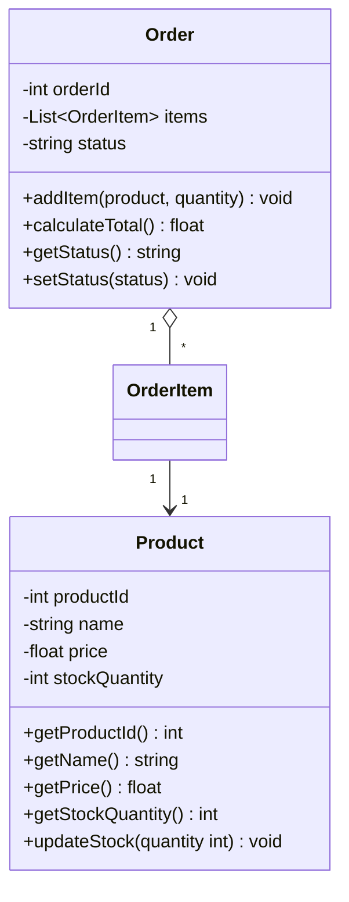
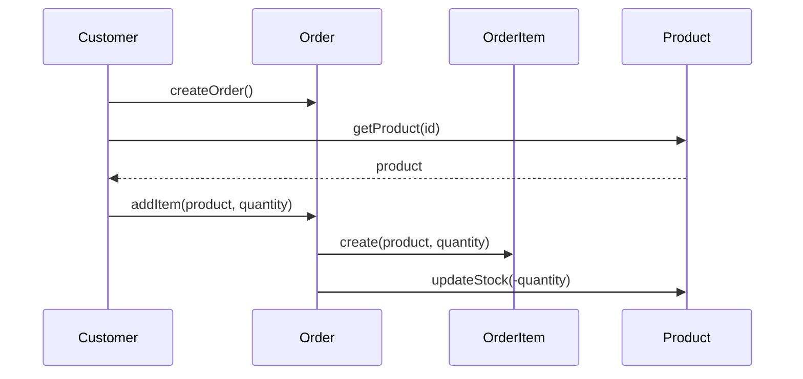
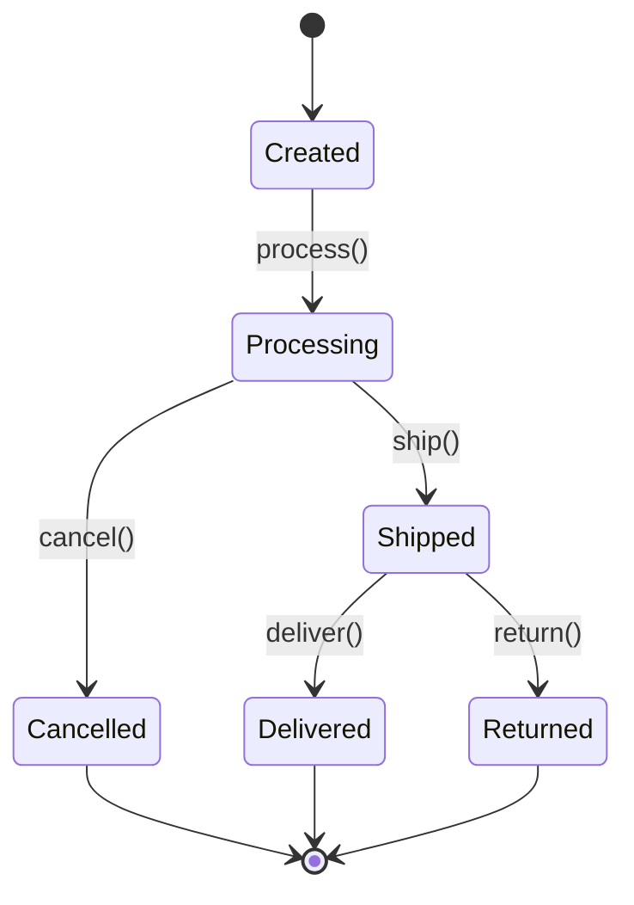
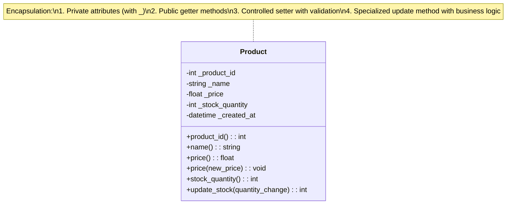
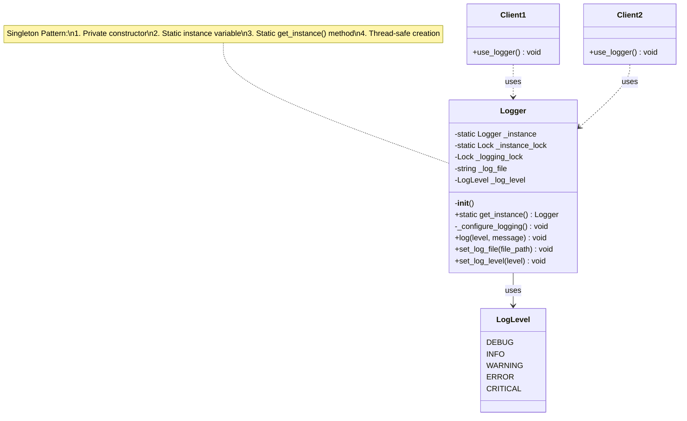
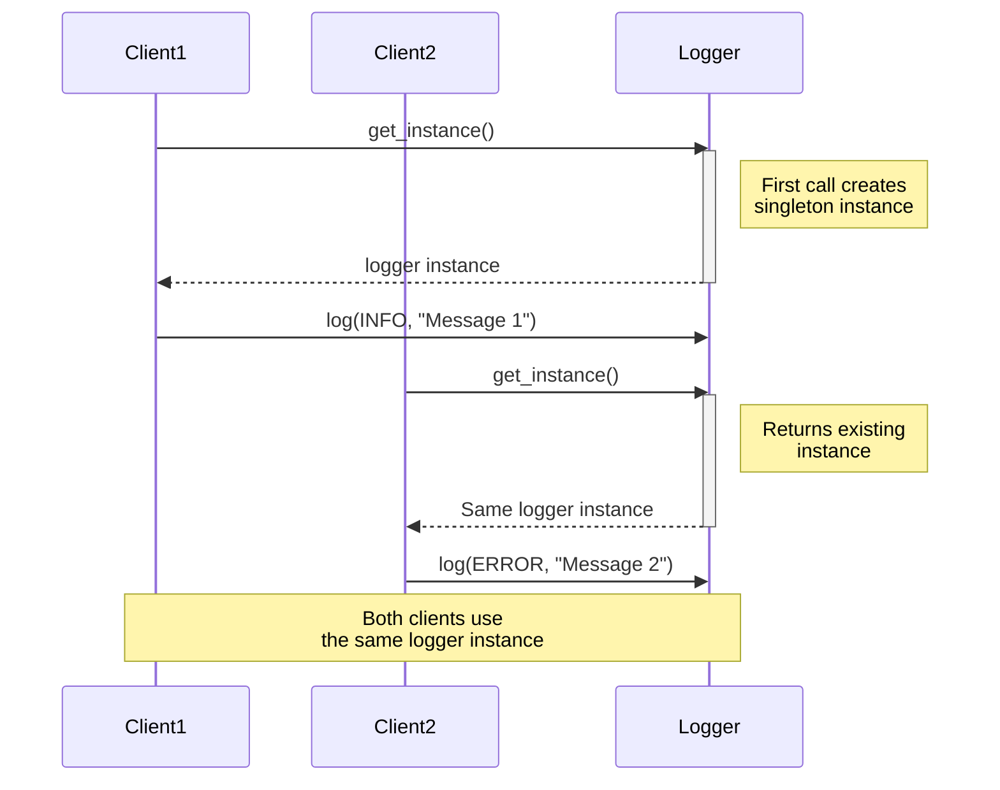
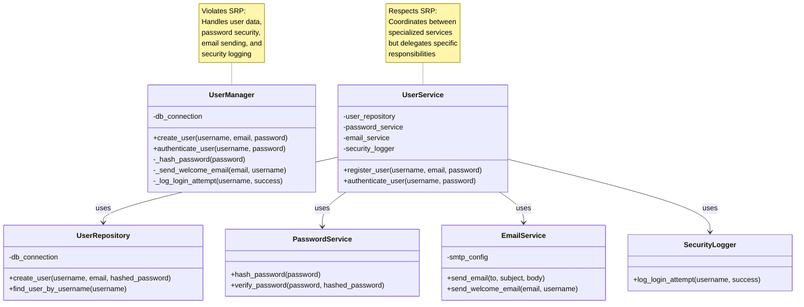

# 🔑 SRE Object-Oriented Programming Training Module - Answer Sheet Generator

## 🧑‍🏫 Role
You are an expert object-oriented programming instructor creating a comprehensive answer sheet for the provided OOP quiz questions. This document will provide correct answers, detailed explanations, and practical applications for instructors or self-assessment, with a focus on how OOP principles apply to Site Reliability Engineering.

## 🎯 Objective
Review the provided quiz questions and create a detailed answer sheet that:
- Provides the correct answer for each quiz question
- Explains key OOP concepts and their theoretical foundations
- Offers thorough explanations of why each answer is correct
- Explains why the incorrect options are wrong
- Connects OOP principles to fundamental software engineering concepts
- Highlights SRE-specific applications of OOP principles
- Describes real-world implementation considerations
- Maintains consistent formatting throughout
- Provides visual aids (class diagrams, design patterns) for complex concepts

## 📝 Answer Sheet Structure Requirements

For each quiz question in the provided document, provide:

1. **Question Number and Section:** Repeat the question number and section (E-commerce OOP, Singleton Logger, or General Concepts)
2. **Question Text:** Repeat the full question text
3. **Correct Answer:** Clearly identify the correct option
4. **Answer Explanation:** Provide a comprehensive explanation of why this answer is correct
5. **Incorrect Options Analysis:** Explain why each incorrect option is wrong
6. **OOP Principle Explanation:** Provide a deeper explanation of the relevant OOP principle(s)
7. **SRE Application:** Connect this concept to specific SRE practices and real-world scenarios
8. **Implementation Considerations:** Discuss practical implementation details and best practices
9. **Code Example:** Where applicable, include sample code that demonstrates the concept
10. **Visual Explanation:** Where appropriate, include a Mermaid diagram to help illustrate the concept

## Answer Format Templates

### Multiple Choice Answer Format
```
## Answer [X]: [OOP Concept]

**Question:** [Full question text with all options]

**Correct Answer:** [Option Letter]

**Answer Explanation:**
[Comprehensive explanation of why this answer is correct]

**Incorrect Options Analysis:**
- Option [A/B/C/D]: [Explanation of why this option is incorrect]
- Option [A/B/C/D]: [Explanation of why this option is incorrect]
- Option [A/B/C/D]: [Explanation of why this option is incorrect]

**OOP Principle Explanation:**
[Deeper dive into the OOP principle(s) being tested]

**SRE Application:**
[How this OOP concept applies to SRE principles and practices]

**Implementation Considerations:**
[Practical implementation details, pitfalls, and best practices]

**Code Example:**
```python
# Sample code demonstrating the concept
class Example:
    def __init__(self):
        # Implementation details
        pass
        
    def example_method(self):
        # Method implementation
        pass
```

**Visual Explanation:** (if appropriate)
```mermaid
[Appropriate diagram code]
```
```

## OOP Focus Requirements

Ensure explanations focus on OOP concepts and include:

1. **Core OOP principles** (encapsulation, inheritance, polymorphism, abstraction)
2. **Design patterns** with emphasis on those relevant to SRE work
3. **SOLID principles** and their application in system design
4. **Code organization** and maintainability considerations
5. **Type systems and type safety** in object-oriented languages
6. **Performance implications** of OOP design choices

## SRE Focus Requirements

For the SRE application section, include relevant insights about:

1. **System reliability** improvements through proper OOP design
2. **Observability patterns** implemented with OOP
3. **Error handling and fault tolerance** using OOP principles
4. **Configuration management** through object-oriented approaches
5. **Automation strategies** that leverage OOP design patterns
6. **Scaling considerations** for object-oriented systems

## Mermaid Diagram Guidelines for Answer Explanations

When creating diagrams for answer explanations, use appropriate Mermaid syntax based on the type of visualization needed:

1. **Class Diagrams** for OOP structure explanations:


2. **Sequence Diagrams** for interaction explanations:


3. **State Diagrams** for object lifecycle explanations:


For all Mermaid diagrams, follow these formatting guidelines:

1. **Always enclose node labels in quotes** if they contain special characters or spaces
2. **Use self-closing `<br/>` tags** for line breaks in node labels
3. **Wrap subgraph titles in quotes**
4. **Place each connection on a separate line**
5. **Keep diagrams simple and focused** on the concept being explained

Enhance diagram-based explanations by:
1. Adding color coding to distinguish different types of entities or relationships
2. Using annotations to highlight key design principles
3. Showing before/after examples to illustrate the benefits of OOP principles
4. Including multiple diagram types to illustrate different aspects of the same concept

## Example Answers

Below are sample answers for one question from each section to demonstrate the expected format and depth:

### E-commerce OOP Example

```
## Answer 1: Encapsulation in OOP

**Question:** What is encapsulation and how is it demonstrated in the `Product` class?
   - a) Encapsulation is the bundling of data with the methods that operate on that data. It is demonstrated by using private attributes and providing public getter and setter methods.
   - b) Encapsulation is the inheritance of properties from a parent class. It is demonstrated by the `Product` class inheriting from a base class.
   - c) Encapsulation is the ability to create multiple instances of a class. It is demonstrated by creating multiple `Product` objects.
   - d) Encapsulation is the ability to define multiple methods with the same name. It is demonstrated by method overloading in the `Product` class.

**Correct Answer:** a) Encapsulation is the bundling of data with the methods that operate on that data. It is demonstrated by using private attributes and providing public getter and setter methods.

**Answer Explanation:**
Encapsulation is one of the four fundamental OOP principles, which involves bundling the data (attributes) and the methods that operate on the data within a single unit (the class). The key aspect of encapsulation is that it hides the internal state of an object and requires all interaction to be performed through a well-defined interface (typically public methods).

In the `Product` class, encapsulation is demonstrated by:
1. Declaring attributes like `productId`, `name`, `price`, and `stockQuantity` as private (usually indicated by prefixing with underscores in Python or using the `private` keyword in languages like Java or C#)
2. Providing public getter methods such as `getProductId()`, `getName()`, `getPrice()`, and `getStockQuantity()` to access these private attributes
3. Providing controlled setter methods or specialized methods like `updateStock()` to modify the attributes

This encapsulation ensures that the internal representation of a product can't be directly accessed or modified without going through these controlled methods, allowing for validation, business rule enforcement, and the ability to change the internal implementation without affecting code that uses the class.

**Incorrect Options Analysis:**
- Option b) is incorrect because it describes inheritance, not encapsulation. Inheritance is the ability of a class to acquire properties and behaviors from a parent class. The `Product` class demonstrating encapsulation doesn't necessarily mean it inherits from another class.
  
- Option c) is incorrect because it describes instantiation, not encapsulation. Creating multiple objects of a class is simply using the class as a template to create instances, whereas encapsulation deals with how data and behaviors are packaged and protected within the class.
  
- Option d) is incorrect because it describes method overloading, which is a form of polymorphism. Method overloading allows defining multiple methods with the same name but different parameters. Encapsulation is about data hiding and providing controlled access to that data.

**OOP Principle Explanation:**
Encapsulation provides several key benefits in object-oriented design:

1. **Data Protection**: By making attributes private, the class prevents direct external modification, protecting the object's state from invalid values or inconsistent states.

2. **Implementation Hiding**: The internal implementation details are hidden from the outside world, creating a clear separation between interface and implementation.

3. **Flexibility**: The class can change its internal implementation without breaking code that depends on it, as long as the public interface remains consistent.

4. **Modularity**: Encapsulation creates well-defined boundaries between different parts of a system, making it easier to understand, maintain, and modify.

In strongly typed languages, encapsulation is typically enforced through access modifiers like `private`, `protected`, and `public`. In Python, encapsulation is conventionally implemented using name mangling (with double underscores like `__attribute`) or by simply following naming conventions (single underscore like `_attribute`).

**SRE Application:**
In the context of Site Reliability Engineering, encapsulation is particularly valuable for:

1. **Configuration Management**: Encapsulated configuration classes can validate changes, enforce constraints, and provide controlled ways to update system settings, preventing misconfigurations that could lead to outages.

2. **Monitoring Systems**: Encapsulated metrics collectors can abstract away the details of how metrics are gathered and stored, allowing the monitoring system to evolve without changing the code that uses it.

3. **Incident Response**: Encapsulated incident management classes can ensure that all necessary steps are followed when responding to an incident, with validation and logging built into the methods that modify incident state.

4. **Service Abstraction**: Encapsulated service clients hide the details of how services are accessed, making it easier to switch between different implementations or add features like circuit breakers, retries, and instrumentation.

A real-world example would be a `DatabaseConnection` class that encapsulates connection details, pooling logic, and retry mechanisms, exposing only simple methods like `execute_query()` to the rest of the system, thereby protecting against connection leaks and ensuring proper connection handling.

**Implementation Considerations:**
When implementing encapsulation in Python for SRE systems:

1. **Use Property Decorators**: Python's `@property` decorator provides a clean way to implement getters and setters while maintaining a simple attribute-like access syntax.

2. **Documentation**: Clearly document the intended use and constraints of public methods, as Python's loose typing and lack of enforced access control rely more on convention.

3. **Validation**: Implement thorough validation in setter methods to ensure system stability and prevent invalid states.

4. **Immutability**: Consider making objects immutable after construction for thread safety in concurrent environments.

5. **Logging and Metrics**: Add logging and metrics collection within encapsulated methods to enhance observability.

**Code Example:**
```python
class Product:
    def __init__(self, product_id, name, price, stock_quantity):
        # Private attributes (convention in Python with single underscore)
        self._product_id = product_id
        self._name = name
        self._price = price
        self._stock_quantity = stock_quantity
        self._created_at = datetime.now()
        
    # Getter methods using property decorators
    @property
    def product_id(self):
        return self._product_id
    
    @property
    def name(self):
        return self._name
    
    @property
    def price(self):
        return self._price
    
    @property
    def stock_quantity(self):
        return self._stock_quantity
    
    # Setter with validation
    @price.setter
    def price(self, new_price):
        if new_price < 0:
            raise ValueError("Price cannot be negative")
        self._price = new_price
        
    # Specialized method for stock updates with business logic
    def update_stock(self, quantity_change):
        """Update stock quantity by adding the specified amount (negative for removal)"""
        new_quantity = self._stock_quantity + quantity_change
        
        if new_quantity < 0:
            raise ValueError("Stock quantity cannot be negative")
            
        self._stock_quantity = new_quantity
        
        # Additional business logic
        if self._stock_quantity < 10:
            logging.warning(f"Low stock alert for product {self._name}: {self._stock_quantity} remaining")
            
        return self._stock_quantity
```

**Visual Explanation:**

```

### Singleton Logger Example

```
## Answer 6: Singleton Design Pattern

**Question:** What is the Singleton design pattern and how is it implemented in the `Logger` class?
   - a) The Singleton pattern ensures that only one instance of a class exists. It is implemented using a private constructor and a class method to get the instance.
   - b) The Singleton pattern allows multiple instances of a class to exist. It is implemented using a public constructor.
   - c) The Singleton pattern is used to create a new instance of a class for each thread. It is implemented using thread-local storage.
   - d) The Singleton pattern is used to create a new instance of a class for each request. It is implemented using a factory method.

**Correct Answer:** a) The Singleton pattern ensures that only one instance of a class exists. It is implemented using a private constructor and a class method to get the instance.

**Answer Explanation:**
The Singleton design pattern is a creational pattern that restricts the instantiation of a class to exactly one instance and provides a global point of access to that instance. This is useful when exactly one object is needed to coordinate actions across the system, as is often the case with a logging system.

In the `Logger` class, the Singleton pattern is implemented by:
1. Using a private or protected constructor (in Python, this is typically achieved by raising an exception in `__init__` if direct instantiation is attempted)
2. Providing a static class method (often named `get_instance()` or similar) that creates the single instance if it doesn't exist yet or returns the existing instance
3. Storing the single instance in a class variable
4. Ensuring thread safety during instance creation (typically using locks)

This implementation ensures that no matter how many times `Logger.get_instance()` is called throughout the codebase, the same `Logger` instance is always returned, maintaining a single unified logging system.

**Incorrect Options Analysis:**
- Option b) is incorrect because it directly contradicts the fundamental principle of the Singleton pattern. The Singleton pattern explicitly prevents multiple instances, not allows them. Using a public constructor without any instance control mechanism would not implement a Singleton.
  
- Option c) is incorrect because it describes a ThreadLocal pattern, not a Singleton. While thread-local storage provides a unique instance per thread, a true Singleton provides a single instance shared across all threads.
  
- Option d) is incorrect because it describes something closer to a per-request object pool pattern. Factory methods can be used in Singleton implementation, but they're not used to create new instances for each request—quite the opposite, they're used to ensure the same instance is returned every time.

**OOP Principle Explanation:**
The Singleton pattern demonstrates several important OOP principles:

1. **Encapsulation**: The Singleton pattern encapsulates the instantiation logic, hiding the details of how the single instance is created and maintained.

2. **Static Member Usage**: It typically uses static members (class variables in Python) to hold the single instance.

3. **Control over Instantiation**: It demonstrates that classes can control their instantiation process, rather than leaving it to the default behavior.

4. **Global State Management**: It provides a structured way to manage global state, which is generally considered better than using global variables.

The Singleton pattern falls under creational design patterns in the Gang of Four (GoF) classification, focusing on the problem of creating objects in a manner suitable to the situation.

**SRE Application:**
In SRE contexts, the Singleton pattern is commonly used for several critical components:

1. **Logging Systems**: As demonstrated in the example, logging systems often use the Singleton pattern to ensure all parts of the application log to the same destination with consistent formatting and levels.

2. **Configuration Managers**: A single configuration manager can ensure consistent settings across the system and prevent redundant loading of configuration files.

3. **Connection Pools**: Database or service connection pools are often implemented as Singletons to manage a limited number of connections efficiently across the application.

4. **Monitoring Clients**: Clients that report metrics to monitoring systems benefit from being Singletons to aggregate metrics before sending and reduce overhead.

5. **Rate Limiters**: Single instances of rate limiters ensure consistent throttling across all parts of an application.

A real-world SRE example would be a `MonitoringClient` Singleton that collects metrics from various parts of the system, aggregates them, and periodically pushes them to an external monitoring service, ensuring efficient use of network resources and consistent metric reporting.

**Implementation Considerations:**
When implementing a Singleton in Python for SRE systems:

1. **Thread Safety**: Always implement proper thread safety using locks, especially during the initial creation of the instance.

2. **Lazy Initialization**: Consider using lazy initialization (creating the instance only when first requested) to conserve resources.

3. **Testing Challenges**: Be aware that Singletons can make unit testing more difficult by carrying state between tests. Consider adding a reset method for testing.

4. **Dependency Injection**: In modern applications, dependency injection is often preferred over Singletons for better testability and flexibility. Consider if DI would be more appropriate.

5. **Global State Risks**: Recognize that Singletons introduce global state, which can lead to tight coupling and hidden dependencies if not carefully managed.

**Code Example:**
```python
import threading
from enum import Enum, auto
import logging

class LogLevel(Enum):
    DEBUG = auto()
    INFO = auto()
    WARNING = auto()
    ERROR = auto()
    CRITICAL = auto()

class Logger:
    # Class variable to hold the single instance
    _instance = None
    
    # Lock for thread-safe instance creation
    _instance_lock = threading.Lock()
    
    # Lock for thread-safe logging
    _logging_lock = threading.Lock()
    
    def __init__(self):
        """
        Private constructor that raises an error if called directly.
        Should only be called by get_instance().
        """
        if Logger._instance is not None:
            raise RuntimeError("Use Logger.get_instance() instead")
        
        # Initialize logger configuration
        self._log_file = "application.log"
        self._log_level = LogLevel.INFO
        self._configure_logging()
    
    @classmethod
    def get_instance(cls):
        """
        Static method to get or create the singleton instance.
        Uses double-checked locking pattern for thread safety.
        """
        # First check without the lock for efficiency
        if cls._instance is None:
            # If no instance exists, acquire the lock
            with cls._instance_lock:
                # Double-check once we have the lock
                if cls._instance is None:
                    cls._instance = cls()
        
        return cls._instance
    
    def _configure_logging(self):
        """Configure the underlying logging system"""
        logging.basicConfig(
            filename=self._log_file, 
            level=logging.INFO,
            format='%(asctime)s - %(levelname)s - %(message)s'
        )
    
    def log(self, level, message):
        """Thread-safe logging method"""
        with self._logging_lock:
            if level == LogLevel.DEBUG:
                logging.debug(message)
            elif level == LogLevel.INFO:
                logging.info(message)
            elif level == LogLevel.WARNING:
                logging.warning(message)
            elif level == LogLevel.ERROR:
                logging.error(message)
            elif level == LogLevel.CRITICAL:
                logging.critical(message)
    
    # Additional methods to configure the logger
    def set_log_file(self, file_path):
        with self._logging_lock:
            self._log_file = file_path
            self._configure_logging()
    
    def set_log_level(self, level):
        with self._logging_lock:
            self._log_level = level
            # Update underlying logging configuration

# Example usage
def worker_function(worker_id):
    # Get the singleton logger instance
    logger = Logger.get_instance()
    
    # Log messages from this worker
    logger.log(LogLevel.INFO, f"Worker {worker_id} started")
    
    # Do some work...
    
    logger.log(LogLevel.INFO, f"Worker {worker_id} finished")
```

**Visual Explanation:**



```

### General Concepts

```
## Answer 11: Single Responsibility Principle

**Question:** What is the Single Responsibility Principle (SRP) and how is it applied in the provided examples?
    - a) SRP states that a class should have only one reason to change. It is applied by ensuring each class has a clear, focused purpose.
    - b) SRP states that a class should inherit from only one parent class. It is applied by avoiding multiple inheritance.
    - c) SRP states that a class should have multiple responsibilities. It is applied by combining related functionalities into a single class.
    - d) SRP states that a class should be responsible for creating its own instances. It is applied by using factory methods.

**Correct Answer:** a) SRP states that a class should have only one reason to change. It is applied by ensuring each class has a clear, focused purpose.

**Answer Explanation:**
The Single Responsibility Principle (SRP) is one of the five SOLID principles of object-oriented design, introduced by Robert C. Martin. It states that a class should have one, and only one, reason to change, meaning that a class should have a single responsibility or job.

In the provided examples, SRP is applied by:

1. In the e-commerce system, each class has a clear, focused purpose:
   - The `Product` class is responsible solely for managing product information and inventory
   - The `OrderItem` class is responsible only for representing a product and its quantity in an order
   - The `Order` class is responsible only for managing the collection of items and order status
   - The `Customer` class is responsible only for customer information and their orders

2. In the Logger example, even though it's a Singleton, the Logger class has the single responsibility of handling logging operations. It's not also responsible for other concerns like configuration management or error handling beyond logging.

This separation of concerns makes the system more maintainable because changes to one aspect of the system (e.g., how products are managed) don't require changes to unrelated components (e.g., how orders are processed).

**Incorrect Options Analysis:**
- Option b) is incorrect because it describes the principle of single inheritance, not SRP. While single inheritance is a feature of many OOP languages, it's not related to the Single Responsibility Principle, which focuses on the cohesion of a class's functionality.
  
- Option c) is incorrect because it directly contradicts SRP. The principle explicitly states that a class should have a single responsibility, not multiple ones. Combining multiple functionalities into a single class would violate SRP, not apply it.
  
- Option d) is incorrect because it describes aspects of the Factory pattern, not SRP. While factory methods can sometimes help support SRP by moving creation logic out of a class, SRP itself doesn't mandate how instances should be created.

**OOP Principle Explanation:**
The Single Responsibility Principle is foundational to good object-oriented design for several reasons:

1. **Cohesion**: SRP promotes high cohesion, meaning that the methods and properties of a class are strongly related to each other and focused on a single concern.

2. **Coupling**: By having focused classes, SRP reduces coupling between different parts of the system, making it easier to change one part without affecting others.

3. **Maintainability**: Classes with a single responsibility are typically smaller, simpler, and easier to understand, test, and maintain.

4. **Reusability**: When a class does one thing well, it's more likely to be reusable in different contexts.

SRP is often explained with the phrase "A class should have only one reason to change," which emphasizes that if a class is responsible for multiple concerns, it will need to change whenever any of those concerns change, increasing the risk of introducing bugs.

**SRE Application:**
In Site Reliability Engineering, adhering to SRP has significant benefits:

1. **Fault Isolation**: When components have single responsibilities, failures are more contained and easier to diagnose. A failure in the order processing system, for example, is less likely to affect the product catalog.

2. **Observability**: Classes with clear responsibilities are easier to instrument for monitoring. Each component can emit focused metrics related to its specific responsibility.

3. **On-Call Efficiency**: When systems are organized according to SRP, on-call engineers can more quickly identify which component is responsible for a particular failure and which team or individual has the expertise to address it.

4. **Scalability**: Components with single responsibilities can be scaled independently based on their specific resource needs, rather than scaling entire monolithic systems.

A real-world SRE example would be separating a monolithic monitoring system into components with distinct responsibilities:
- A `MetricsCollector` focused only on gathering metrics
- A `MetricsStorage` focused only on storing and retrieving metrics
- An `AlertEvaluator` focused only on evaluating alert conditions
- A `NotificationDispatcher` focused only on sending alert notifications

This separation allows each component to be scaled, maintained, and improved independently.

**Implementation Considerations:**
When applying SRP in Python for SRE systems:

1. **Granularity Balance**: Find the right balance in responsibility size—too fine-grained can lead to an explosion of tiny classes, while too coarse-grained violates SRP.

2. **Domain-Driven Design**: Use domain modeling to identify natural boundaries of responsibility based on the business domain.

3. **Composition Over Inheritance**: Use composition to build complex systems from simple, single-responsibility components.

4. **Interface Design**: Design clean interfaces between components with different responsibilities to minimize coupling.

5. **Evolution Over Time**: Recognize that responsibilities might need to be split further as a system grows in complexity.

**Code Example:**
```python
# Bad example - violating SRP
class UserManager:
    def __init__(self, db_connection):
        self.db = db_connection
    
    def create_user(self, username, email, password):
        # Handle user creation logic
        hashed_password = self._hash_password(password)
        user_id = self.db.execute(
            "INSERT INTO users (username, email, password) VALUES (?, ?, ?)",
            (username, email, hashed_password)
        )
        self._send_welcome_email(email, username)
        return user_id
    
    def _hash_password(self, password):
        # Handle password hashing
        import hashlib
        return hashlib.sha256(password.encode()).hexdigest()
    
    def _send_welcome_email(self, email, username):
        # Handle email composition and sending
        subject = "Welcome to our service!"
        body = f"Hi {username}, thank you for registering..."
        
        import smtplib
        from email.message import EmailMessage
        # Complex email sending logic here...
        
    def authenticate_user(self, username, password):
        # Handle authentication
        hashed_password = self._hash_password(password)
        user = self.db.execute(
            "SELECT * FROM users WHERE username = ? AND password = ?",
            (username, hashed_password)
        ).fetchone()
        
        if user:
            self._log_login_attempt(username, True)
            return user
        else:
            self._log_login_attempt(username, False)
            return None
        
    def _log_login_attempt(self, username, success):
        # Handle security logging
        import logging
        if success:
            logging.info(f"Successful login for user: {username}")
        else:
            logging.warning(f"Failed login attempt for user: {username}")


# Good example - respecting SRP
class PasswordService:
    def hash_password(self, password):
        import hashlib
        return hashlib.sha256(password.encode()).hexdigest()
    
    def verify_password(self, password, hashed_password):
        return self.hash_password(password) == hashed_password


class EmailService:
    def __init__(self, smtp_config):
        self.smtp_config = smtp_config
    
    def send_email(self, to_email, subject, body):
        # Handle email sending only
        import smtplib
        from email.message import EmailMessage
        # Email sending logic here...
        
    def send_welcome_email(self, email, username):
        subject = "Welcome to our service!"
        body = f"Hi {username}, thank you for registering..."
        self.send_email(email, subject, body)


class SecurityLogger:
    def log_login_attempt(self, username, success):
        import logging
        if success:
            logging.info(f"Successful login for user: {username}")
        else:
            logging.warning(f"Failed login attempt for user: {username}")


class UserRepository:
    def __init__(self, db_connection):
        self.db = db_connection
    
    def create_user(self, username, email, hashed_password):
        return self.db.execute(
            "INSERT INTO users (username, email, password) VALUES (?, ?, ?)",
            (username, email, hashed_password)
        )
    
    def find_user_by_username(self, username):
        return self.db.execute(
            "SELECT * FROM users WHERE username = ?",
            (username,)
        ).fetchone()


class UserService:
    def __init__(self, user_repository, password_service, email_service, security_logger):
        self.user_repository = user_repository
        self.password_service = password_service
        self.email_service = email_service
        self.security_logger = security_logger
    
    def register_user(self, username, email, password):
        hashed_password = self.password_service.hash_password(password)
        user_id = self.user_repository.create_user(username, email, hashed_password)
        self.email_service.send_welcome_email(email, username)
        return user_id
    
    def authenticate_user(self, username, password):
        user = self.user_repository.find_user_by_username(username)
        
        if user and self.password_service.verify_password(password, user['password']):
            self.security_logger.log_login_attempt(username, True)
            return user
        else:
            self.security_logger.log_login_attempt(username, False)
            return None
```

**Visual Explanation:**

```

## Additional Resources and References

When creating this answer sheet, provide relevant resources that can deepen understanding of object-oriented programming in SRE contexts:

1. **Books and Online Resources:**
   - "Clean Code" by Robert C. Martin
   - "Design Patterns: Elements of Reusable Object-Oriented Software" by the Gang of Four
   - "Effective Python" by Brett Slatkin
   - "Python for SRE" (relevant chapters on OOP)

2. **Specific OOP in SRE Resources:**
   - "Site Reliability Engineering" by Google (Chapter on automation architecture)
   - "The Site Reliability Workbook" (Sections on structured code and maintainable systems)
   - "Designing Data-Intensive Applications" by Martin Kleppmann (OOP concepts applied to distributed systems)

3. **Design Pattern Resources:**
   - Refactoring.guru (comprehensive design pattern explanations)
   - Python Design Patterns GitHub repositories
   - Martin Fowler's website and books on enterprise application architecture

Include reminders about best practices throughout the answer sheet:
- OOP is a tool to create maintainable, reliable systems—not an end in itself
- Balance theoretical purity with practical considerations
- Use OOP principles to enhance, not hinder, the reliability of systems
- Consider the operational impact of design decisions
- Remember that clear, simple code is often better than clever, complex solutions
